# LAPORAN PRAKTIKUM SISTEM OPERASI JOBSHEET 1

<h4> Nama : Muhammad Toriq Januarsyah<h4>
<h4> NIM : 254107020075<h4>
<h4> Kelas : 1-H <h4>

## 1.10 Latihan
### 1.10.1. Latihan Konseptual
#### Latihan 1.1
1. Jelaskan 5 fungsi utama sistem operasi dengan contoh konkret dari minimal 2 OS berbeda (Windows, macOS, atau Linux).

#### Jawaban 
1. Mengatur penjadwalan proses, pembuatan, hingga penghentian proses.
2. Membagi-bagi kapasitas RAM untuk setiap aplikasi yang dibuka agar tidak saling berebut.
3. Mengatur cara menyimpan, menghapus, dan mengelompokkan data dalam folder agar rapi dan aman.
4. Menghubungkan perangkat luar (seperti keyboard, mouse, atau printer) agar bisa dikenali dan dipakai oleh komputer
5. Menjaga data dari akses orang lain yang tidak berhak melalui sistem login dan izin akses.

contoh :
- windows => Penggunaan Task Manager untuk mengakhiri aplikasi yang tidak merespons.
- linux => Penggunaan perintah top atau htop untuk memantau proses yang sedang berjalan di Ubuntu Server.

#### Latihan 1.2
1. Kapan sebaiknya menggunakan Windows vs Linux vs macOS?  
   Analisis berdasarkan use case: gaming, development, server, creative work, dan enterprise.

#### Jawaban 
- berdasarkan use case maka penggunaan yang tepat  
    Windows => gaming,Perkantoran dan Bisnis, Aplikasi Umum & Kompatibilitas Tinggi.  
    linux => Server dan Cloud Computing, Development dan Programming, Sistem yang Membutuhkan Stabilitas Tinggi.  
    macOS => Creative Work (Desain, Editing, Audio, Video), Ekosistem Apple, development iOS

### 1.10.2. Latihan Praktikal 
#### latihan 1.3
Install Ubuntu Server 22.04 LTS di VirtualBox dengan langkah berikut:
1. Download Ubuntu Server ISO dari website resmi
2. Create VM baru di VirtualBox (RAM: 2GB, Disk: 25GB)
3. Install dengan automatic partitioning (guided)
4. Buat user account dengan password yang kuat
5. Reboot dan login ke sistem
6. Dokumentasikan proses instalasi dengan screenshot key steps

#### Jawaban 
1. Download Ubuntu Server

2. Login menggunakan user account dan password

3. Tampilan Awal 
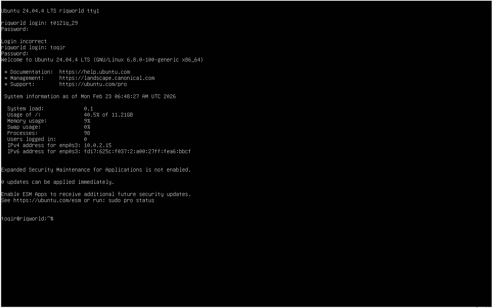

#### Latihan 1.4 
Setelah instalasi Ubuntu Server, lakukan tasks berikut:
1. Update package list: sudo apt update
2. Upgrade packages: sudo apt upgrade
3. Install neofetch: sudo apt install neofetch
4. Jalankan neofetch dan screenshot hasilnya
5. Check disk usage dengan df -h
6. Check memory dengan free -h
7. Dokumentasikan output dari setiap command

#### Jawaban 
1. Update package list: sudo apt update 
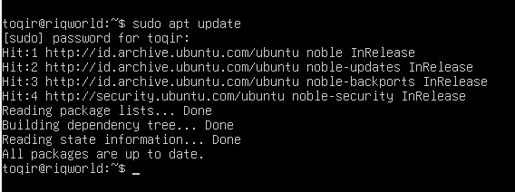

2. Upgrade packages: sudo apt upgrade  
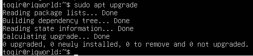

3. Install neofetch: sudo apt install neofetch  
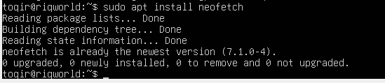

4. Jalankan neofetch dan screenshot hasilnya  
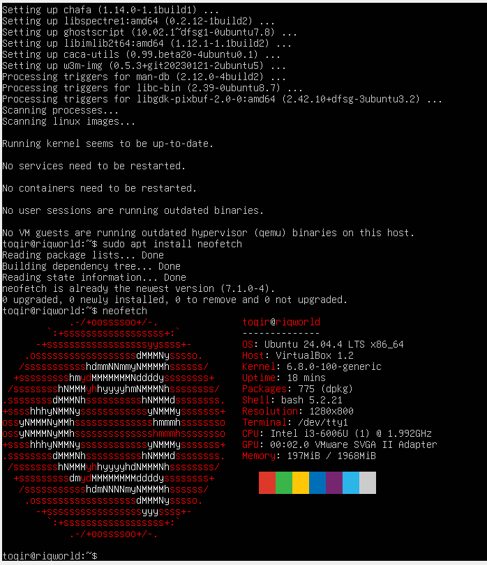

5. Check disk usage dengan df -h  
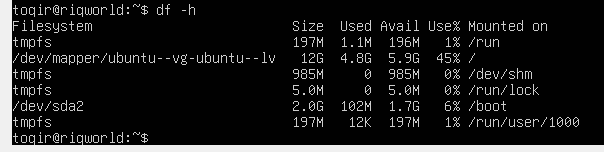

6. Check memory dengan free -h  
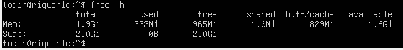

#### Latihan 1.5
Eksplorasi sistem yang baru diinstall:
1. Tampilkan informasi OS: cat /etc/os-release
2. Tampilkan versi kernel: uname -r
3. List partisi: lsblk
4. Check network connectivity: ping -c 4 google.com
5. Install dan jalankan htop untuk melihat resource usage
6. Buat laporan singkat tentang konfigurasi sistem Anda

#### Jawaban 
1. Tampilkan informasi OS: cat /etc/os-release  
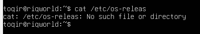

2. Tampilkan versi kernel: uname -r  
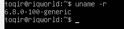

3. List partisi: lsblk  
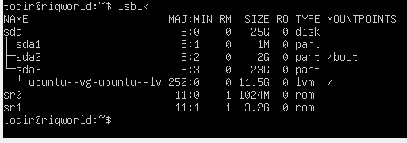

4. Check network connectivity: ping -c 4 google.com  
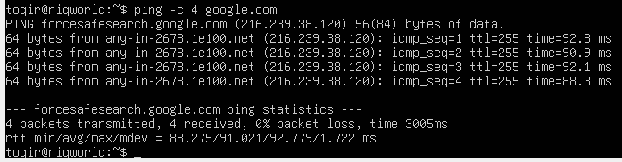

5. Install dan jalankan htop untuk melihat resource usage
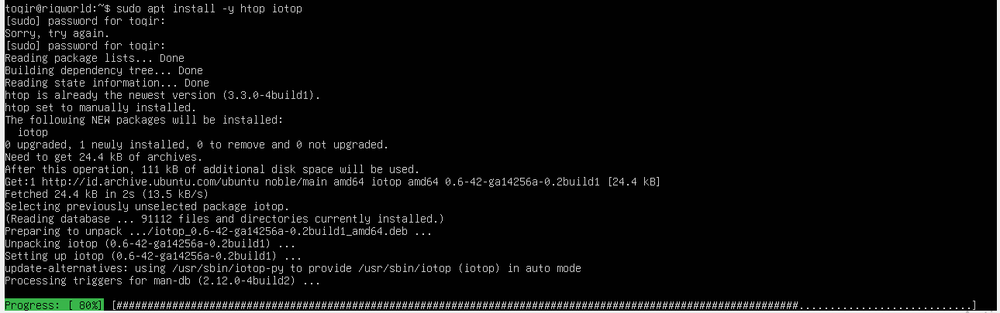  
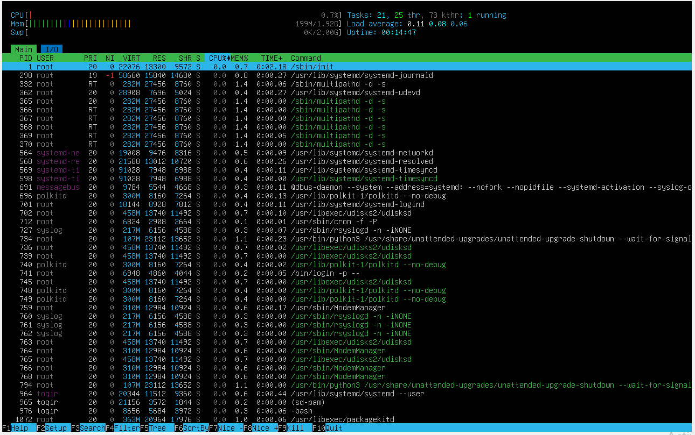

### 1.10.3. Latihan Refleksi 
#### Latihan 1.6
Ceritakan pengalaman Anda dengan sistem operasi:
1. Sistem operasi apa yang Anda gunakan sehari-hari? (Windows, macOS, Linux, atau lainnya)
2. Berapa lama Anda menggunakan sistem operasi tersebut?
3. Apa yang Anda sukai dari sistem operasi tersebut?
4. Apa tantangan atau masalah yang pernah Anda hadapi?
5. Apakah Anda pernah menggunakan sistem operasi lain? Bandingkan pengalaman Anda.
6. Setelah mempelajari bab ini, apakah ada sistem operasi lain yang ingin Anda coba? Mengapa?
Tulis refleksi Anda dalam 300-500 kata disertai dengan dokumentasi.

#### Jawaban 
Dalam kehidupan sehari-hari, bisa dikatakan saya selalu menggunakan Windows. Saya sudah menggunakan sistem ini sejak pertama kali mengenal komputer hingga sekarang. Alasan utama mengapa saya tetap bertahan dengan Windows adalah faktor kebiasaan dan kemudahannya. Hampir semua kebutuhan saya, mulai dari mengerjakan tugas, menikmati hiburan, hingga bermain game, semuanya tersedia dan bisa berjalan dengan sangat lancar di ekosistem ini tanpa perlu pengaturan yang rumit. Jika melihat dari sisi cara kerjanya, Windows memiliki keunggulan karena kemampuannya dalam menyesuaikan diri dengan berbagai jenis perangkat keras. Sistem ini memiliki dukungan otomatis yang sangat baik; saya hampir tidak pernah kesulitan saat menyambungkan perangkat baru seperti printer, kamera, atau perangkat tambahan lainnya karena Windows biasanya langsung mengenali dan menyiapkannya untuk saya. Hal inilah yang membuat Windows terasa sangat praktis bagi pengguna umum yang tidak ingin direpotkan oleh urusan teknis di balik layar. Selama menggunakan dengan keunggulan yang saya sebutkan sebelumnya, tantangan dan kendala juga saya temui ditengah prosesnya. Tantangan yang paling sering saya hadapi dan cukup mengganggu adalah sistem pembaruan (update) yang sering kali muncul tiba-tiba dan memakan waktu lama sehingga sanggat mengganggu ketika sedang dibutuhkan. Selain itu, seiring bertambahnya aplikasi yang diinstal, performa laptop terkadang terasa semakin berat dan melambat, yang memaksa saya untuk sering melakukan pembersihan sistem agar tetap nyaman digunakan. Sejauh ini, saya memang belum pernah mencoba sistem operasi lain secara mendalam seperti macOS atau Linux karena sudah terlanjur nyaman dengan Windows sejak kecil. Namun, setelah mengikuti praktikum dan mempelajari materi di bab ini, pandangan saya mulai terbuka dan saya merasa sangat tertarik untuk mencoba Linux, khususnya distro Ubuntu yang kita pelajari. Ketertarikan saya muncul karena saya terkesan dengan efisiensi dan stabilitasnya. Di materi ini, saya belajar bahwa Linux bisa berjalan sangat ringan bahkan tanpa tampilan grafis sekalipun. Saya ingin merasakan sendiri bagaimana rasanya memiliki kendali penuh atas sistem operasi, mengelola file secara lebih aman, dan memahami bagaimana sebuah sistem bisa bekerja sangat stabil untuk menjalankan server-server besar di dunia.
