# LAPORAN PRAKTIKTUM SISTEM OPERASI JOBSHEET 10

<h4> Nama : Muhammad Toriq Januarsyah<h4>
<h4> NIM : 254107020075<h4>
<h4> Kelas : TI 1-H <h4>

## 1. Manajemen  Memori & System Call
Pada bab ini akan memahami konsep system call — mekanisme yang digunakan program untuk meminta layanan dari kernel. Kita juga akan memanfaatkan kemampuan Bash dari Bab 9 untuk membangun script monitoring yang nyata dan berguna. 

Seluruh praktikum dijalankan sebagai pengguna biasa kecuali perintah yang secara eksplisit menggunakan sudo. Buat direktori kerja terlebih dahulu:
```
mkdir -p ~/ praktikum - os / week10 - memory
```
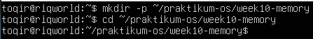

### 1.1 Arsitektur Memori di Linux
Setiap program yang berjalan di Linux mendapatkan ruang alamat virtual sendiri. Artinya, setiap program seolah-olah memiliki memori pribadi yang tidak dapat diganggu program lain. Kernel bertugas mengatur pemetaan antara alamat virtual tersebut dengan memori fisik (RAM).

Perintah yang Digunakan
- free -h : ringkasan penggunaan RAM dan swap dalam format mudah dibaca.
- cat /proc/meminfo : detail informasi memori langsung dari kernel.
- top : memantau penggunaan resource sistem secara real-time.

#### Praktikum 10.1 Melihat Penggunaan Memori
Tujuan: mengenali struktur dan penggunaan memori pada sistem Linux.
1. Jalankan free -h untuk melihat ringkasan RAM dan swap.
```
free -h
```
2. Lihat detail memori dari kernel melalui /proc/meminfo.
```
cat /proc/meminfo | head -n 20
```
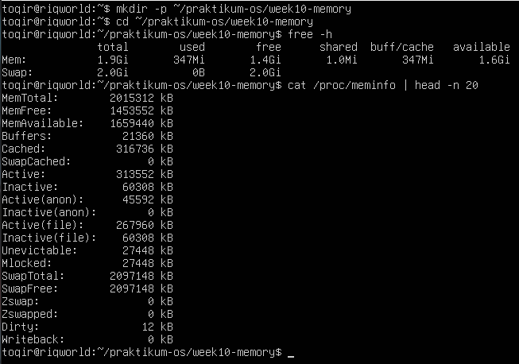

Analisis:
1. Hitung persentase memori tersedia: available / total × 100%. Jika hasilnya di bawah 10%, sistem mulai kekurangan memori. <br>
    jawab : <br>
    - Total = 1.9Gi dan Available = 1.6Gi.  

    - Perhitungan: 1.6 / 1.9 x 100% = 84.2\%.  

    - Karena hasilnya jauh di atas 10%, sistem dalam kondisi sangat sehat dan tidak kekurangan memori sama sekali.  

2. Pada baris Swap, apakah kolom used bernilai 0? Jika lebih dari 0, kernel sudah pernah memindahkan data ke disk karena RAM tidak cukup. <br>
    jawab : <br>
    - Pada baris Swap, kolom used menunjukkan angka 0B.
    Hal ini berarti RAM fisik masih sangat mencukupi untuk semua proses yang berjalan, sehingga kernel belum perlu memindahkan data apa pun ke disk (swap).

3. Perhatikan field Cached dan Buffers di /proc/meminfo. Nilai ini sesuai dengan kolom buff/cache pada free -h. <br>
    jawab : <br>
    - Di /proc/meminfo: Buffers = 21.360 KB dan Cached = 316.736 KB.

    - Jika dijumlahkan: 21.360 + 316.736 = 338.096 KB

    - Nilai ini sangat mendekati kolom buff/cache pada free -h yaitu 347Mi (selisih sedikit karena satuan GiB/MiB vs KB serta perbedaan waktu pembacaan sepersekian detik).

#### Studi Kasus 10.1 Server Lambat karena Memori
Skenario: Server aplikasi terasa lambat saat banyak pengguna aktif. Administrator perlu menentukan apakah penyebabnya adalah kekurangan memori.
1.  Periksa kondisi memori secara keseluruhan.
```
free -h
```

2. Pantau proses secara real-time.
```
top
```

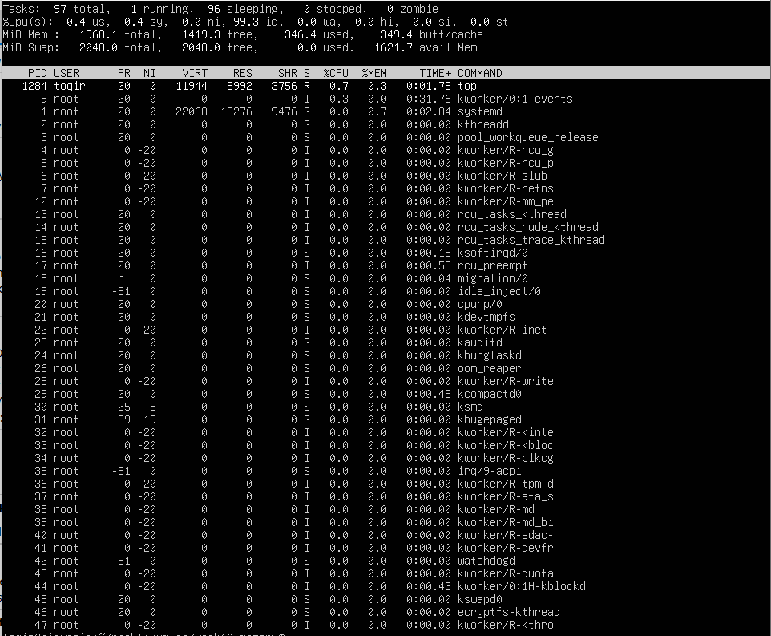

Di dalam top: tekan M untuk mengurutkan berdasarkan memori, tekan q
untuk keluar.

Analisis:
1. Apakah nilai available sangat kecil (misalnya di bawah 200 MB pada server dengan RAM 2 GB)? Jika ya, server kemungkinan kekurangan memori. <br>
    jawab : <br>
   - Nilai avail Mem pada gambar top menunjukkan 1621.0 MiB (sekitar 1.6 GB).

    - Ini jauh di atas ambang batas kritis (200 MB), jadi penyebab lambatnya sistem (jika ada) bukan karena kehabisan RAM.
    
2. Apakah kolom used pada baris Swap lebih dari 0? Jika ya, kernel sedang menggunakan swap, yang berarti performa menurun. <br>
    jawab : <br>
    - Nilai used pada baris Swap di top adalah 0.0.

    - Tidak ada penggunaan swap, artinya performa disk tidak terganggu oleh aktivitas paging yang berlebihan.

3. Di tampilan top, proses apa yang memiliki %MEM terbesar? Proses tersebut menjadi kandidat utama penyebab lambatnya server.<br>
    jawab :<br>
    - Berdasarkan tampilan top, proses dengan %MEM tertinggi adalah systemd dengan nilai 0.7%.

    - Tidak ada indikasi aplikasi yang mengalami kebocoran memori (memory leak) atau "memakan" RAM secara tidak wajar.

#### Praktikum 10.2 Mengamati Aktivitas Paging
Tujuan: memahami aktivitas memori virtual melalui kolom swap pada vmstat.
1. Jalankan vmstat dengan interval 1 detik, 5 sampel.
```
vmstat 1 5
```
Pada output, temukan kolom swap yang berisi dua sub-kolom:
• si: KB/detik yang dipindahkan dari disk ke RAM. Nilai 0 = tidak ada data yang sedang dimuat dari swap.
• so: KB/detik yang dipindahkan dari RAM ke disk. Nilai 0 = RAM masih cukup, tidak ada data yang dikeluarkan ke swap. <br>
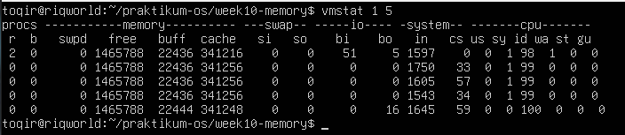

Analisis:
1. Amati nilai si dan so pada kelima baris. Pada sistem normal dengan RAM cukup, kedua nilai ini selalu 0.<br>
    jawab : <br>
    - Pada kolom swap, sub-kolom si (swap-in) dan so (swap-out) semuanya bernilai 0 di kelima baris data tersebut.

    - Sistem sama sekali tidak melakukan pertukaran data antara RAM dan Swap selama pengamatan. Ini adalah indikator performa yang sangat bagus.

2.  Jika nilai si atau so sesekali muncul lebih dari 0, artinya pernah ada aktivitas swap. Ini masih wajar jika tidak terus-menerus.<br>
    jawab :<br>
    - Kolom swpd bernilai 0, yang mengonfirmasi bahwa tidak ada memori virtual yang sedang digunakan di disk.

    - Kolom free stabil di angka 1.465.788 KB (sekitar 1.4 GB), yang menunjukkan ketersediaan ruang RAM yang sangat melimpah.

    - Kolom buff dan cache juga stabil, menandakan kernel mengelola penyimpanan sementara (I/O) dengan tenang tanpa adanya lonjakan proses.

3. Jika si dan so terus-menerus lebih dari 0, sistem dalam kondisi memory pressure serius — performa turun drastis karena akses disk jauh lebih lambat dari RAM.<br>
    jawab : <br>
    - Kolom r (runnable) sempat berada di angka 2 pada baris pertama, lalu kembali ke 0. Ini menunjukkan ada sedikit antrean proses di CPU pada awalnya, namun segera teratasi.

    - Kolom b (blocked) bernilai 0, artinya tidak ada proses yang tertahan menunggu input/output (I/O).
    
4. Perhatikan juga kolom free (RAM kosong) dan buff (buffer) untuk memahami  kondisi keseluruhan RAM saat itu.<br>
    jawab :<br>
    - Nilai free pada sistem berada di angka 1.465.788 KB

    - Nilai buff berada di angka 22.436 KB hingga 22.444 KB.

    - Sistem memiliki manajemen memori yang sangat sehat karena tidak ada tanda-tanda kemacetan atau pemborosan sumber daya.

#### Praktikum 10.3 Membuat dan Mengonfigurasi Swap File
Tujuan: menambahkan swap space dan memahami parameter swappiness
1.  Buat file berukuran 512 MB sebagai calon swap.
```
sudo fallocate -l 512M /swapfile-week10
```

2. Atur permission file menjadi 600 — hanya root yang boleh membaca dan menulis
```
sudo chmod 600 /swapfile-week10 
```

3. Format file sebagai area swap, lalu aktifkan.
```
sudo mkswap / swapfile - week10
sudo swapon / swapfile - week10
```

4. Verifikasi swap aktif. Anda akan melihat entri /swapfile-week10
dengan ukuran 512M, dan nilai total pada baris Swap di free -h bertambah 512M.
```
swapon -- show
free -h
```

5. Periksa nilai swappiness, ubah sementara, dan verifikasi perubahan.
```
cat / proc / sys / vm / swappiness
sudo sysctl vm . swappiness =10
cat / proc / sys / vm / swappiness
```
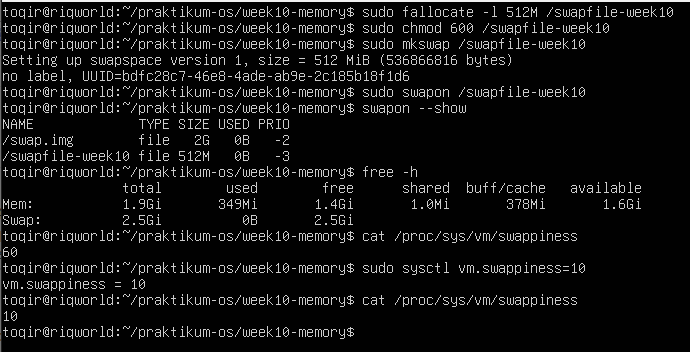

Analisis:
1. Berapa nilai swappiness default? Apa artinya bagi perilaku kernel dalam menggunakan swap? <br>
    jawab : <br>
    - Berdasarkan output perintah cat, nilai swappiness default adalah 60.

    - Nilai 60 adalah nilai moderat yang memerintahkan kernel untuk mulai memindahkan data yang jarang digunakan dari RAM ke Swap meskipun RAM fisik belum benar-benar penuh. Hal ini dilakukan untuk menjaga keseimbangan antara penggunaan memori aplikasi dan cache sistem.

2. Setelah diubah ke 10, konfirmasi nilai berubah pada output cat kedua. Apa dampak nilai 10 terhadap penggunaan swap dibanding nilai 60? <br>
    jawab : <br>
    - Pada output cat kedua setelah perintah sysctl, terlihat nilai sudah sukses berubah menjadi 10.

    - Dibandingkan dengan nilai 60, nilai 10 membuat kernel menjadi lebih pasif/enggan menggunakan swap. Kernel akan berusaha semaksimal mungkin mempertahankan data di RAM fisik dan hanya akan menggunakan swap jika RAM sudah sangat kritis. Dampak positifnya adalah sistem terasa lebih responsif karena kecepatan RAM jauh lebih tinggi daripada disk.


3. Apakah entri /swapfile-week10 muncul di swapon –show? Jika tidak,
pastikan Langkah 2 (chmod 600) sudah dijalankan sebelum Langkah 3.<br>
    jawab : 
    - Ya, entri /swapfile-week10 muncul dengan jelas pada output swapon --show dengan ukuran (SIZE) 512M.

    - Munculnya entri ini menandakan bahwa langkah-langkah sebelumnya, terutama pemberian izin akses chmod 600, sudah dilakukan dengan benar. Jika izin akses tidak diatur ke 600 (hanya bisa dibaca/tulis oleh root), kernel biasanya akan menolak mengaktifkan file tersebut demi alasan keamanan.

#### Praktikum 10.4 Monitoring Memory
Tujuan: mengidentifikasi proses dengan penggunaan memori terbesar.
1. Ambil snapshot proses diurutkan dari penggunaan memori terbesar
```
ps aux --sort=-%mem | head
```
Baris pertama adalah header (nama kolom). Proses di baris kedua adalah
pengguna memori terbesar saat perintah dijalankan.

2. Pantau secara real-time dengan top
```
top
```
Di dalam top: M = urutkan berdasarkan memori, P = urutkan berdasarkan CPU, q = keluar.
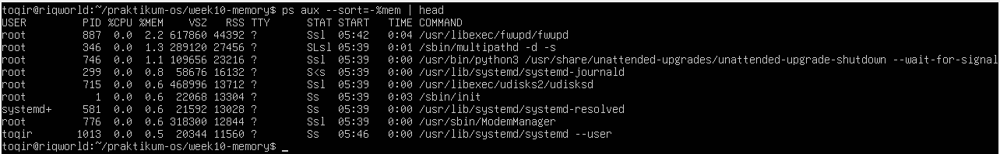
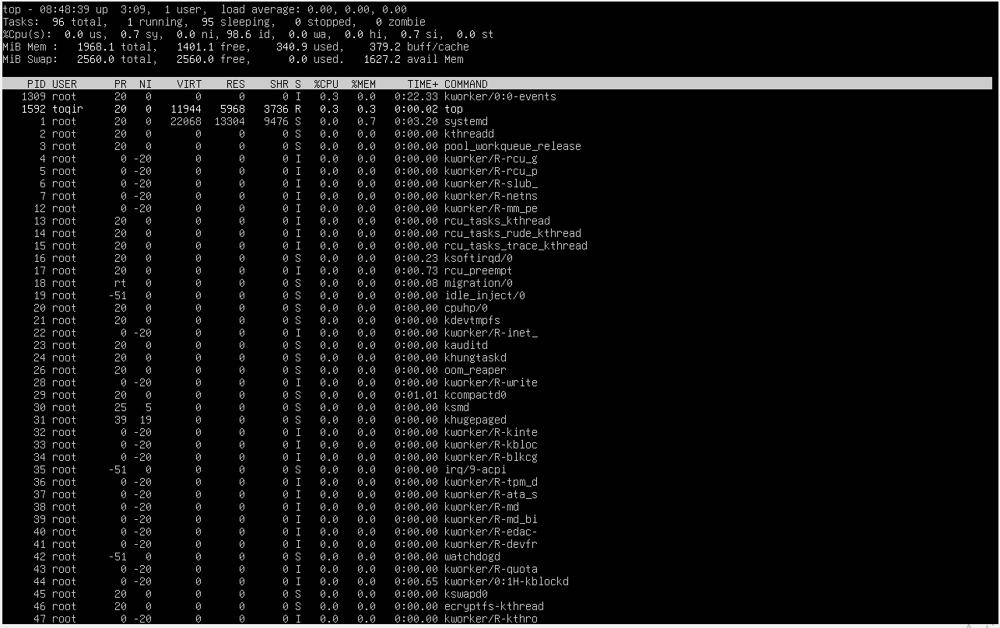
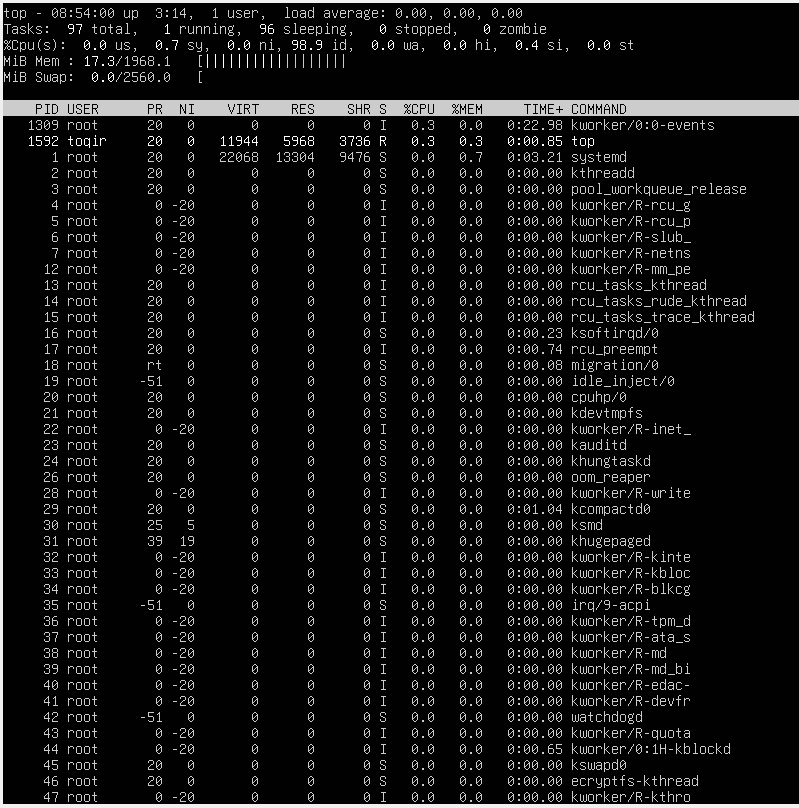
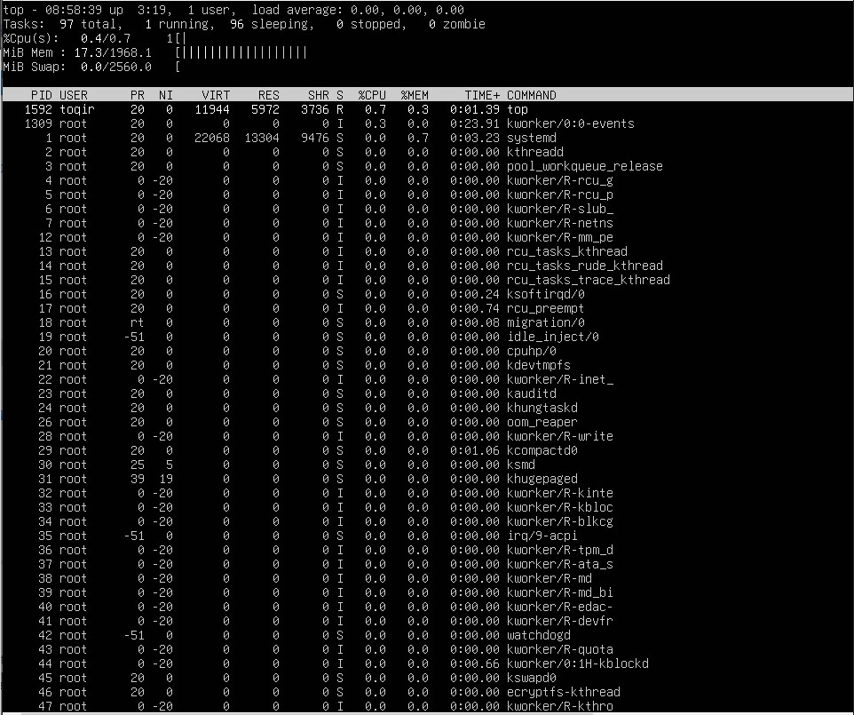

Analisis:
1. Proses apa yang berada di urutan pertama? Catat nilai %MEM dan RSS-nya. <br>
    jawab : <br>
    - proses teratas adalah /usr/libexec/fwupd/fwupd.

    - %MEM: 2.2%.

    - RSS: 44392 KB.

2. Konversikan RSS dari KB ke MB (bagi 1024). Misalnya, RSS=524288 berarti proses menggunakan 512 MB RAM. Apakah wajar untuk jenis program tersebut? <br>
    jawab : <br>
    - Konversi: 44392 / 1024 = 43.35 MB.  

    - Penggunaan sebesar 43.35 MB sangat wajar. fwupd adalah daemon sistem untuk pembaruan firmware. Untuk layanan latar belakang (background service) di Ubuntu, angka ini termasuk efisien dan tidak membebani RAM 2GB yang dimiliki.

3. Mengapa VSZ selalu lebih besar dari RSS pada proses yang sama? <br>
    jawab <br>
    - VSZ (Virtual Set Size) mencakup seluruh memori yang dialokasikan proses, termasuk library yang dipanggil namun belum tentu digunakan, serta bagian yang mungkin berada di swap. Sedangkan RSS (Resident Set Size): Hanya menghitung memori yang benar-benar menempati RAM fisik secara aktif.

    - Pada proses fwupd, VSZ-nya mencapai 617860 KB. Ini menunjukkan proses tersebut memesan ruang alamat yang besar, namun hanya 44392 KB (RSS) yang benar-benar memakan tempat di RAM fisik

4. Apakah urutan proses di ps konsisten dengan tampilan top saat diurutkan berdasarkan %MEM? <br>\
    jawab : <br>
    - Konsisten, namun bisa berbeda dalam waktu nyata (real-time).

    - keduanya konsisten mengurutkan berdasarkan penggunaan memori terbesar. Namun, pada Gambar 3 (tampilan top diurutkan M), muncul systemd (0.7%) dan top (0.3%) di urutan atas.

    - Perintah ps memberikan snapshot satu waktu (saat itu fwupd mungkin sedang aktif memindai), sedangkan top memperbarui data setiap beberapa detik secara dinamis. Jadi, perbedaan urutan antar gambar adalah hal yang wajar karena perubahan aktivitas proses di sistem.

#### Praktikum 10.5 Script Monitor Memori
Tujuan: mengotomasi pemantauan memori menggunakan Bash script.
1. Masuk ke direktori kerja dan buat file script:
```
cd ~/ praktikum - os / week10 - memory
nano monitor - memori . sh
```

2. Ketik script berikut:
``` 
#!/bin/bash
set -euo pipefail

echo "=== Monitor Memori==="
date
echo

free -h
echo

AVAIL =$(free | awk '/Mem/ {printf "%d", $7/$2*100}')
if [ "$AVAIL" -lt "$THRESHOLD" ]; then
    echo "PERINGATAN : Memori tersedia hanya ${AVAIL}%!"
else
    echo "Status : Memori tersedia ${ AVAIL }% (normal)"
fi
echo

echo " --- 5 Proses Memori Tertinggi ---"
ps aux --sort=-%mem | head -n 6 | tail -n 5
```

3. Beri izin dan jalankan:
```
chmod +x monitor-memori.sh
bash monitor-memori.sh
```
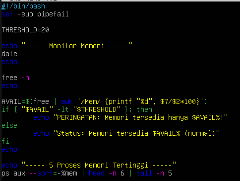
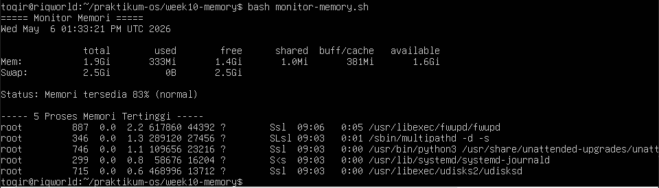

Analisis:
1. Variabel THRESHOLD=20 menetapkan batas persentase. Perintah free | awk ’/Mem/ {printf "%d", $7/$2*100}’ mengambil kolom ke-7 (available) dibagi kolom ke-2 (total) dari baris Mem, lalu dikalikan 100 untuk menghasilkan persentase bilangan bulat. <br>
    jawab : <br>
    - Variabel THRESHOLD=20: Menetapkan batas kritis ketersediaan memori sebesar 20%.

    - Mekanisme awk: Perintah free | awk '/Mem/ {printf "%d", $7/$2*100}' bekerja dengan cara mengambil nilai memori yang tersedia pada kolom ke-7, lalu membaginya dengan total memori pada kolom ke-2. Hasil pembagian dikalikan 100 untuk mendapatkan persentase dalam bentuk bilangan bulat berkat format %d.

2. Kondisi if [ "$AVAIL" -lt "$THRESHOLD" ] bernilai benar jika persentase memori tersedia di bawah 20.<br>
    jawab : <br>
    - Kondisi if [ "$AVAIL" -lt "$THRESHOLD" ] menggunakan operator -lt (less than).

    - Logika ini akan bernilai benar (true) jika persentase memori yang tersisa ($AVAIL) lebih kecil dari 20. Jika benar, script akan mengeksekusi perintah echo yang berisi pesan peringatan.

3. Ubah THRESHOLD menjadi 90 dan jalankan ulang. Apa yang berubah pada output? Mengapa demikian? <br>
    jawab : <br>
    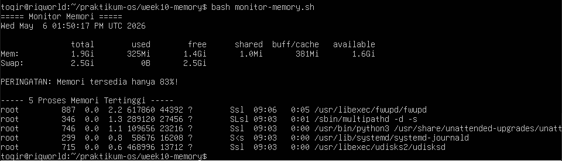
    - Script akan memunculkan pesan "PERINGATAN: Memori tersedia hanya 83%!" alih-alih status "normal".
    - Angka 84 ini lebih kecil daripada 90. Akibatnya, kondisi -lt (lebih kecil dari) terpenuhi, sehingga sistem menganggap memori sudah melewati batas aman dan memicu pesan peringatan.

#### Studi Kasus 10.2 Gagal Akses File
Skenario: Program tidak dapat membaca file konfigurasi. Penyebab umum: file tidak ada, path salah, atau permission tidak sesuai. Kita akan mensimulasikan kondisi ini dan mengamati pesan error yang dihasilkan.
1. Buat direktori dan file konfigurasi contoh.
```
mkdir -p ~/praktikum-os/week10-memory/syscall-case
cd ~/praktikum-os/week10-memory/syscall-case
echo "PORT=8080" > app.conf
ls -l app.conf
cat app.conf
```

2.  Simulasikan permission bermasalah.
```
chmod 000 app.conf
cat app.conf
```

3. Kembalikan permission dan verifikasi.
```
chmod 644 app.conf
cat app.conf
```
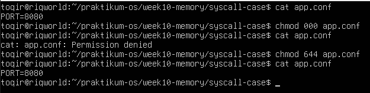

Analisis:
1. Mengapa cat menghasilkan Permission denied setelah chmod 000? System
call apa yang gagal? <br>
    jawab : <br>
    - Perintah chmod 000 mencabut seluruh hak akses (read, write, execute) dari semua level pengguna (owner, group, others). Karena cat membutuhkan hak akses read (r) untuk membaca isi file, sistem menolak permintaan tersebut.

    - Secara teknis, system call yang gagal adalah open(). Saat menjalankan cat, program tersebut mencoba memanggil kernel untuk membuka file tersebut, namun kernel memeriksa tabel permission dan mengembalikan error (Permission denied).

2. Apa perbedaan pesan error Permission denied vs No such file or directory? Coba rm app.conf lalu cat app.conf untuk melihat perbedaannya. <br>
    jawab :  <br>
    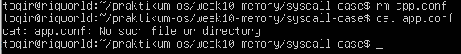
    - Permission denied: Berarti file tersebut ada di dalam sistem, tetapi pengguna yang sedang aktif tidak memiliki izin yang cukup untuk berinteraksi dengan file tersebut (seperti yang terjadi setelah chmod 000).

    - No such file or directory: Berarti file tersebut memang tidak ditemukan di lokasi yang dituju. Jika kamu melakukan rm app.conf (menghapus file) lalu menjalankan cat app.conf, sistem akan memberikan pesan ini karena inode file tersebut sudah tidak terdaftar lagi di direktori.

3. Permission 644 berarti apa untuk owner, group, dan others? <br>
    jawab :<br>
    - Angka 644 adalah representasi oktal dari hak akses berikut:
        - Owner (6): Berasal dari 4 (read) + 2 (write) = 6. Artinya, pemilik file bisa membaca dan mengubah isi file.
        - Group (4): Berasal dari 4 (read) saja. Artinya, anggota kelompok hanya bisa membaca file tanpa bisa mengubahnya.
        - Others (4): Berasal dari 4 (read) saja. Artinya, pengguna lain di luar pemilik dan grup hanya bisa membaca file tersebut.

#### Praktikum 10.6 Mengamati System Call dengan strace
Tujuan: melihat dan menganalisis system call yang dilakukan suatu perintah.

Perintah yang Digunakan:
- strace perintah: jalankan perintah sambil catat semua system call (argumen
dan nilai kembalian).
- strace -c perintah: tampilkan ringkasan statistik (jumlah pemanggilan,
waktu, error).

1.  Lihat 30 baris pertama system call dari perintah ls.
```
strace ls 2 >&1 | head -n 30
```
Setiap baris mengikuti format: namasyscall(argumen) = nilai_kembali.
Contoh interpretasi:
- openat(AT_FDCWD, "/etc/ld.so.cache", O_RDONLY) = 3: membuka file untuk dibaca, berhasil (file descriptor = 3).
- read(3, "...", 4096) = 1234: membaca hingga 4096 byte dari fd 3 berhasil membaca 1234 byte.
- close(3) = 0: menutup fd 3, berhasil.
- openat(. . . ) = -1 ENOENT: gagal karena file tidak ditemukan.

2.  Lihat ringkasan statistik dan bandingkan dua direktori berbeda.
```
strace -c ls
strace -c ls /etc 2>&1 | tail -5
```
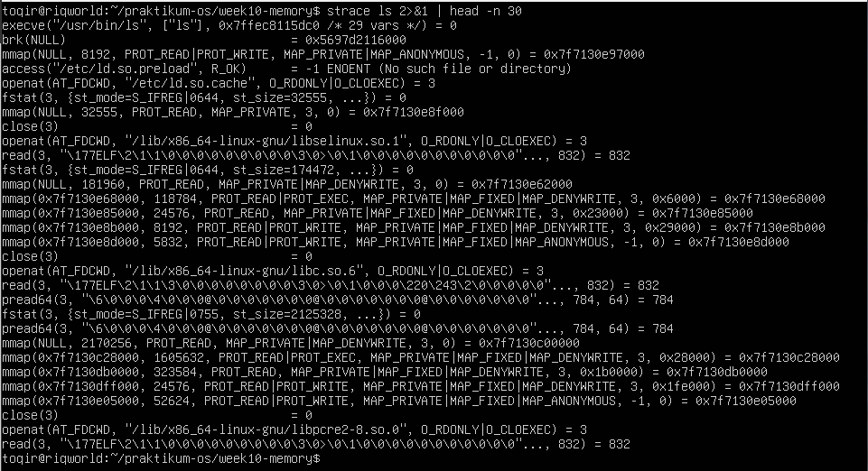
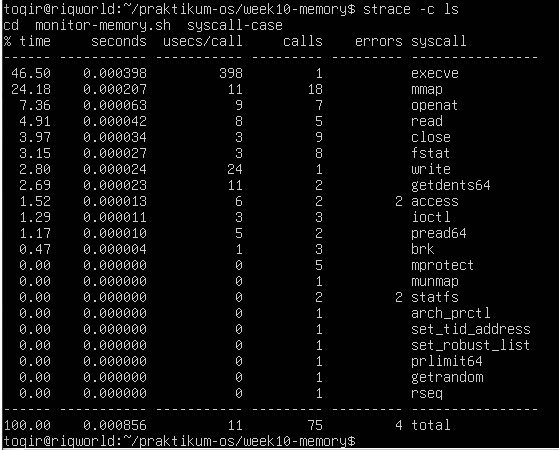
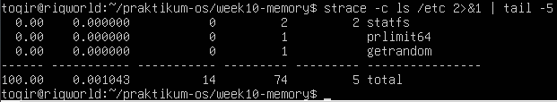

Analisis:
1. Dari output Langkah 1, identifikasi minimal 4 system call berbeda. Jelaskan fungsi singkat masing-masing berdasarkan argumen yang terlihat.<br>
    jawab : <br>
    - Identifikasi 4 System Call berbeda (Langkah 1):
        - execve: Digunakan di awal untuk mengeksekusi program (dalam hal ini /usr/bin/ls). Ia menerima argumen berupa path program, argumen perintah, dan variabel lingkungan (env).
        - brk: Digunakan untuk mengubah ukuran data segment atau mengatur alokasi memori (heap). Terlihat dipanggil dengan NULL untuk menanyakan batas memori saat ini.
        - openat: Digunakan untuk membuka file atau direktori. Terlihat membuka file sistem seperti /etc/ld.so.cache dan library di /lib/x86_64-linux-gnu/.
        - mmap: Digunakan untuk memetakan file atau perangkat ke dalam memori aplikasi. Sering terlihat digunakan untuk memuat shared libraries (.so) agar bisa digunakan oleh program ls

2. Dari ringkasan strace -c, system call mana yang paling sering dipanggil? <br>
Mengapa?<br>
    jawab : <br>
    - Paling sering: mmap dipanggil sebanyak 18 kali. 
    - Karena program ls perlu memuat banyak shared libraries agar bisa berjalan. Setiap library yang dibutuhkan akan dipetakan ke ruang memori proses menggunakan mmap. Selain itu, mmap juga digunakan untuk alokasi memori yang lebih besar daripada yang bisa ditangani oleh brk.


3. Apakah ada system call dengan errors lebih dari 0? Apakah itu berarti
program bermasalah, ataukah bagian normal dari logika program? <br>
    jawab : <br>
    - terdapat error pada access (2 error) dan statfs (2 error).
    - Ini adalah bagian normal dari logika program. Program sering kali mencoba mencari file konfigurasi atau library di beberapa lokasi standar. Jika tidak ketemu di lokasi pertama (menghasilkan error ENOENT), program akan mencoba lokasi berikutnya. Ini bukan berarti program rusak, melainkan cara program beradaptasi dengan lingkungan sistem.


4. Apakah jumlah system call berbeda antara ls dan ls /etc? Faktor apa yang menyebabkan perbedaan tersebut? <br>
    jawab : <br>
    - ls biasa: Total 75 calls.
    - ls /etc: Total 74 calls
    - perbedaan ini dipengaruhi oleh jumlah file dan sub-direktori di dalam folder tersebut. Direktori yang lebih padat (seperti /etc) akan memicu lebih banyak panggilan getdents64 (untuk membaca daftar file) dan stat atau lstat (untuk mengambil informasi detail file jika menggunakan opsi -l atau warna). Dalam hal ini, perbedaannya sangat tipis karena perintah yang dijalankan hanya ls sederhana tanpa opsi tambahan.

### 1.6 Tugas Praktikum 
Instruksi Umum: Kerjakan seluruh tugas pada direktori berikut.
```
mkdir -p ~/praktikum-os/week10-memory
cd ~/praktikum-os/week10-memory
```

#### Tugas 10.1 Audit Penggunaan Memori Sistem
Instruksi: Buat script memory-audit.sh yang menghasilkan laporan kondisi memori sistem secara otomatis.
```
nano ~/praktikum-os/week10-memory/memory-audit.sh
```
```
#!/bin/bash
set -euo pipefail

LAPORAN ="memory-report.txt "

{
    echo "=== LAPORAN MEMORI SISTEM ==="
    date
    echo
    echo " --- Ringkasan free -h ---"
    free -h
    echo
    echo " --- /proc/meminfo ---"
    cat/proc/meminfo | head -n 20
} > "$LAPORAN"

echo "Laporan disimpan ke: $LAPORAN"
cat "$LAPORAN"
```
```
chmod +x ~/praktikum-os/week10-memory/memory-audit.sh
cd ~/praktikum-os/week10-memory
bash memory - audit . sh
```
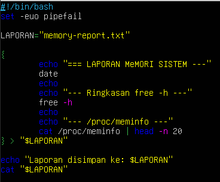
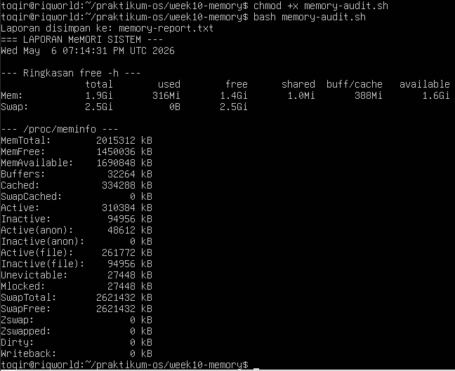

Analisis
1. Hitung persentase memori tersedia (available / total × 100%). Apakah sistem dalam kondisi normal? <br>
    Jawab : <br>
    - Berdasarkan ringkasan free -h, memori available adalah 1.6Gi dan total adalah 1.9Gi.
    - Perhitungan:$$\frac{1.6}{1.9} \times 100\% \approx 84,2\%$$
    - Sistem berada dalam kondisi Sangat Normal. Dengan ketersediaan memori di atas 80%, sistem memiliki ruang yang sangat luas untuk menangani proses baru tanpa risiko perlambatan atau penggunaan swap yang berlebihan.

2. Mengapa buff/cache tidak dihitung sebagai memori yang terpakai dari sudut pandang ketersediaan untuk aplikasi? <br>
    jawab : <br>
    - Dari sudut pandang ketersediaan aplikasi, buff/cache berisi data sementara yang digunakan kernel Linux untuk mempercepat akses ke sistem file. Namun, data ini bersifat "non-essential" dalam jangka pendek. Jika sebuah aplikasi membutuhkan RAM tambahan, kernel akan secara otomatis dan instan menghapus isi cache tersebut untuk dialokasikan ke aplikasi. Itulah sebabnya kapasitas ini digolongkan sebagai memori yang tersedia (available).

3. Dari /proc/meminfo, apakah SwapTotal lebih besar dari 0? Berapa nilai SwapFree? <br>
    jawab : <br>
    - Ya, nilai SwapTotal lebih besar dari 0, yaitu sebesar 2621432 KB (atau sekitar 2.5Gi).
    - Nilai SwapFree adalah 2621432 KB.
    - Karena nilai SwapTotal sama persis dengan SwapFree, ini menunjukkan bahwa penggunaan swap saat ini adalah 0 KB. Sistem sepenuhnya mengandalkan RAM fisik karena kapasitasnya masih sangat mencukupi.

#### Tugas 10.2 Identifikasi Proses dengan Memori Tertinggi
Instruksi: Simpan daftar 10 proses pengguna memori terbesar ke file.
'''
ps aux --sort=-%mem | head -n 10 > top-memory-process.txt
cat top-memory-process.txt
'''
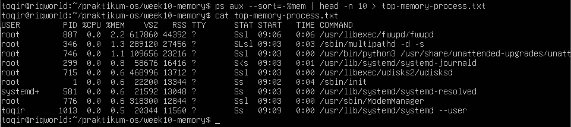

Analisis
1. Proses apa di urutan pertama? Catat nilai %MEM dan RSS. <br>
    jawab : <br>
    - Nama Proses (COMMAND): /usr/libexec/fwupd/fwupd
    - Nilai %MEM: 2.2
    - Nilai RSS: 44392 (dalam satuan KB)

2. Konversikan RSS ke MB (bagi 1024). Apakah wajar? <br>
    Jawab : <br>
    - Perhitungan:$$44392 / 1024 = 43,35 \text{ MB}$$
    - Nilai ini sangat wajar. Proses fwupd adalah layanan sistem (firmware update daemon) yang berjalan di latar belakang. Penggunaan memori sekitar 43 MB untuk layanan sistem pada OS Linux modern tergolong efisien dan ringan.

3. Jumlahkan %MEM dari 5 proses teratas. Berapa persen RAM yang mereka gunakan bersama? <br>
    Jawab : <br>
    - jumlahkan kolom %MEM dari lima baris pertama:
        1. fwupd                        : 2.2%
        2. multipathd                   : 1.3%
        3. python3 (unattended-upgrades): 1.1%
        4. systemd-journald             : 0.8%
        5. udisksd                      : 0.6%
        - Total Penjumlahan:
        $$2.2 + 1.3 + 1.1 + 0.8 + 0.6 = \mathbf{6.0\%}$$

    - Lima proses teratas secara kolektif hanya menggunakan 6% dari total RAM sistem. Hal ini menunjukkan beban kerja sistem saat ini sangat rendah dan manajemen memori berjalan dengan sangat baik.

#### Tugas 10.3 Membuat dan Memverifikasi Swap File
Instruksi: Buat swap file khusus tugas sebesar 256 MB dan verifikasi.
```
sudo fallocate -l 256M /swapfile-tugas-week10
sudo chmod 600 /swapfile-tugas-week10
sudo mkswap /swapfile-tugas-week10
sudo swapon /swapfile-tugas-week10
```
```
{
    echo "=== VERIFIKASI SWAP ==="
    swapon --show
    echo    
    free -h
} > swap-check.txt
cat swap-check.txt
```
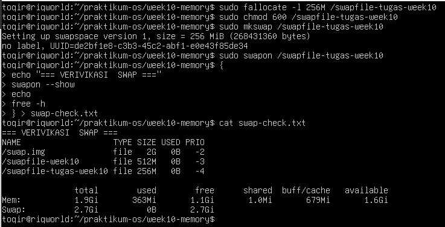

Analisis
1. Identifikasi kolom NAME, TYPE, SIZE, dan USED pada output swapon -–show. <br>
    jawab : <br>
    - NAME: /swapfile-tugas-week10
    - TYPE: file
    - SIZE: 256M
    - USED: 0B

2. Apakah nilai total pada baris Swap di free -h bertambah 256 MB? <br>
    jawab : <br>
    - Ya, nilai tersebut bertambah sesuai kapasitas swap file baru.
    - Sebelum tugas ini (Tugas 10.1), total swap adalah 2.5Gi. Setelah mengaktifkan swap file tambahan sebesar 256 MB, total swap yang terlihat kini menjadi 2.7Gi.

3. Mengapa permission 600 penting? Apa risiko jika diatur ke 644? <br>
    Jawab : <br>
    - Permission 600 (-rw-------) memastikan bahwa hanya pengguna root yang memiliki hak akses baca dan tulis terhadap swap file tersebut. Hal ini sangat krusial karena swap file berisi salinan data dari RAM fisik yang mungkin mencakup informasi sensitif seperti kata sandi, kunci enkripsi, atau data pribadi yang sedang diproses oleh aplikasi.
    - Jika diatur ke 644 (-rw-r--r--), maka pengguna biasa di dalam sistem (selain root) memiliki hak akses baca (read) terhadap file tersebut.
        - Dampak Keamanan: Pengguna tidak berwenang dapat membaca isi swap dan melakukan ekstraksi data sensitif milik pengguna lain atau sistem, yang mengakibatkan kebocoran informasi serius.

#### Tugas 10.4 Analisis System Call dengan strace
 Instruksi: Analisis system call yang dipanggil perintah ls.
```
strace -c ls 2> strace-summary.txt
strace ls /etc 2> strace-ls-etc.txt
cat strace-summary.txt
```
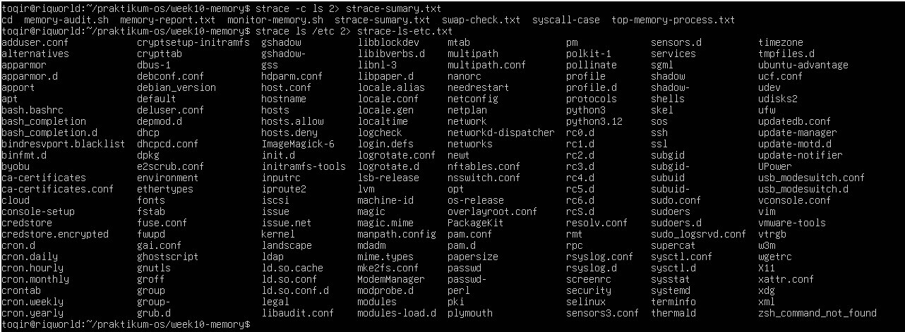
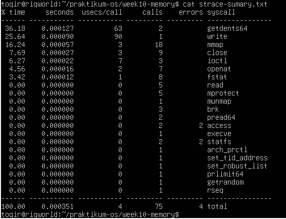

Analisis
1. Sebutkan minimal 5 system call dari strace-summary.txt beserta fungsi
singkatnya. <br>
    jawab : <br>
    - berikut adalah 5 system call yang digunakan oleh perintah ls:
        1. getdents64: Berfungsi untuk membaca struktur direktori (mengambil daftar file/folder di dalam suatu lokasi).
        2. write: Berfungsi untuk menuliskan data ke output, dalam hal ini menampilkan teks daftar file ke layar terminal.
        3. mmap: Berfungsi untuk memetakan file atau perangkat ke dalam memori (sering digunakan untuk memuat library sistem).
        4. openat: Berfungsi untuk membuka sebuah file atau direktori guna mendapatkan file descriptor.
        5. close: Berfungsi untuk menutup file descriptor yang sudah tidak digunakan agar sumber daya sistem kembali bebas.

2. System call mana yang paling sering dipanggil? Mengapa? <br>
    jawab : <br>
    - Berdasarkan kolom calls, system call mmap adalah yang paling sering dipanggil, yaitu sebanyak 18 kali.
    - Hal ini terjadi karena setiap kali perintah ls dijalankan, sistem perlu memetakan berbagai library pendukung (seperti libc atau library bahasa lainnya) dari penyimpanan fisik ke dalam ruang alamat memori agar program bisa berjalan dengan lengkap.

3. Apakah ada errors lebih dari 0? Apakah program tetap berjalan normal
meskipun ada kegagalan tersebut? <br>
    jawab : <br>
    - Ya, terdapat errors lebih dari 0, yaitu pada system call access (2 errors) dan statfs (2 errors).
    - Program ls tetap berjalan dengan normal meskipun terdapat kegagalan tersebut. Dalam sistem Linux, kegagalan pada access sering kali hanyalah cara program memeriksa keberadaan sebuah file konfigurasi opsional (seperti .ld.so.preload). Jika file tersebut tidak ditemukan (error ENOENT), program akan mengabaikannya dan melanjutkan eksekusi ke langkah berikutnya tanpa menghentikan proses utama.

#### Tugas 10.5 Studi Kasus Diagnosa Server Lambat
Skenario: Server terasa lambat. Buat script diagnosa yang menggabungkan semua pemeriksaan dari bab ini menggunakan fungsi Bash.
1. Buka file dengan nano
```
nano ~/praktikum-os/week10-memory/diagnosa-server.sh
```

2. Isi file diagnosa-server.sh
```
#!/bin/bash
set -euo pipefail

LAPORAN="diagnosa-server-lambat.txt"
WARN_MEM=false
WARN_SWAP=0

cek_memori () {
    echo "--- Kondisi Memori ---"
    free -h
    echo
    AVAIL_PCT=$(free | awk '/Mem/ {printf "%d" , $7/$2*100}')
    if [ "$AVAIL_PCT" -lt 20 ]; then
        echo "PERINGATAN: Memori tersedia hanya ${AVAIL_PCT}%"
        WARN_MEM=true
    fi
} 

cek_swap () {
    echo "--- Penggunaan Swap ---"
    swapon --show 2>/dev/null || echo "Tidak ada swap aktif"
    echo
    WARN_SWAP=$(free | awk '/Swap/ {print $3}')
    if [ "$WARN_SWAP" -gt 0 ]; then
        echo "INFO: Swap digunakan (${WARN_SWAP} kB)"
    fi
}

cek_proses () {
    echo "--- 10 Proses Memori Tertinggi ---"
    ps aux --sort=-%mem | head -n 11
    echo
}

cek_paging () {
    echo "--- Aktivitas Paging (5 sampel) ---"
    vmstat 1 5
    echo
}

ringkasan () {
    echo "=== RINGKASAN ==="
    if [ "$WARN_MEM"=true ]; then
        echo "- Memori : KRITIS - perlu tindakan segera"
    else
        echo "- Memori : normal"
    fi

    if [ "$WARN_SWAP" -gt 0 ]; then
        echo "- Swap : aktif - pantau aktivitas paging"
    else
        echo "- Swap : tidak digunakan"
    fi
}

{
    echo "=== LAPORAN DIAGNOSA SERVER ==="
    date
    echo
    cek_memori
    cek_swap
    cek_proses
    cek_paging
    ringkasan
} | tee "$LAPORAN"

echo
echo "Laporan disimpan ke: $LAPORAN"
```

3. Jalankan script diagnosa
```
chmod +x ~/praktikum-os/week10-memory/diagnosa-server.sh
cd ~/praktikum-os/week10-memory
bash diagnosa-server.sh
```
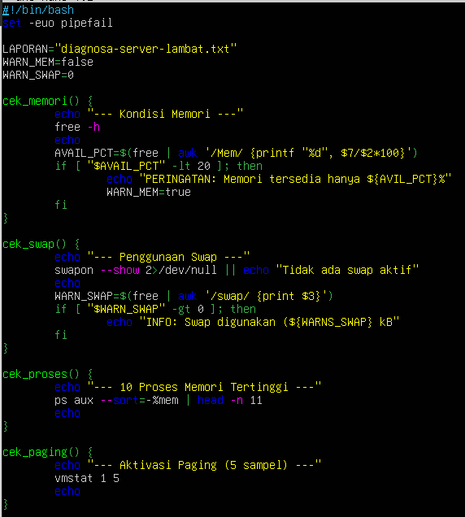
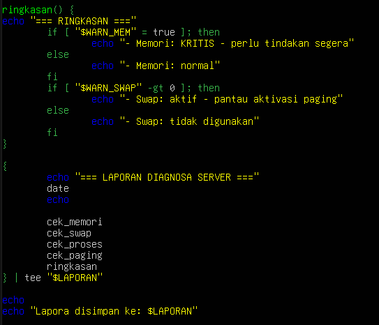
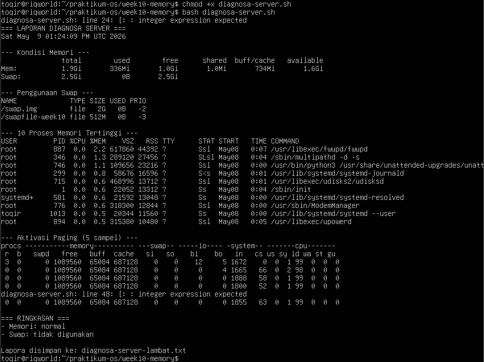

Analasis
1. Jelaskan peran masing-masing fungsi: cek_memori, cek_swap, cek_proses, cek_paging, dan ringkasan. Mengapa diagnosa dipecah menjadi fungsi terpisah? <br>
    jawab : <br>
    - cek_memori: Menganalisis kapasitas RAM fisik yang tersedia dan menghitung persentasenya terhadap total memori.
    - cek_swap: Mengidentifikasi apakah ada partisi/file swap yang aktif dan berapa kapasitas yang sedang digunakan.
    - cek_proses: Menampilkan 10 proses teratas yang paling banyak mengonsumsi memori untuk mendeteksi adanya memory leak atau proses berat.
    - cek_paging: Memantau aktivitas keluar-masuk data antara RAM dan disk (swap) dalam interval waktu tertentu menggunakan vmstat.
    - ringkasan: Memberikan kesimpulan akhir mengenai status kesehatan sistem berdasarkan hasil pengecekan sebelumnya.
    - Alasan Pemisahan: <br>
        Diagnosa dipecah menjadi fungsi terpisah agar kode lebih terstruktur (modular), mudah dibaca, dan mempermudah proses debugging jika terjadi kesalahan pada salah satu bagian pengecekan tanpa mengganggu bagian lainnya.

2. Berdasarkan bagian RINGKASAN, apakah kondisi sistem normal atau kritis? <br>
Jelaskan berdasarkan nilai threshold yang digunakan script. <br>
    jawab : <br>
    - Sistem berada dalam kondisi Normal.
    - Script menggunakan ambang batas (threshold) 20% untuk memori tersedia. Karena memori yang tersedia adalah 1.6Gi dari total 1.9Gi (sekitar 84%), nilai ini jauh di atas batas minimal 20%, sehingga sistem tidak dianggap kritis.

3. Mengapa script menggunakan tee "$LAPORAN" bukan redirection biasa > "$LAPORAN"? Apa keuntungannya? <br>
    jawab : <br>
    - Perintah tee memungkinkan output ditampilkan secara bersamaan di layar terminal dan disimpan ke dalam file laporan. Jika hanya menggunakan redirection biasa (>), output hanya akan masuk ke file tanpa muncul di layar, sehingga pengguna tidak bisa melihat hasil diagnosa secara langsung saat script berjalan.

4. Dari output cek_paging, apakah ada aktivitas si atau so? Jika ada, apa implikasinya terhadap performa server? <br>
    jawab : <br>
    - Pada output vmstat, nilai pada kolom si (swap-in) dan so (swap-out) semuanya adalah 0.
    - Nilai 0 menunjukkan tidak ada aktivitas paging yang terjadi. Implikasinya terhadap performa server sangat positif. Server berjalan cepat karena seluruh data diproses langsung di RAM tanpa harus menunggu proses baca-tulis yang lambat pada media penyimpanan (disk) melalui mekanisme swap.