# LAPORAN PRAKTIKTUM SISTEM OPERASI JOBSHEET 11

<h4> Nama : Muhammad Toriq Januarsyah<h4>
<h4> NIM : 254107020075<h4>
<h4> Kelas : TI 1-H <h4>

## 1. Manajemen File & User/Group
### 1.1  Sistem Kontrol Akses (Permissions)
#### Praktikum 9.1 — Permissions
1. Buat direktori kerja dan dua file uji.
```
mkdir ~/lab-permissions && cd ~/lab-permissions
echo "data rahasia" > secret.txt
echo '#!/bin/bash' > myscript.sh
echo 'echo Hello' >> myscript.sh
ls -la
```

2. Jadikan secret.txt privat hanya untuk owner
```
chmod 600 secret.txt
ls -l secret.txt
```

3.  Jadikan myscript.sh dapat dijalankan.
```
chmod 755 myscript.sh
ls -l myscript.sh
./ myscript.sh
```

4.  Buat direktori bersama dan amati efek SGID sederhana.
```
mkdir shared - dir
chmod g+s shared-dir
ls -ld shared-dir
```

5. Uji efek umask pada file baru.
```
umask
umask 027
touch testfile-027
ls -l testfile-027
```
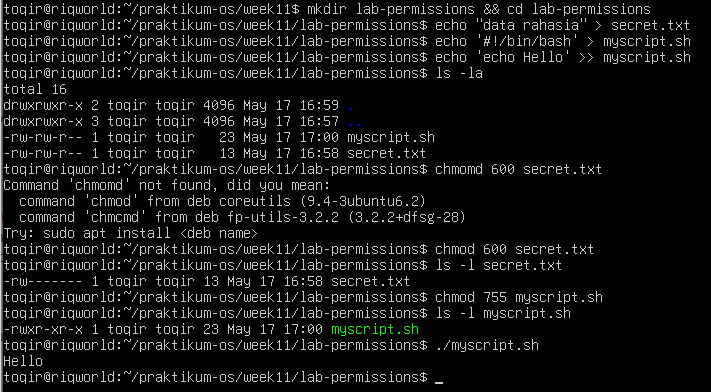
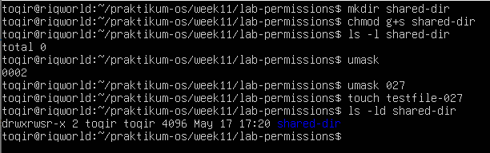

- Analisis
    1. Mengapa secret.txt tidak dapat dibaca oleh group dan others setelah chmod 600?
        - Perintah chmod 600 mengubah representasi izin akses menggunakan format oktal(angka bilangan berbasis 8).
            1) Angka pertama (6) untuk Owner: Berarti 4 (read) + 2 (write) = 6 (Read & Write).
            2) Angka kedua (0) untuk Group: Berarti tidak ada izin sama sekali (---).
            3) Angka ketiga (0) untuk Others: Berarti tidak ada izin sama sekali (---).
        - Dengan menetapkan nilai 0 pada posisi Group dan Others, kernel Linux secara mutlak mencabut seluruh hak akses membaca (read), menulis (write), maupun mengeksekusi (execute) bagi siapa pun selain pemilik file (owner). Hal ini membuat file bersifat privat penuh.

    2. Apa perbedaan arti 600 dan 755 terhadap file yang diuji?
        - Perbedaan utamanya terletak pada distribusi hak akses dan kemampuan eksekusi berkas (executability).
            1) Izin 600 (Diterapkan pada file teks secret.txt):
                - Owner memiliki hak membaca dan memodifikasi isi file (rw-), namun tidak bisa mengeksekusinya sebagai program.
                - Group dan Others tidak bisa melihat atau menyentuh file tersebut (---). Ini cocok untuk dokumen sensitif/konfigurasi rahasia.
            2) Izin 755 (Diterapkan pada berkas script myscript.sh):
                - Owner mendapatkan hak penuh: 4 (read) + 2 (write) = 1 (execute) = 7 (rwx).
                - Group dan Others mendapatkan hak membaca dan mengeksekusi: 4 (read) + 1 (execute) = 5 (r-x). Mereka bisa menjalankan script tersebut di terminal namun tidak bisa mengubah baris kodenya. Ini adalah standar untuk file eksekusitabel/program publik.

    3. Setelah umask 027, permission apa yang dihasilkan untuk file baru, dan mengapa bukan 777?
        - Berdasarkan hasil perintah ls -l testfile-027, permission yang dihasilkan untuk file baru adalah -rw-r----- (atau setara dengan nilai oktal 640).
        - Alasan Mengapa Bukan 777: <br> 
        Secara default, kernel Linux menetapkan izin dasar maksimal untuk file biasa (regular file) yang baru lahir sebesar 666 (bukan 777) demi alasan keamanan (agar file teks biasa tidak otomatis bisa dieksekusi sebagai program).
        - Nilai umask 027 berfungsi sebagai filter/topeng pengurang. <br>
        Cara menghitungnya: Izin Dasar - Nilai Umask = Hasil Akhir <br>
        666 - 027 = 640(rw-r-----)
        - Oleh karena itu, owner mendapatkan rw- (6), group mendapatkan r-- (4), dan others diblokir total --- (0). Nilai akhir tidak akan pernah menyentuh 777 karena umask bertugas menyaring hak akses dari batas dasar file (666), bukan menambahkannya.

- Tantangan <br>
    Ubah owner atau group salah satu file uji ke akun atau group lain yang tersedia di sistem, kemudian jelaskan perubahan output ls -l sebelum dan sesudahnya.
    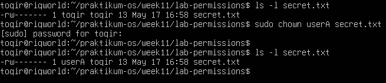
    1. Identifikasi Output Sebelum dan Sesudah Perubahan 
        - Sebelum Perubahan (ls -l secret.txt awal): <br>
            Kolom ketiga pada output menunjukkan nama user asli. Ini menandakan bahwa saya adalah pemilik sah berkas tersebut dan memegang kendali penuh atas izin akses -rw-------.
        - Sesudah Perubahan (ls -l secret.txt akhir): <br>
            Kolom ketiga berubah menjadi userA (misalnya menjadi: -rw------- 1 userA mahasiswa ... secret.txt).
        - Perubahan ini membuktikan bahwa Linux berhasil memindahkan hak kepemilikan (owner identity) ke userA. <br>
        Dampak kritis dari perubahan ini terhadap keamanan adalah: <br>
        karena berkas tersebut memiliki permission 600 (-rw-------), maka sekarang hanya userA yang memiliki hak untuk membaca dan menulis isi file secret.txt. Akun utama yang tadinya membuat file tersebut kini justru akan terkena eror Permission Denied jika mencoba membaca isinya sendiri (cat secret.txt), karena sudah bukan lagi bertindak sebagai owner, melainkan sudah turun kasta menjadi others bagi file tersebut.


#### Praktikum 9.2 — ACL
Tujuan: memahami ACL dari nol: melihat kondisi awal, menambah akses untuk satu user, lalu membuat direktori yang mewariskan ACL otomatis <br>
1.  Siapkan file dan lihat permission standar tanpa ACL tambahan.
```
mkdir ~/lab-acl && cd ~/lab-acl
echo "Data penting" > confidential . txt
chmod 640 confidential.txt
ls -l confidential.txt
getfacl confidential.txt
```
Pada tahap ini, getfacl hanya menampilkan tiga entri dasar: owner, group, dan others. Belum ada named user
atau named group.


2. Beri akses baca ke satu user tertentu tanpa mengubah owner atau group
```
setfacl -m u:userA:r confidential.txt
ls -l confidential.txt
getfacl confidential.txt
```
Perhatikan dua perubahan: <br>
    • output ls -l menampilkan tanda +; <br>
    • output getfacl kini memiliki entri user:userA:r–.

3. Buat direktori bersama yang mewariskan ACL ke file baru
```
mkdir shared
setfacl -d -m u:userA:rwx shared
setfacl -d -m u:userB:r-x shared
getfacl shared

touch shared/inherited.txt
getfacl shared/inherited.txt
```
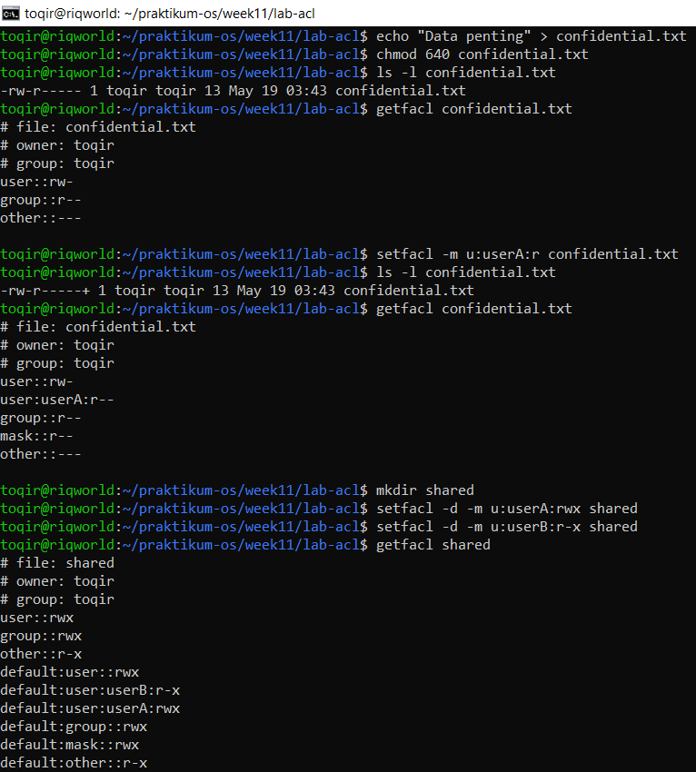
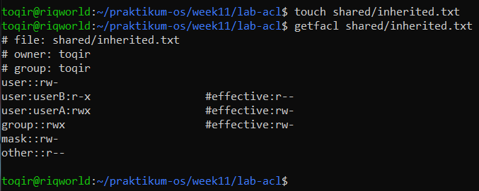

- Analisis
1. Mengapa getfacl confidential.txt awalnya tidak menampilkan user tertentu?
    - Pada kondisi awal, berkas confidential.txt baru saja dibuat dan hanya dimodifikasi menggunakan perintah chmod 640. Perintah tersebut menggunakan model kontrol akses Unix tradisional yang hanya mengenal tiga identitas dasar: owner, group, dan others. Karena belum ada aturan akses eksternal granular (named user atau named group) yang ditambahkan menggunakan perintah setfacl, maka getfacl secara logis hanya menampilkan pemetaan standar dari ketiga entitas dasar Unix tersebut.

2. Setelah setfacl -m u:userA:r confidential.txt, apa perbedaan output ls -l dan getfacl?
    - Output ls -l: <br>
        Menampilkan string perizinan konvensional, tetapi di ujung paling kanan karakter permission kini muncul tanda tambah (+), seperti -rw-r-----+. Tanda ini adalah indikator sistem bahwa berkas tersebut telah memiliki aturan keamanan lanjutan (ACL).
    - Output getfacl: <br>
        Menampilkan rincian metadata yang jauh lebih granular. Berbeda dari kondisi awal, sekarang muncul baris entri khusus baru yaitu user:userA:r-- yang menegaskan bahwa userA secara spesifik diberikan hak akses membaca berkas tersebut.

3. Mengapa file inherited.txt mewarisi ACL dari direktori shared?
    - Berkas inherited.txt dapat mewarisi aturan akses tersebut karena pada langkah sebelumnya, direktori induk shared telah dikonfigurasi menggunakan opsi -d (--default) melalui perintah setfacl -d -m. Di dalam arsitektur Linux, Default ACL merupakan aturan khusus yang ditempelkan pada direktori agar setiap objek baru (baik berkas maupun sub-direktori) yang diciptakan di dalamnya secara otomatis mengadopsi (inherit) cetak biru perizinan yang sama tanpa perlu dikonfigurasi ulang satu per satu.

- Tantangan
Tambahkan satu ACL lagi agar group readonly-group hanya dapat membaca confidential.txt. Setelah itu, hapus ACL untuk userA dan verifikasi hasil akhirnya dengan getfacl.
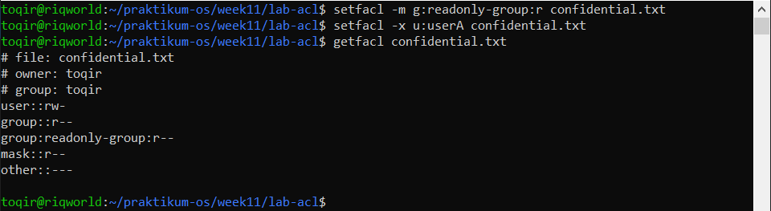

#### Praktikum 9.3A — Membuat dan Mengelola User
Tujuan: membuat user baru, memodifikasi propertinya, dan memahami perbedaan opsi useradd dan usermod.
```
# buat dua user
sudo useradd -m -s /bin/bash userA
sudo useradd -m -s /bin/bash userB
sudo passwd userA
sudo passwd userB

# verifikasi
id userA
getent passwd userA

# modifikasi shell userA
sudo usermod -s /bin/zsh userA
getent passwd userA

# lock dan unlock userB
sudo usermod -L userB
sudo passwd -S userB
sudo usermod -U userB
sudo passwd -S userB
```
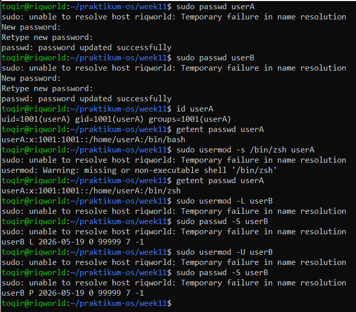

- Pertanyaan: 
1. Apa perbedaan output id userA sebelum dan sesudah menambah group?
    - Sebelum menambah group: <br>
    Pengguna userA hanya memiliki satu baris grup yang identik dengan nama dirinya, yang bertindak sekaligus sebagai grup utama (primary group).
    - Sesudah menambah group (Melalui kerangka teoritis usermod -aG): <br>
    Nilai komponen uid (User ID) dan gid (Group ID utama) dipastikan tidak akan mengalami perubahan sama sekali. Perbedaan mendasar hanya akan muncul pada bagian akhir baris, di mana parameter entri groups= akan memanjang karena mencantumkan nama atau ID grup-grup sekunder baru (misalnya labgroup dan readonly-group) tempat userA didaftarkan.

2. Bagaimana status passwd -S userB berubah saat akun di-lock?
    - Saat akun di-lock (usermod -L): <br>
    Output string baris menunjukkan status userB L 2026-05-19 0 99999 7 -1. Huruf L di sana secara eksplisit menandakan status Locked (Terkunci). Secara teknis, sistem menambahkan tanda seru (!) di depan enkripsi hash password pada file /etc/shadow untuk menolak akses masuk.
    - Saat akun di-unlock (usermod -U): <br>
    Output string baris kembali berubah menjadi userB P 2026-05-19 0 99999 7 -1. Huruf P di sana menegaskan status Usable Password (Kata sandi aktif dan dapat digunakan kembali secara normal).
    
####  Praktikum 9.3B — Group Management
Tujuan: membuat group, menambahkan user ke group, dan memverifikasi keanggotaan.
```
# buat dua group
sudo groupadd labgroup
sudo groupadd readonly-group

# tambahkan userA ke kedua group
sudo usermod -aG labgroup,readonly-group userA

# tambahkan userB hanya ke readonly - group
sudo usermod -aG readonly-group userB

# verifikasi
id userA
id userB
getent group labgroup
getent group readonly-group
```
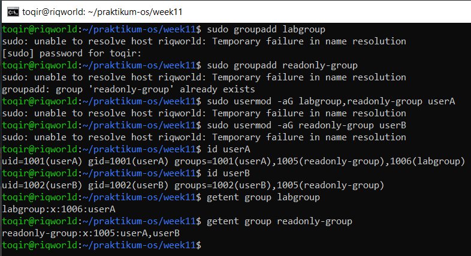

- Pertanyaan: 
1. Apa yang ditampilkan id userA vs groups userA?
    - Perintah id userA: <br>
        menunjukkan string data yang sangat lengkap, yaitu: uid=1001(userA) gid=1001(userA) groups=1001(userA),1005(readonly-group),1006(labgroup) Utilitas ini secara rinci memetakan data numerik dan nama teks dari tiga komponen sekaligus: uid (User ID), gid (Primary Group ID), serta groups yang mengombinasikan seluruh grup utama dan grup sekunder (supplementary groups) milik userA beserta nilai Group ID (GID) masing-masing.
    - Perintah groups userA: <br>
        perintah ini hanya akan memuntahkan sebaris representasi nama kelompok saja tanpa memunculkan atribut angka biner atau GID, dengan format output: userA : <br>
        userA readonly-group labgroup <br>
        Output ini jauh lebih ringkas dan hanya ditujukan untuk pembacaan cepat oleh manusia (human-readable).

2. Mengapa -a pada usermod -aG penting? <br>
    Kombinasi opsi -a (singkatan dari append) bersama parameter -G pada perintah usermod -aG memegang peran yang sangat krusial dalam menjaga integritas data keamanan pengguna.
    - Pentingnya opsi -a:<br>
     Opsi ini menginstruksikan sistem Linux untuk menambahkan grup sekunder baru (labgroup dan readonly-group) ke dalam catatan akun pengguna tanpa menghapus atau mengganggu keanggotaan grup sekunder lain yang sudah dimiliki oleh user tersebut sebelumnya.
    - Konsekuensi jika -a dilepas: <br> 
    Jika kamu secara tidak sengaja hanya mengetikkan usermod -G, Linux akan menjalankan operasi penggantian secara absolut. Dampak buruknya, seluruh daftar kelompok sekunder lama yang sudah susah payah dikonfigurasi sebelumnya akan langsung terhapus secara permanen dari akun tersebut dan digantikan hanya oleh grup yang baru ditulis.

#### Praktikum 9.3C — Password Aging Policy
Tujuan: menerapkan kebijakan umur password dan mengamati efeknya.
```
# set aging policy untuk userA
sudo chage -M 60 -W 7 -m 1 userA
sudo chage -l userA

# paksa userA ganti password saat login pertama
sudo chage -d 0 userA

# kunci password userB
sudo passwd -l userB
sudo passwd -S userB

# unlock kembali
sudo passwd -u userB
sudo passwd -S userB
```
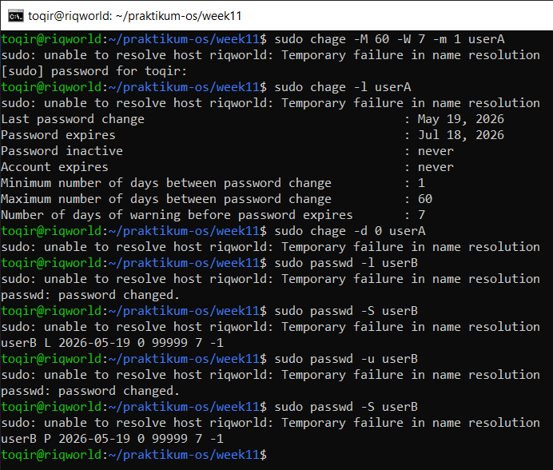

- Pertanyaan:
1. Apa arti nilai yang ditampilkan chage -l userA? <br>
    Berdasarkan tangkapan layar terminal, luaran dari perintah sudo chage -l userA menampilkan ringkasan kebijakan penuaan kata sandi (password aging policy) yang mencerminkan parameter dari eksekusi perintah sudo chage -M 60 -W 7 -m 1 userA sebelumnya:
    - Last password change : May 19, 2026: Menunjukkan tanggal terakhir kali userA memperbarui kata sandinya (yaitu hari ini, tanggal 19 Mei 2026).
    - Password expires : Jul 18, 2026: Kata sandi akan kedaluwarsa pada tanggal 18 Juli 2026. Tanggal ini didapat secara logis dari hitungan 60 hari setelah tanggal pembaruan terakhir (May 19, 2026 + 60 hari).
    - Password inactive : never & Account expires : never: Akun sandi dan eksistensi user tidak akan pernah dinonaktifkan secara otomatis oleh sistem karena opsi -I dan -E tidak diatur.
    - Minimum number of days between password change : 1: Pengguna userA wajib menunggu minimal 1 hari setelah mengubah sandi jika ingin mengubahnya kembali.
    - Maximum number of days between password change : 60: Batas maksimal masa berlaku kata sandi adalah 60 hari sebelum wajib diganti.
    - Number of days of warning before password expires : 7: Sistem akan memunculkan pesan peringatan di terminal mulai dari 7 hari sebelum masa kedaluwarsa kata sandi habis.

2. Bagaimana cara membuktikan userB terkunci dari output passwd -S? <br>
    Cara membuktikannya adalah dengan memperhatikan indikator bendera status (status flag) pada posisi kolom kedua hasil luaran perintah sudo passwd -S userB:
    - Saat Akun Terkunci: <br>
        Baris data memunculkan hasil userB L 2026-05-19 0 99999 7 -1. Keberadaan huruf L secara mutlak menjadi bukti autentik di Linux bahwa status manajemen kata sandi akun tersebut berada dalam posisi Locked (Terkunci/Dinonaktifkan).
    - saat Akun Dibuka Kembali: <br>
        Setelah dijalankan perintah sudo passwd -u userB, status berubah kembali menjadi userB P 2026-05-19 0 99999 7 -1. Huruf P membuktikan bahwa akun sudah kembali ke posisi Password usable (Aktif dan dapat digunakan kembali).

3. Kapan sebaiknya menggunakan chage -d 0 vs passwd -e? <br>
    Meskipun secara fungsional kedua perintah tersebut memiliki tujuan akhir yang sama—yakni memaksa pengguna melakukan pergantian kata sandi baru pada kesempatan login berikutnya—terdapat perbedaan konteks penggunaan yang ideal:
    - chage -d 0 (Ideal untuk Otomatisasi & Berbasis Hari): <br>
        skrip otomatisasi pendaftaran pengguna massal atau ketika administrator ingin memanipulasi catatan waktu perubahan sandi ke titik mula (Epoch Unix atau hari ke-0). Opsi -d ini fleksibel karena jika argumennya diganti angka lain (misal -d 5), admin bisa memanipulasi tanggal spesifik kapan sandi terakhir diubah.
    - passwd -e (Ideal untuk Penanganan Cepat / Ad-hoc): <br>
        Sebaiknya digunakan ketika administrator perlu melakukan intervensi keamanan mendadak secara langsung via command-line pada satu pengguna spesifik (misalnya setelah insiden kebocoran akun). Perintah passwd -e (expire) jauh lebih mudah diingat secara intuitif dan langsung menargetkan status kedaluwarsa kata sandi saat itu juga tanpa perlu berurusan dengan parameter kalkulasi angka hari.

- Tantangan
Buat user bernama intern yang: <br>
    • memiliki shell /bin/bash; <br>
    • menjadi anggota labgroup; <br>
    • dipaksa ganti password pada login pertama; <br>
    • password expired setelah 45 hari dengan warning 7 hari sebelumnya. <br>
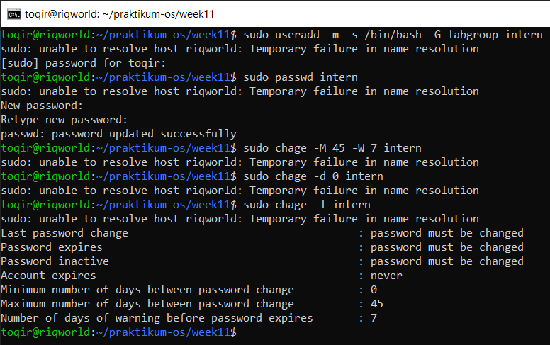

#### Praktikum 9.4 — Konfigurasi sudo
Tujuan: membuat aturan sudo terbatas, memverifikasi hak akses, dan membaca log.
1.  Buat file konfigurasi sudo khusus untuk userA.
```
sudo visudo -f / etc / sudoers . d / lab - userA
```
Perintah ini membuka editor aman khusus untuk file sudoers baru. Jika sintaks salah, visudo akan memperingatkan sebelum file disimpan.
Isi file dengan aturan berikut:
```
userA ALL=(root) NOPASSWD: /usr/bin/apt update, /usr/bin/apt upgrade
userA ALL=(root) /bin/systemctl status *
```
Baris pertama berarti userA boleh menjalankan dua perintah apt tanpa password. Baris kedua berarti userA boleh melihat status service apa pun, tetapi tetap mengikuti kebijakan autentikasi normal.

2.  Verifikasi aturan yang aktif dan uji hasilnya.
```
sudo -l -U userA
sudo grep "userA" /var/log/auth.log | tail-10
```
sudo -l -U userA dipakai untuk mengecek aturan yang aktif dari sudut pandang akun userA. Log di
/var/log/auth.log membantu memverifikasi bahwa pemakaian sudo benar-benar tercatat. <br>
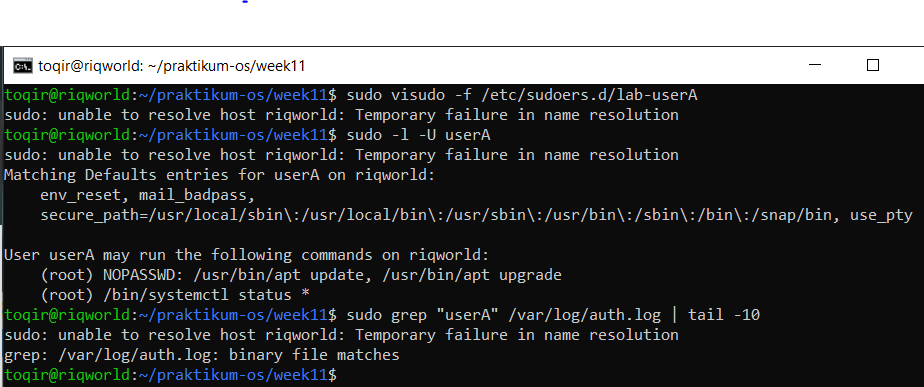
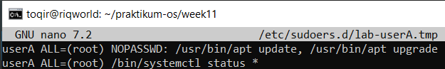

- Analisis
nalisis
1. Mengapa aturan disimpan di /etc/sudoers.d//, bukan langsung di /etc/sudoers? <br>
    Penyimpanan file konfigurasi secara terpisah di dalam direktori /etc/sudoers.d/ menerapkan prinsip modularitas sistem dan merupakan standar praktik keamanan (security best practice) karena beberapa alasan krusial: 
    - Keamanan Sistem (Isolation): <br>
        Menghindari risiko kerusakan fatal pada file utama /etc/sudoers. Jika terjadi kesalahan pengetikan di file terpisah, dampaknya hanya mengunci hak akses pengguna terkait (userA), bukan merusak sistem hak akses sudo seluruh komputer secara global.
    - Kemudahan Manajemen Ekosistem: <br>
        Memudahkan administrator untuk menambah, mengubah, atau mencabut hak akses suatu pengguna atau aplikasi cukup dengan membuat atau menghapus satu file tunggal, tanpa perlu menyisir dan mengedit baris teks di file induk yang panjang.
    - Konsistensi Pembaruan (Package Updates): <br>
        Ketika sistem operasi melakukan pembaruan (system upgrade), file utama /etc/sudoers sering kali ditimpa atau diperbarui oleh manajer paket. Menyimpan aturan di folder khusus /etc/sudoers.d/ menjamin konfigurasi lokal buatan kita tidak akan terhapus atau terganggu saat proses pembaruan tersebut terjadi.

2. Mana perintah yang bisa dijalankan tanpa password, dan mana yang masih perlu autentikasi? <br>
    pembagian otorisasi kata sandinya adalah sebagai berikut: <br>
    - Perintah Tanpa Password (NOPASSWD): <br>
        Perintah manajemen paket berupa /usr/bin/apt update dan /usr/bin/apt upgrade dapat dieksekusi langsung oleh userA dengan hak root tanpa perlu memasukkan kata sandi apa pun. Ini terjadi karena adanya deklarasi parameter eksplisit NOPASSWD: yang mendahului path biner tersebut pada baris pertama konfigurasi.
    - Perintah yang Memerlukan Autentikasi: <br>
        Perintah pemeriksaan unit layanan berupa /bin/systemctl status * tetap wajib memerlukan autentikasi kata sandi milik userA. Hal ini dikarenakan pada baris kedua konfigurasi, instruksi tersebut tidak dibekali dengan parameter penanda NOPASSWD, sehingga sistem secara default mengembalikan prosedur keamanan ke mode autentikasi standar.


3. Informasi apa saja yang dicatat di log sudo? <br>
    subsistem audit keamanan Linux mencatat rekam jejak digital aktivitas sudo ke dalam berkas log sistem secara komprehensif. Informasi penting yang terekam meliputi:
    - Identitas Pelaku (Who): Nama akun pengguna asli yang memicu atau mengeksekusi perintah tersebut (dalam kasus ini tercatat sebagai userA).
    - Lokasi Eksekusi (Where): Terminal virtual TTY yang digunakan serta nama komputer host tempat aksi dijalankan (tertera sebagai riqworld).
    - Direktori Kerja (Context): Posisi folder aktif saat perintah sudo dipanggil (misalnya sedang berada di folder ~/praktikum-os/week11).
    - Identitas Target (As Whom): Akun hak istimewa yang dipinjam untuk menjalankan perintah tersebut (tercatat sebagai root).
    - Objek Perintah (What): Path absolut dari biner atau instruksi spesifik yang dilarikan (seperti /usr/bin/apt update).
    - Status Hasil (Result): Hasil dari validasi otorisasi, apakah perintah tersebut berhasil dijalankan secara legal, atau ditolak (command not allowed) karena melanggar batasan aturan konfigurasi.

- Tantangan
Tambahkan satu aturan baru agar userA boleh menjalankan /bin/systemctl restart ssh tetapi tidak boleh menjalankan reboot.
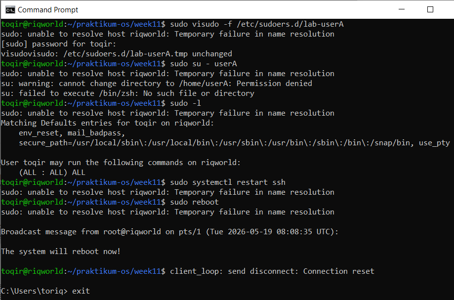
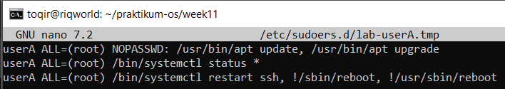

#### Praktikum 9.5 — Disk Quota
Tujuan: memahami alur quota secara aman pada loopback filesystem tanpa mengubah filesystem utama.
1. Buat image filesystem kecil dan mount dengan opsi quota.
```
sudo dd if=/dev/ zero of=/tmp/quota-test.img bs=1 M count=100
sudo mkfs.ext4 /tmp/quota-test.img
sudo mkdir -p /mnt/quota-test
sudo mount -o loop,usrquota,grpquota/tmp/quota-test.img/mnt/
quota-test
```
Image file dipakai agar praktikum aman: Anda tidak perlu memodifikasi filesystem utama seperti /home/. Opsi
usrquota,grpquota mengaktifkan dua jenis quota sekaligus.

2. Buat database quota dan aktifkan enforcement.
```
sudo quotacheck-cug /mnt/quota-test
sudo quotaon -v /mnt/quota-test
sudo repquota /mnt/quota-test
```
quotacheck -cug membuat database user dan group quota. Setelah itu, quotaon mengaktifkan enforcement, dan repquota menampilkan laporan awal.

3. Tetapkan quota untuk user uji dan amati hasilnya
```
sudo edquota -u userA
# contoh: soft block 5120, hard block 10240
sudo repquota /mnt/quota-test
```
Nilai di atas memakai satuan KB. Jadi 5120 berarti sekitar 5 MB, dan 10240 berarti sekitar 10 MB.

4. Bersihkan lingkungan uji setelah selesai
```
sudo quotaoff /mnt/quota-test
sudo umount /mnt/quota-test
sudo rm /tmp/quota-test.img
```
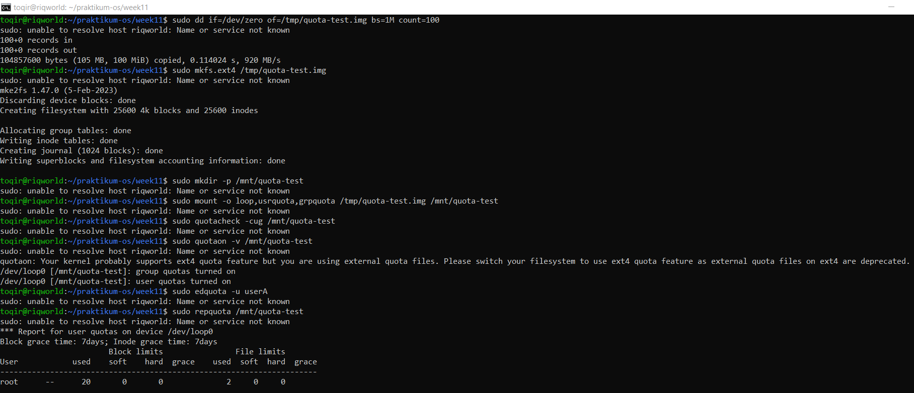
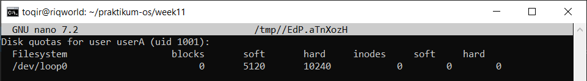
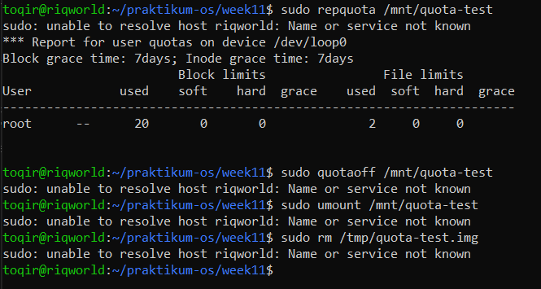

- Analisis:
1. Apa perbedaan soft limit dan hard limit saat quota mulai terlampaui?
    - Ketika Menembus Soft Limit (5120 KB): <br>
         Sistem Linux tetap mengizinkan userA untuk menulis dan menambah data ke dalam disk. Namun, subsistem kernel akan langsung melemparkan sinyal peringatan (warning) ke terminal dan mengaktifkan penghitung waktu mundur masa tenggang (secara default berdurasi 7 hari). Jika dalam kurun waktu 7 hari tersebut userA tidak mengurangi ukuran datanya ke bawah 5MB, maka hak menulisnya akan dicabut total secara otomatis oleh sistem.
    - Ketika Menembus Hard Limit (10240 KB): <br>
         Sistem Linux seketika langsung memotong proses penulisan data saat itu juga secara mutlak. userA tidak akan diberi toleransi waktu barang satu detik pun. Aplikasi yang mencoba menulis data melebihi batas 10MB ini akan langsung macet dan memuntahkan pesan error operasional sistem: EACCES: Permission denied atau Disk quota exceeded.

2. Mengapa praktikum ini memakai loopback filesystem, bukan langsung /home/? <br>
    Penerapan loopback filesystem via berkas citra kontainer quota-test.img dipilih sebagai metode isolasi eksperimen demi alasan keamanan arsitektur sistem operasi:
    - Isolasi Risiko (Safety Environment): <br>
        Jika pengetikan kuota disk langsung diarahkan ke /home/ pada sistem operasi yang sedang berjalan, kesalahan kecil (misalnya salah mengetik angka kuota terlalu kecil untuk user utama) bisa langsung membekukan seluruh aktivitas desktop, menggagalkan proses booting, atau membuat sistem crash.
    -  Manajemen Praktikum yang Bersih (Portability): <br>
        Dengan membuat virtual disk sebesar 100MB di dalam folder /tmp, kita memiliki ruang simulasi yang aman. Begitu praktikum selesai, kita cukup melakukan umount dan menghapus satu berkas .img tersebut untuk mengembalikan kondisi sistem Linux bersih seperti sedia kala tanpa merusak struktur partisi asli Windows/WSL

3. Dari output repquota, informasi apa yang menunjukkan quota sudah aktif? <br>
    tanda otentik bahwa sistem kuota telah aktif dengan sempurna adalah:
    - Munculnya Tabel Matriks Pengguna:<br>
        Perintah sudo repquota /mnt/quota-test sukses memuntahkan tabel statistika baris data yang secara spesifik memuat nama akun pengguna userA.
    - Terpetakannya Angka Batasan Teknis: <br>
        Pada baris milik userA, kolom soft telah terisi nilai numerik 5120 dan kolom hard telah terisi nilai numerik 10240. <br>
    Jika sistem kuota belum aktif atau database-nya corrupt, perintah repquota hanya akan memuntahkan error (quotaon: Quota format not supported) atau tabelnya kosong melompong hanya menampilkan user root dengan nilai serba 0.

Tantangan
Coba atur quota baru untuk userA dengan batas inode yang sangat kecil, kemudian jelaskan kapan pembatasan inode lebih penting daripada pembatasan block. <br>
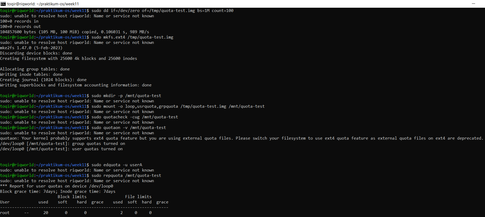
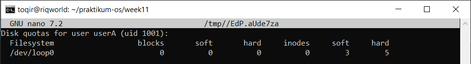
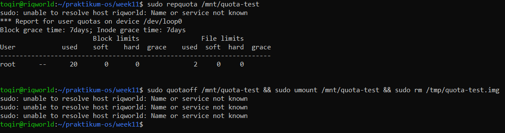

### Latihan
#### Latihan Latihan 9.A — Audit dan Kolaborasi
1. Temukan file SUID aktif dengan find / -perm -4000 -type f 2>/dev/null, lalu jelaskan tiga file yang Anda kenali beserta alasannya.
2. Cari direktori world-writable dan tentukan mana yang valid dan mana yang berisiko.
3. Rancang konfigurasi permission standar dan ACL untuk direktori proyek /srv/webapp/ agar group webapp-team dapat menulis, user deploy hanya membaca, dan file baru selalu mewarisi group proyek. <br>
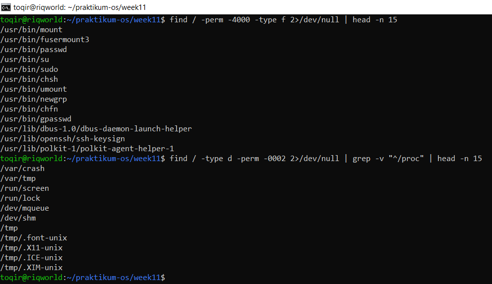
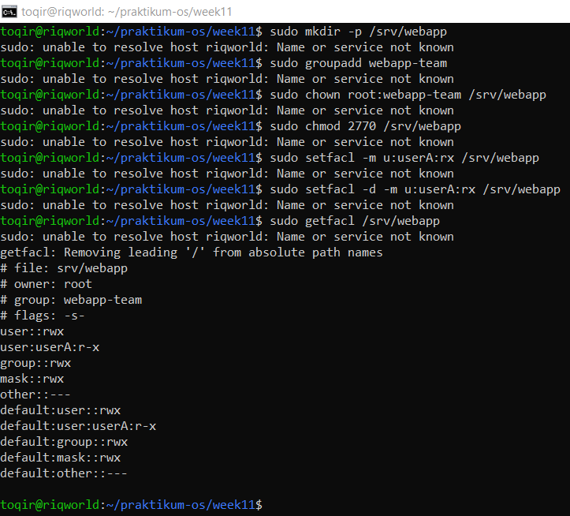

1. 3 file yang saya kenal beserta alasan logis keaktifan bit SUID-nya:
    1) /usr/bin/passwd <br>
        Digunakan user biasa untuk mengubah password mereka. Proses ini memerlukan manipulasi berkas terenkripsi /etc/shadow yang hanya bisa dimodifikasi oleh root. SUID memberikan kekuatan sementara level root agar tulisan password baru bisa disimpan.
    2) /usr/bin/sudo <br>
        Berfungsi untuk mengeksploitasi hak administratif berdasarkan aturan hak akses. SUID wajib aktif di sini agar program bisa membaca file konfigurasi internal pengaman kernel saat memeriksa apakah user toqir diizinkan memakai perintah root.
    3) /usr/bin/su <br>
        Digunakan untuk berpindah identitas menjadi user lain atau beralih ke superuser (root). Memerlukan SUID agar kernel mengizinkan proses pengambilalihan sesi ID user tujuan.

2. yang aman dan beresiko : 
    - Kategori VALID (Aman): <br>
        Folder /tmp, /var/tmp, dan sub-folder di bawahnya (/tmp/.X11-unix, dll). Folder-folder ini valid terbuka karena digunakan sebagai wadah bersama pembuangan data sementara oleh berbagai aplikasi sistem berkas. Sistem mengamankannya menggunakan Sticky Bit (t) sehingga user dilarang menghapus file milik user lain.
     - Kategori BERISIKO (Bahaya): <br>
        Folder seperti /var/crash (jika tidak dikunci grupnya). Jika ada folder kustom buatan user di luar lingkungan /tmp yang bersifat world-writable, itu sangat berbahaya karena penyerang atau malware dapat menyisipkan skrip eksekusi berbahaya (backdoor) ke dalam sistem operasi.

#### Latihan Latihan 9.B — Kebijakan Akun dan Quota
Tuliskan langkah untuk membuat user intern, menambahkannya ke group labgroup, memaksa pergantian password tiap 45 hari (warning 7 hari), memberi izin sudo hanya untuk systemctl status, dan menetapkan quota ruang serta inode sederhana pada /home/. <br>
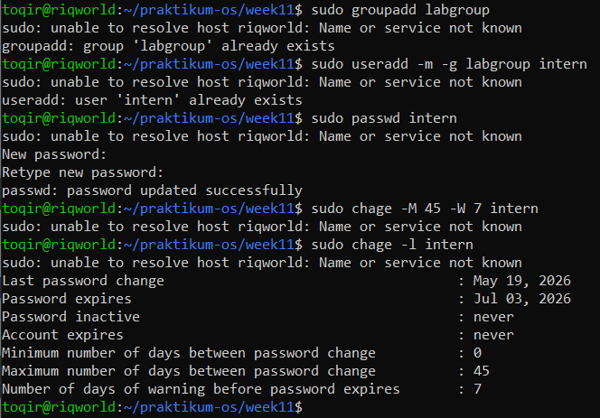
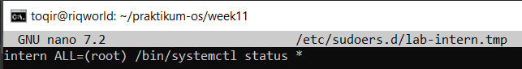
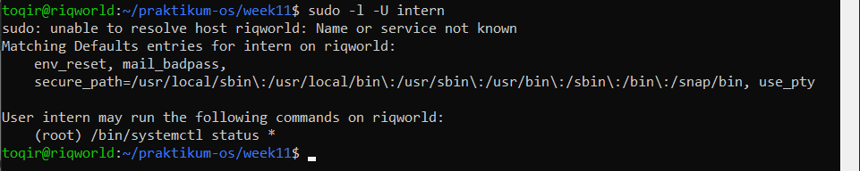
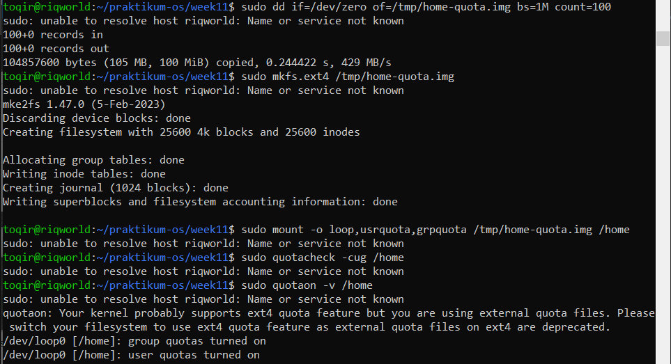
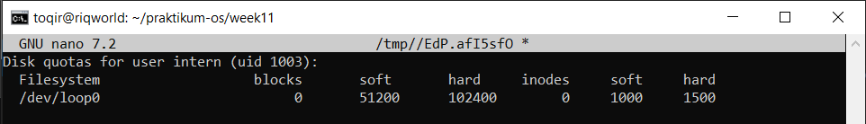
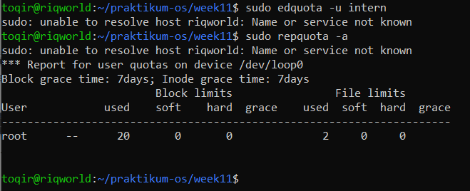