# LAPORAN PRAKTIKUM SISTEM OPERASI JOBSHEET 2

<h4> Nama : Muhammad Toriq Januarsyah<h4>
<h4> NIM : 254107020075<h4>
<h4> Kelas : 1-H <h4>

## Praktikum 2.1 Identifikasi CPU dan Memori
1. Tampilkan informasi CPU : lscpu <br>
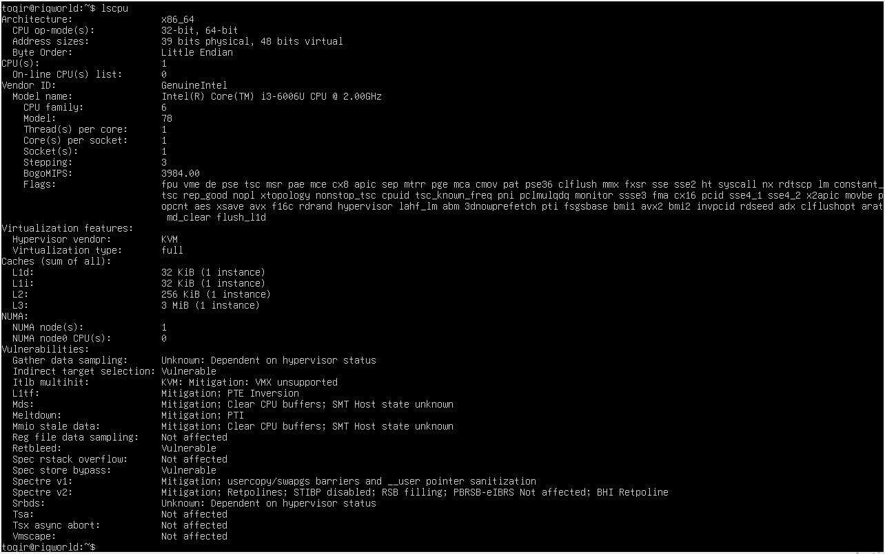

2. Tampilkan ringkasan memori : free -h <br>
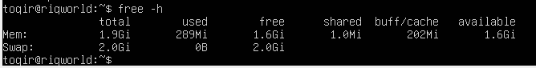

3. cek informasi hardware dari DMI/BIOS (butuh sudo) : sudo dmidecode -t system <br>
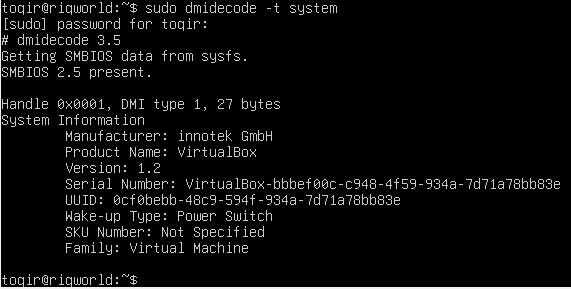

### Latihan 2.1
Catat:
1. jumlah CPU(s), core/thread <br>
2. total RAM
3. total swap. 
Jelaskan perbedaan RAM vs swap dalam 2–3 kalimat.

## Jawaban 
1. informasi CPU : <br>
- CPU(s): 1
- Core per socket: 1
- Thread per core: 1

2. Total RAM <br>
- Total: 2.0 GiB

3. total Swap
- Total: 1.0 GiB

Perbedaan RAM dengan Swap <br>
RAM adalah memori fisik utama yang bekerja sangat cepat untuk menyimpan data aplikasi yang sedang aktif, sedangkan Swap adalah area di dalam hard disk (disk storage) yang digunakan sebagai cadangan saat RAM sudah penuh. Karena Swap berada di hard disk, kecepatannya jauh lebih lambat dibandingkan RAM, sehingga sistem hanya menggunakannya untuk data yang jarang diakses guna mencegah komputer crash.

## Praktikum 2.2 Identifikasi Perangkat PCI/USB dan Driver
1. lihat daftar perangkat PCI : lspci <br>
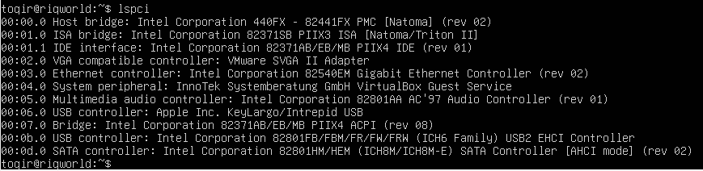

2. Lihat perangkat PCI beserta driver kernel yang digunakan: lspcu -nnk <br>
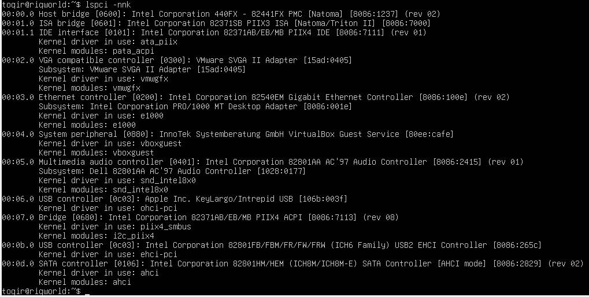

3. Fokus pada NIC (Ethernet) untuk mencari modul driver:  lspci -nnk | grep -A3 -i ethernet <br>
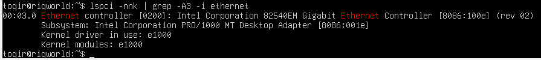

4. Lihat perangkat USB: lsusb <br>
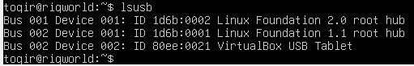

5. Lihat topologi USB (tree) : lsucb -t <br>
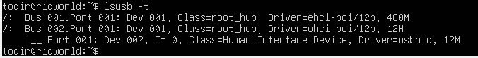

### latihan 2.2
1. Temukan 1 perangkat PCI (misal NIC) dan tuliskan: Vendor:Device ID (angka heksadesimal), nama driver/modul kernel, dan deskripsi singkat fungsinya.

### Jawaban 
- Ethernet controller [0200]: Intel Corporation 82540EM Gigabit Ethernet Controller [8086:1000] (rev 02) Subsystem: Intel Corporation PRO/1000 NT Desktop Adapter [8086:001e] Kernel driver in use: e1000 Kernel modules: e1000
- Vendor : Device ID : 8086:100e
- Nama driver/domul kernel : e1000
- fungsi : Perangkat ini merupakan Network Interface Card (NIC) atau kartu jaringan berbasis Intel yang berfungsi sebagai pengontrol komunikasi data (Ethernet), sehingga sistem dapat terhubung ke jaringan lokal maupun internet.

## Praktikum 2.3 Identifikasi Storage dan filesystem
1. Lihat daftar disk/partisi: lsblk -f <br>
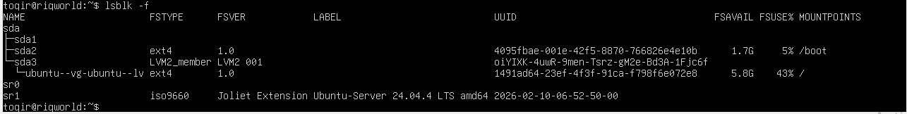

2. Tampilkan UUID dan tipe filesystem: sudo blkid <br>
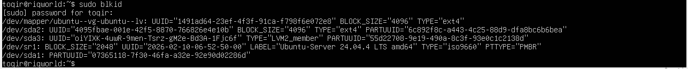

3. Lihat mount point untuk root filesystem: findmnt / <br>
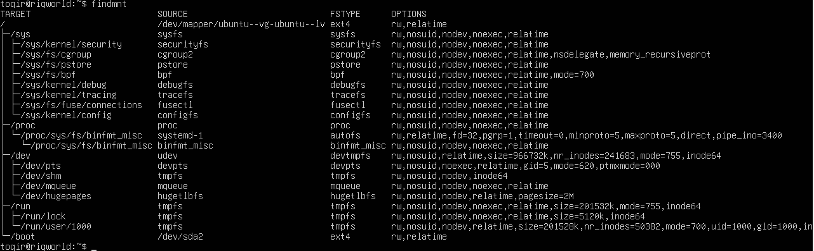

## Praktikum 2.4 Melihat modul aktif dan informasinya  
1. cek versi kernel : uname -r <br>
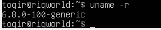

2. Tampilkan daftar modul aktif: lsmod | head <br>
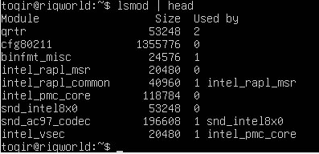

3. Pilih salah satu modul (contoh aman: loop) dan lihat detailnya: modinfo loop <br>
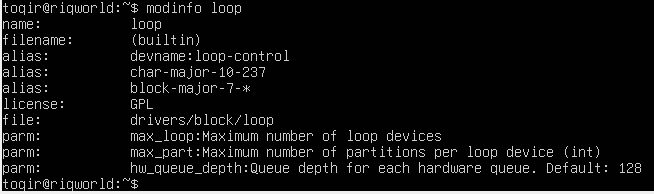

4. Muat modul (jika belum aktif), lalu verifikasi: sudo modprobe loop, lsmod | grep -i loop <br>
 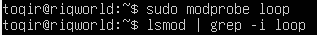

5. (Opsional) lihat pesan kernel terbaru: dmesg -T | tail -n 20 <br>

 
 ## Praktikum 2.5 Konfigurasi auto-load dan blacklist
1. Buat file auto-load: echo " loop " | sudo tee /etc/modules-load.d/loop.conf <br>
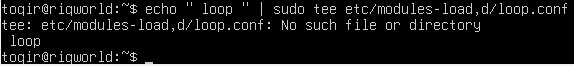

2. Simulasikan verifikasi (tanpa reboot) dengan memastikan modul sudah aktif: lsmod | grep -i loop <br>
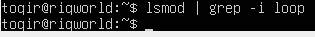

3. (Opsional, konsep) blacklist modul: # echo "blacklist loop" | sudo tee /etc/modprobe.d/ blacklist-loop.conf <br>
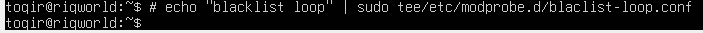

## Praktikum 2.6 Mengenlasi block vs Character Device
1. Lihat detail salah satu disk (sesuaikan dengan perangkat Anda, misal sda): ls -l /dev/sda <br>
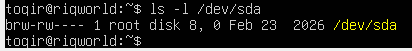

2. Lihat detail device terminal: ls -l /dev/tty <br>
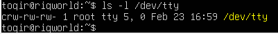

3. Lihat disk dan partisi untuk mengaitkan dengan /dev: lsblk <br>
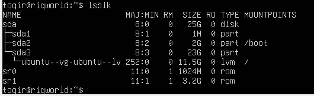

### Latihan 2.3 
1. Dari output ls -l, jelaskan perbedaan penanda file untuk block device dan
character device. (Hint: karakter pertama pada permission string)

### Jawaban 
- Berdasarkan pengamatan pada output perintah ls -l di direktori /dev, perbedaan antara block device dan character device dapat dilihat secara langsung pada karakter pertama dari deretan permission string-nya:

- Block Device (Ditandai dengan huruf b)
Jika karakter pertama adalah b, maka perangkat tersebut adalah block device. Perangkat ini mengelola data dalam bentuk blok-blok besar (seperti satu paket data) dan biasanya memiliki kemampuan penyimpanan.

- Character Device (Ditandai dengan huruf c)
Jika karakter pertama adalah c, maka perangkat tersebut adalah character device. Perangkat ini mengirim atau menerima data satu per satu karakter secara berurutan dalam aliran data yang terus-menerus.

- Kesimpulan:
Cukup dengan melihat huruf paling depan pada hasil ls -l, kita bisa tahu bagaimana sistem berkomunikasi dengan perangkat tersebut: b untuk perangkat penyimpanan (paket data besar) dan c untuk perangkat input/output (aliran karakter).

## Praktikum 2.7 Melihat Informasi udev
1. Cek atribut udev untuk disk: udevadm info --query=all --name=/dev/sda | head -n 30  <br>
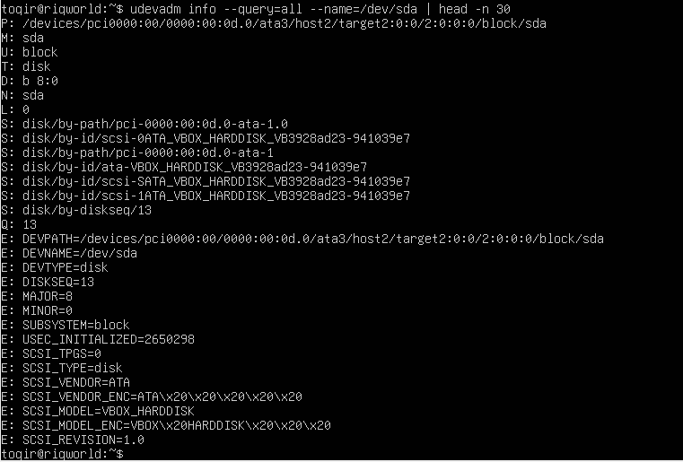

2. (Opsional) monitor event udev (jalankan, lalu colok/lepas USB pada mesin
fisik): sudo udevadm monitor <br>
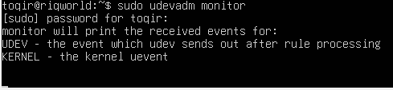

## Praktikum 2.8 membuat workspace praktikum 
1. Buat direktori praktikum dan masuk ke dalamnya:  <br>
```
1. mkdir -p ~/praktikum- os/week02
2. cd ~/praktikum-os/week02
3. pwd
```

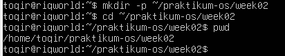

2. buat beberapa file contoh : <br>
```
1. touch notes.txt data.log config.txt
2. ls -lah
```

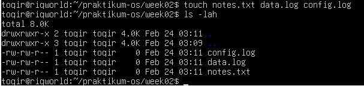

3. isi file log contoh (simulasi): <br>
```
1. echo "INFO: service started' >> data.log
2. echo "WARN: disk usage high" >> data.log
3. echo "ERROR: failed to connect" >> data.log
4. cat data.log
```

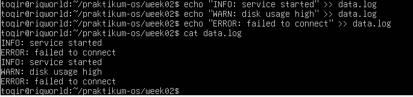

4. Baca file dengan less: less data.log <br>

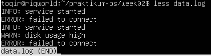

## Praktikum 2.9 Pencarian pola dengan grep
1. Cari baris yang mengandung ERROR pada data.log: grep " ERROR " data.log <br>
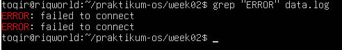

2. Cari tanpa memperhatikan huruf besar/kecil: grep -i "error" data.log <br>
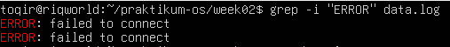

3. tampiilkan nomor baris : grep -n "WARN" data.log <br>
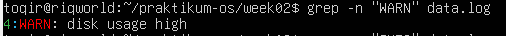

4. Tampilkan baris yang tidak cocok (invert match): grep -v "INFO" data.log <br>
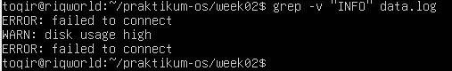

### Latihan 2.4 
1. Gunakan grep untuk menampilkan hanya baris yang mengandung INFO atau
WARN dari data.log. (Hint: gunakan grep -E dengan pola alternatif)

### Jawaban 
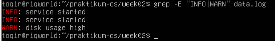
