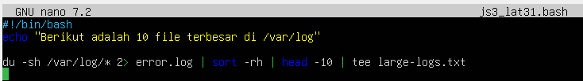
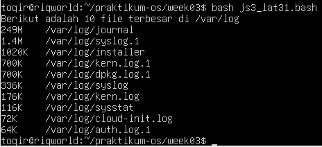
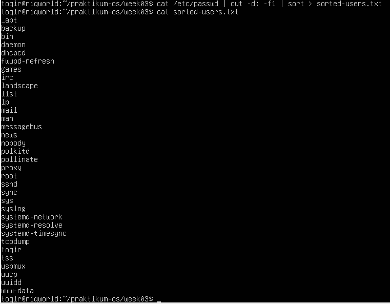
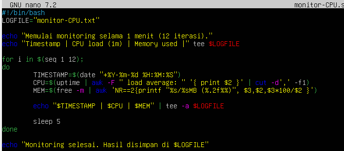
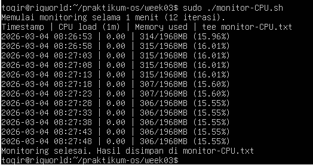

# LAPORAN PRAKTIKUM SISTEM OPERASI JOBSHEET 3

<h4> Nama : Muhammad Toriq Januarsyah<h4>
<h4> NIM : 254107020075<h4>
<h4> Kelas : TI 1-H <h4>

## 1.11 Latihan 

### Latihan 3.1
- Buatlah script yang:
    1. Menampilkan daftar 10 file terbesar di direktori /var/log/
    2. Menyimpan hasilnya ke file large-logs.txt
    3. Menampilkan output juga di terminal menggunakan tee
    4. Menangani error dengan redirect ke error.log

### Jawaban Latihan 3.1
```
#!/bin/bash
echo "Berikut adalah 10 file terbesar di /var/log/"

du -sh /var/log* 2> error.log | sort -rh | head -10 | tee large-log.txt
``` 



### Latihan  Latihan 3.2
- Buat pipeline yang:
    1. Membaca /etc/passwd
    2. Mengekstrak username (kolom pertama)
    3. Mengurutkan alfabetis
    4. Menyimpan ke file sorted-users.txt
Hint: Gunakan cut, sort, dan operator redirect.

### Jawaban Latihan 3.2
```
cat /etc/passwd | cut -d1 -f1 | sort > sorted.users.txt
``` 


### Latihan 3.3 
- Tulis script monitoring yang:
    1. Mencatat penggunaan CPU dan memory setiap 5 detik
    2. Menyimpan log dengan timestamp
    3. Berjalan selama 1 menit (12 iterasi)
    4. Output ditampilkan di terminal DAN disimpan ke file

### Jawaban latihan 3.3
```
#!/bin/bash
LOGFILE="hasil_monitor.txt"

echo "Memulai monitoring selama 1 menit (12 iterasi)."
echo "Timestamp | CPU load (1m) | Memory used" | tee $LOGFILE

for i in $(seq 1 12);
do
    TIMESTAMP=$(date "+%Y-%m-%d %H:%M:%S")
    CPU=$(uptime | awk -F "load average: " '{ print $2 }' | cut -d',' -f1)
    MEM=$(free -m | awk 'NR==2{printf "%s/%sMB (%.2f%%)", $3,$2,$3*100/$2 }')

    echo "$TIMESTAMP | $CPU | $MEM" | tee -a $LOGFILE
    
    sleep 5
done

echo "Monitoring selesai. Hasil disimpan di $LOGFILE"
```



### Latihan 3.4
- Buat perintah yang:
    1. Mencari semua file .conf di sistem
    2. Membuang pesan "Permission denied"
    3. Menghitung jumlah file yang ditemukan
    4. Menyimpan daftar path lengkap ke file

### Jawaban Latihan 3.4
"

"


### Latihan 3.5
- Implementasikan script backup yang:
    1. Menggunakan tar untuk backup direktori
    2. Menampilkan progress dengan tee
    3. Mencatat stdout ke backup-success.log
    4. Mencatat stderr ke backup-error.log
    5. Menambahkan timestamp di setiap log entry

### Jawaban Latihan 3.5

