# LAPORAN PRAKTIKUM SISTEM OPERASI JOBSHEET 4

<h4> Nama : Muhammad Toriq Januarsyah<h4>
<h4> NIM : 254107020075<h4>
<h4> Kelas : TI 1-H <h4>

## Tugas Pendahuluan 
Jawablah pertanyaan-pertanyaan di bawah ini :
1.  Apa yang dimkasud perintah-perintah direktory : pwd, cd, mkdir, rmdir.
2. Apa yang dimaksud perintah-perintah manipulasi file : cp, mv, dan rm (sertakan format yang digunakan)
3. Jelaskan perbedaan symbolic link menggunakan hard link (direct) dan soft link (indirect)
4. Tuliskan maksud perintah-perintah : file, find, which, locate dan grep
  
### Jawaban Tugas Pendahuluan :
1. direktori : 
    - pwd: Print Working Directory -> Menampilkan direktori aktual (lokasi dimana user berada saat ini)
    - cd: Change Directory -> Berpindah dari satu direktori ke direktori lain
    - mkdir: Make Directory -> Membuat direktori baru
    - rmdir: Remove Directory -> Menghapus direktori yang kosong

2. perintah :
    - cp: Copy - Mengkopi file atau direktori
       - format penggunaan: 
        1. cp file_sumber file_tujuan  -> copy file
        2. cp -r dir_sumber dir_tujuan -> copy direktori beserta isinya
    - mv: Move - Memindahkan atau me-rename file/direktori
       - format penggunaan:               
        1. mv file_lama file_baru -> rename file
        2. mv file /path/tujuan/  -> pindahkan file ke direktori lain
        3. mv dir_lama dir_baru   -> rename direktori 
    - rm: Remove - Menghapus file atau direktori
       - format pengguanaan : 
        1. rm file.txt         -> Hapus file
        2. rm -i file.txt      -> Hapus file dengan konfirmasi
        3. rm -r direktori/    -> Hapus direktori beserta isinya 
        4. rm -rf direktori/   -> Hapus paksa direktori tanpa konfirmasi
        
3.  Perbedaan Symbolic Link: Hard Link vs Soft Link <br>
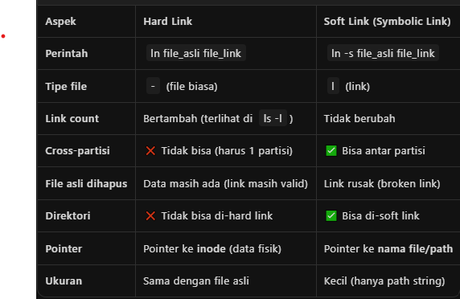 

4. Penjelasan Perintah: file, find, which, locate, grep <br>
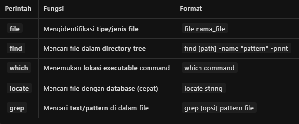 


## Percobaan 1 : Direktory
1. melihat direktori home 
```
$ pwd
$ echo $HOME
```
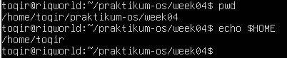

2. Melihat direktori aktual dan parent direktori
```
$ pwd
$ cd .
$ pwd
$ cd ..
$ pwd
$ cd
```
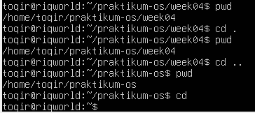

3. Membuat satu direktori, lebih dari satu direktori atau sub direktori
```
$ pwd
$ mkdir A B C A/D/ A/E B/F A/D/A
$ ls -l
$ ls -l A
$ ls -l A/D
```
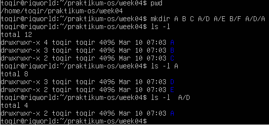

4. Menghapus satu atau lebih direktori hanya dapat dilakukan pada direktori kosong dan hanya dapat dihapus oleh pemiliknya kecuali bila diberikan ijin aksesnya
```
$ rmdir B
```
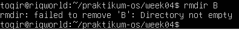
- Terdapat pesan error, mengapa?
    - Karena direktori B tidak kosong, masih ada subdirektori F di dalamnya. Perintah rmdir hanya bisa menghapus direktori yang kosong.
```
$ ls -l B
$ rmdir B/F B
$ ls -l B
```
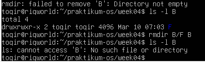
- Terdapat pesan error, mengapa?
    - Karena direktori B sudah terhapus, jadi sistem tidak menemukan direktori tersebut.

5. Navigasi direktori dengan instruksi cd untuk pindah dari sau direktori ke direktori lain.
```
$ pwd
$ ls -l
$ cd A
$ pwd
$ cd ..
$ cd /home/<user>/C
$ pwd
$ cd /<user>/C 
```
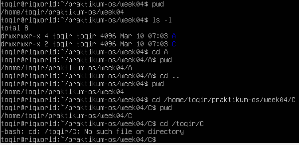
- Terdapat pesan error, mengapa?
    - Karena path /<user>/C salah. Tanda / di awal berarti root directory. Yang benar adalah /home/<user>/C atau ~/C.
```
$ pd
```
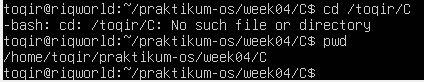

## Percobaan 2  : Manipulasi file
1. Perintah cp untuk mengkopi file atau seluruh direktori
```
$ cat > contoh
Membuat sebuah file 
[Ctrl-d]
$ cp contoh contoh1
$ ls -l
$ mv contoh A
$ ls -l A
cp contoh contoh1 A/D
$ ls -l A/D
```
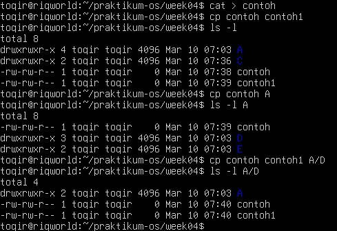

2. Perintah mv untuk memindah file
```
$ mv vontoh contoh2
$ ls -l
$ mv contoh1 contoh2 A/D
$ ls -l A/D
$ mv sontoh contoh1 C
$ ls -lC
```
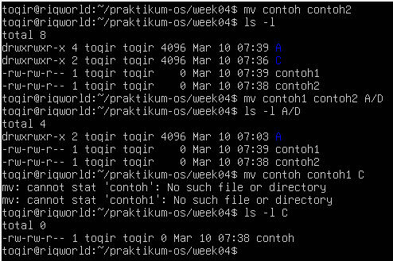

3. Perintah rm untuk menghapus file
```
$ rm contoh2
$ ls -l
$ rm -i contoh
$ rm -rf A C
$ ls -l
```
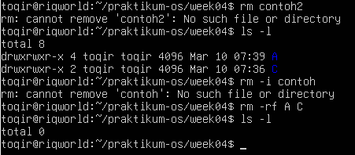

## Percobaan 3 : Symbolic link
1. membuat shortcut (file link)
```
$ echo "Hallo apa khabar" . halo.txt
$ ls -l
$ ln halo.txt z
$ ls -l
$ cat z
$ mkdir mydir
$ ln z mydir/halo.juga
$ cat mydir/halo.juga
$ ln -s z bye.txt
$ ls -l bye.txt
$ cat bye.txt
$ ls -l
$ file halo.txt
$ file bye.txt
```
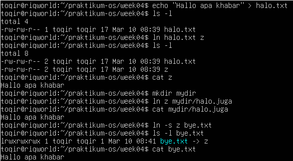

## Percobaan 4 : Melihat isi file
```
$ ls -l
$ file halo.txt
$ file bye.txt
```
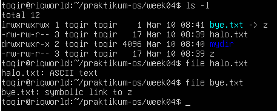

### percobaan 5 : Mencari file 
1. Perintah find 
```
$ find /home -name "*.txt" -print > myerror.txt
$ cat myerror.txt
$ find . -name "*.txt" -exec wc -l '{}' ";"
```
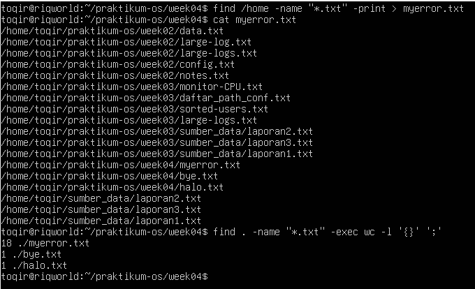

2. Perintah which
```
$ which ls
```
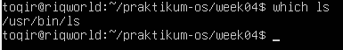

3. Perintah locate
```
locate "*.txt" 
```
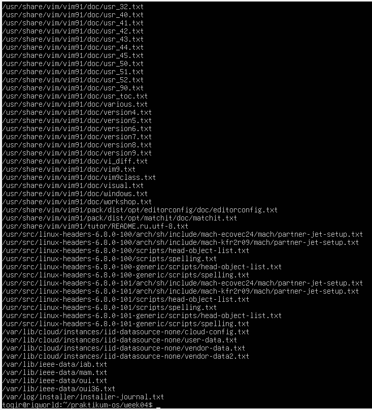

## Percobaan 6 : 
1. mencari text pada file 
```
$ grep hallo *.txt
```
