# LAPORAN PRAKTIKUM SISTEM OPERASI JOBSHEET 4

<h4> Nama : Muhammad Toriq Januarsyah<h4>
<h4> NIM : 254107020075<h4>
<h4> Kelas : TI 1-H <h4>

## Tugas Pendahuluan 
Jawablah pertanyaan-pertanyaan di bawah ini :
1.  Apa yang dimkasud perintah-perintah direktory : pwd, cd, mkdir, rmdir.
2. Apa yang dimaksud perintah-perintah manipulasi file : cp, mv, dan rm (sertakan format yang digunakan)
3. Jelaskan perbedaan symbolic link menggunakan hard link (direct) dan soft link (indirect)
4. Tuliskan maksud perintah-perintah : file, find, which, locate dan grep
  
### Jawaban Tugas Pendahuluan :
1. direktori : 
    - pwd: Print Working Directory -> Menampilkan direktori aktual (lokasi dimana user berada saat ini)
    - cd: Change Directory -> Berpindah dari satu direktori ke direktori lain
    - mkdir: Make Directory -> Membuat direktori baru
    - rmdir: Remove Directory -> Menghapus direktori yang kosong

2. perintah :
    - cp: Copy - Mengkopi file atau direktori
       - format penggunaan: 
        1. cp file_sumber file_tujuan  -> copy file
        2. cp -r dir_sumber dir_tujuan -> copy direktori beserta isinya
    - mv: Move - Memindahkan atau me-rename file/direktori
       - format penggunaan:               
        1. mv file_lama file_baru -> rename file
        2. mv file /path/tujuan/  -> pindahkan file ke direktori lain
        3. mv dir_lama dir_baru   -> rename direktori 
    - rm: Remove - Menghapus file atau direktori
       - format pengguanaan : 
        1. rm file.txt         -> Hapus file
        2. rm -i file.txt      -> Hapus file dengan konfirmasi
        3. rm -r direktori/    -> Hapus direktori beserta isinya 
        4. rm -rf direktori/   -> Hapus paksa direktori tanpa konfirmasi
        
3.  Perbedaan Symbolic Link: Hard Link vs Soft Link <br>
 

4. Penjelasan Perintah: file, find, which, locate, grep <br>
 


## Percobaan 1 : Direktory
1. melihat direktori home 
```
$ pwd
$ echo $HOME
```


2. Melihat direktori aktual dan parent direktori
```
$ pwd
$ cd .
$ pwd
$ cd ..
$ pwd
$ cd
```


3. Membuat satu direktori, lebih dari satu direktori atau sub direktori
```
$ pwd
$ mkdir A B C A/D/ A/E B/F A/D/A
$ ls -l
$ ls -l A
$ ls -l A/D
```


4. Menghapus satu atau lebih direktori hanya dapat dilakukan pada direktori kosong dan hanya dapat dihapus oleh pemiliknya kecuali bila diberikan ijin aksesnya
```
$ rmdir B
```

- Terdapat pesan error, mengapa?
    - Karena direktori B tidak kosong, masih ada subdirektori F di dalamnya. Perintah rmdir hanya bisa menghapus direktori yang kosong.
```
$ ls -l B
$ rmdir B/F B
$ ls -l B
```

- Terdapat pesan error, mengapa?
    - Karena direktori B sudah terhapus, jadi sistem tidak menemukan direktori tersebut.

5. Navigasi direktori dengan instruksi cd untuk pindah dari sau direktori ke direktori lain.
```
$ pwd
$ ls -l
$ cd A
$ pwd
$ cd ..
$ cd /home/<user>/C
$ pwd
$ cd /<user>/C 
```

- Terdapat pesan error, mengapa?
    - Karena path /<user>/C salah. Tanda / di awal berarti root directory. Yang benar adalah /home/<user>/C atau ~/C.
```
$ pd
```


## Percobaan 2  : Manipulasi file
1. Perintah cp untuk mengkopi file atau seluruh direktori
```
$ cat > contoh
Membuat sebuah file 
[Ctrl-d]
$ cp contoh contoh1
$ ls -l
$ mv contoh A
$ ls -l A
cp contoh contoh1 A/D
$ ls -l A/D
```


2. Perintah mv untuk memindah file
```
$ mv vontoh contoh2
$ ls -l
$ mv contoh1 contoh2 A/D
$ ls -l A/D
$ mv sontoh contoh1 C
$ ls -lC
```


3. Perintah rm untuk menghapus file
```
$ rm contoh2
$ ls -l
$ rm -i contoh
$ rm -rf A C
$ ls -l
```


## Percobaan 3 : Symbolic link
1. membuat shortcut (file link)
```
$ echo "Hallo apa khabar" . halo.txt
$ ls -l
$ ln halo.txt z
$ ls -l
$ cat z
$ mkdir mydir
$ ln z mydir/halo.juga
$ cat mydir/halo.juga
$ ln -s z bye.txt
$ ls -l bye.txt
$ cat bye.txt
$ ls -l
$ file halo.txt
$ file bye.txt
```


## Percobaan 4 : Melihat isi file
```
$ ls -l
$ file halo.txt
$ file bye.txt
```


### percobaan 5 : Mencari file 
1. Perintah find 
```
$ find /home -name "*.txt" -print > myerror.txt
$ cat myerror.txt
$ find . -name "*.txt" -exec wc -l '{}' ";"
```


2. Perintah which
```
$ which ls
```


3. Perintah locate
```
locate "*.txt" 
```


## Percobaan 6 : 
1. mencari text pada file 
```
$ grep hallo *.txt
```
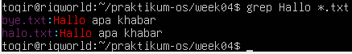

## LATIHAN
1. cobalah urutan perintah berikut : 
```
$ cd
$ pwd
$ ls -al
$ cd .
$ pwd 
$ cd ..
$ pwd
$ ls -al
$ cd..
$ pwd
$ ls -al
$ cd /etc
$ ls -al | more
$ cat passwd
$ cd -
$ pwd
```
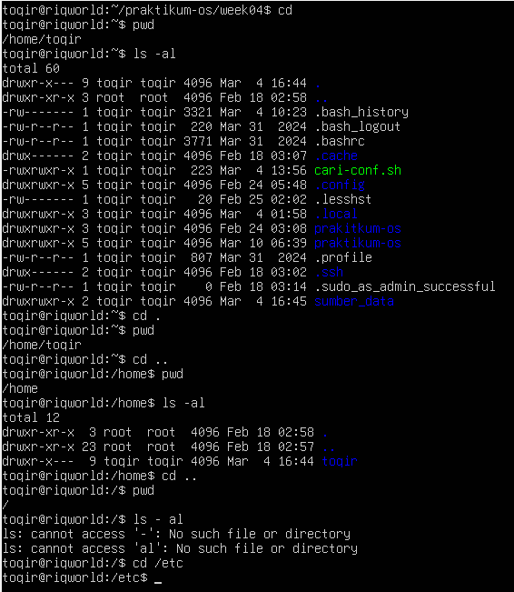
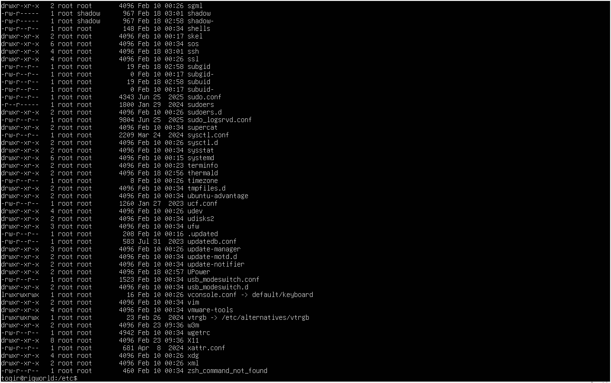
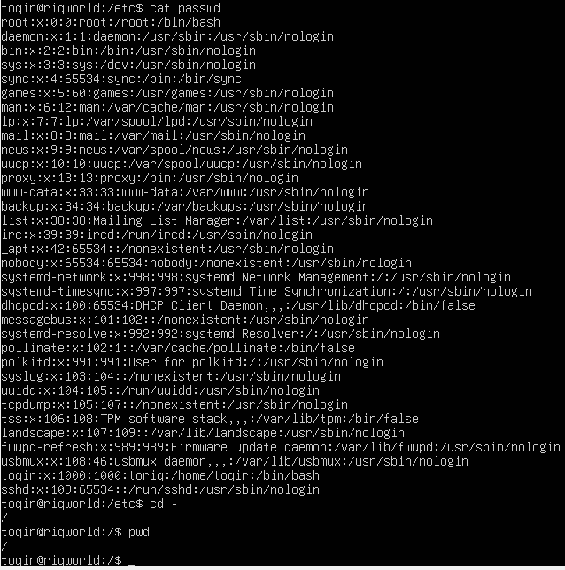

2. Lanjutkan penelusuran pohon pada sistem file menggunakan  cd, ls, pwd, dan cat. telusuri direktori /bin, /usr/bin, /sbin, /tmp dan /boot
```
$ cd /
$ ls -ld bin sbin tmp boot
$ ls /bin
$ ls /sbin
$ ls /tmp
$ ls /boot
```
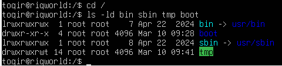
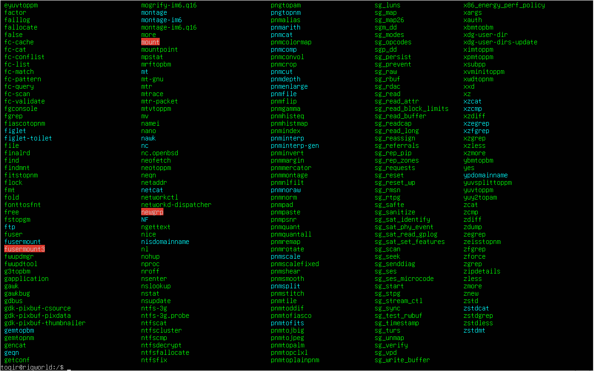
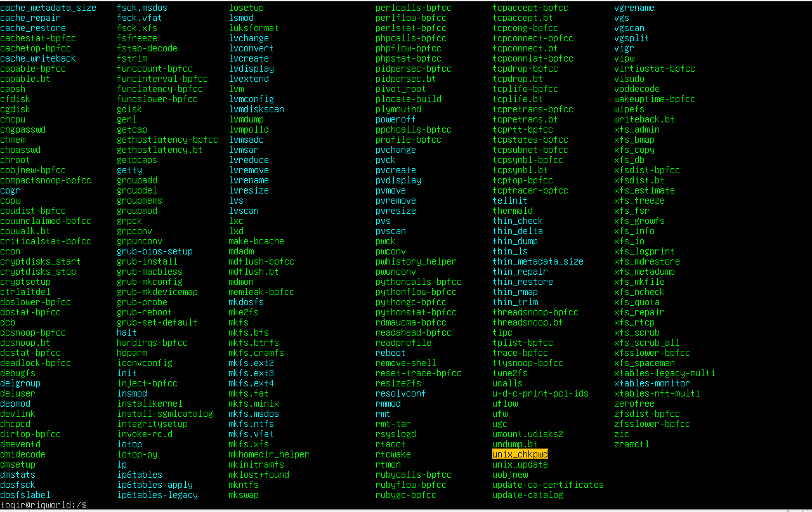
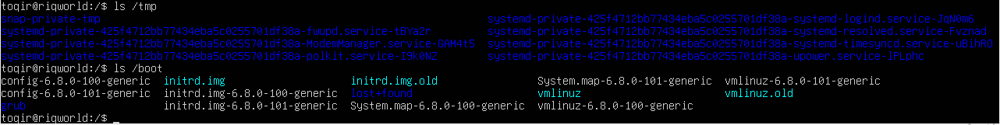

3. telurusi direktori /dev. identifikasi perangkat yang tersedia. identifikasi tty (terminal) anda (ketik who am ai); siapa pemilih tty anda (gunakan ls -l).
```
$ cd /dev
$ ls
$ ls -l
$ who am i
$ ls -l /dev/tty1
```
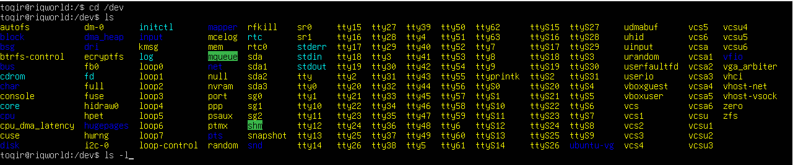
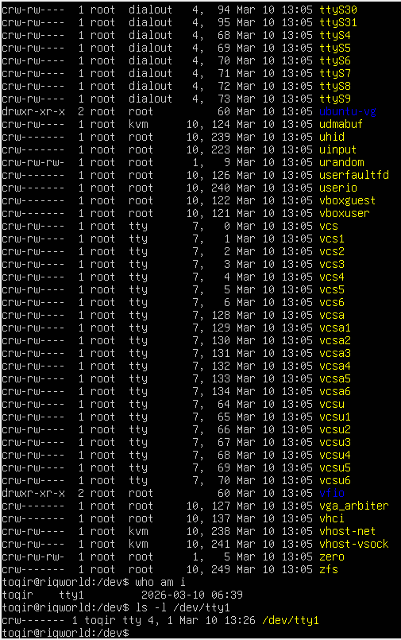

4. telusuri derectory /proc. Tampilkan isi file interrupts, devices, cpuinfo, meminfo dan uptime menggunakan perintah cat. dapatkah anda melihat mengapa derectory /proc disebut pseudo-filesystem yang memungkinkan akses ke struktur data kernel?
```
$ cd /proc
$ ls
$ cat cpu info
$ cat meminfo
$ cat uptime
```
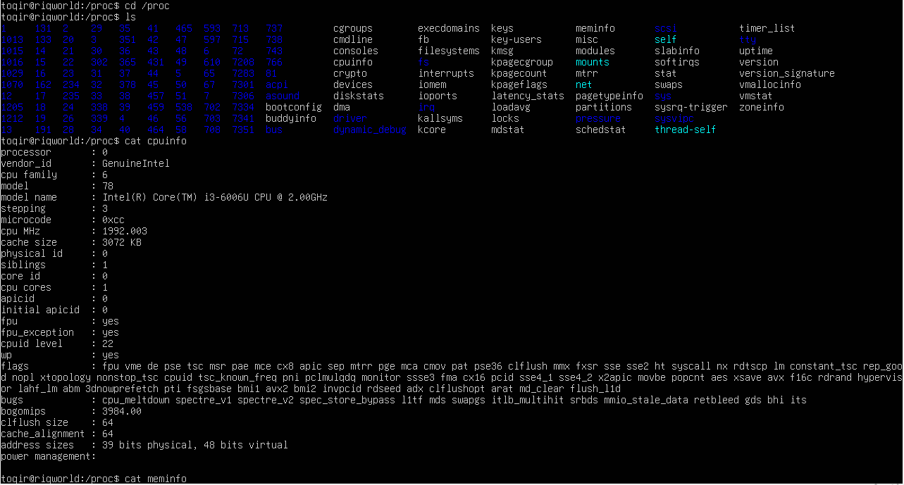
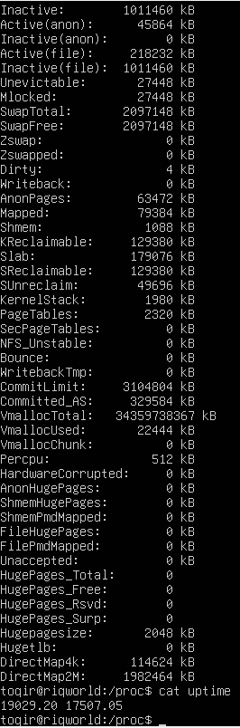
- Ya, hal itu terlihat karena ukuran file di dalam /proc rata-rata adalah 0 bytes (jika dicek dengan ls -l), namun saat dibuka dengan cat, file tersebut berisi banyak informasi sistem yang terus berubah secara real-time.

5. ubahlah direktory home ke user lain secara langsung menggunakan cd -username.
```
$ cd ~root
```
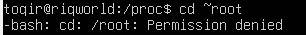

6. ubah kembali ke direktory home anda
```
$ cd ~toqir
```
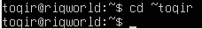

7. Buat subdirektory work dan play 
```
$ mkdir work play 
$ ls -l
```
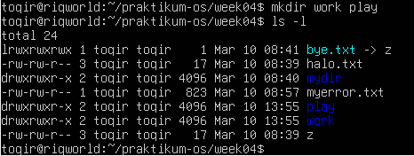 

8. hapus subdirektory play
```
$ rmdir work
$ ls -l
```
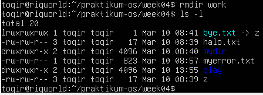

9. copy file /etc/passwd ke directory home anda.
```
$ cp /etc/passwd .
$ ls -l passwd
```
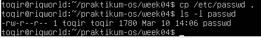

10. pindahkan ke subdirektory play
```
$ mv passwd play
$ ls -l play
```
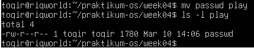

11. ubahlah ke subdirektory play dan buat symbolic link dengan nama terminal yang menunjuk ke perangkat ttt. apa yang terjadi jika melakukan hard link ke perangkat tty?
```
$ cd play
$ ln -s /dev/tty terminal
$ ls -l 
```
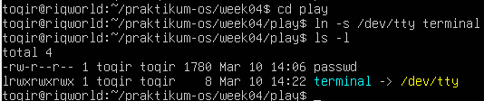
- Sistem akan memunculkan pesan error: ln: failed to create hard link 'terminal' => '/dev/tty': Invalid cross-device link. Tanpa -s (ln /dev/tty terminal), berarti mencoba membuat Hard Link. Linux melarang ini karena /dev/tty berada di sistem file yang berbeda dengan folder play.

12. butalah file bernama hello.txt yang berisi kata "hello word". Dapatkah anda gunakan "cp" menggunakan "terminal" sebagai file asal untuk menghasilkan efek yang sama?
```
$ echo "hello word" > hello.txt
$ cat hello.txt
```
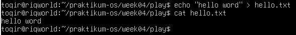
- Tidak bisa secara langsung untuk menghasilkan teks yang sama dengan perintah echo. Jika menggunakan cp terminal [file], sistem akan menganggap terminal sebagai sumber input (keyboard). Terminal akan menunggu pengguna mengetikkan sesuatu secara manual sebelum data tersebut disalin ke file tujuan, berbeda dengan echo yang langsung mengirimkan teks yang sudah ditentukan ke layar.

13. Copy hello.txt ke terminal. apa yang terjadi?
```
$ cp hello.txt terminal 
```
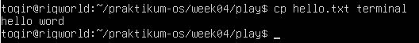
- Isi teks di dalam file hello.txt akan muncul atau tercetak langsung di layar terminal.

14. masih direktory hoeme, copy keseluruhan direktory play ke direktory bernama work menggunakan symbolic link.
```
$ cd ..
$ ln -s play work 
```
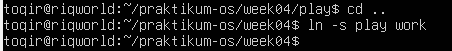

15. hapus direktory work dan isinya dengan satu perintah
```
rm -rf work
```
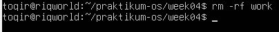

## Laporan 
1. Analisa hasil percobaan yang anda lakukan.
    - Analisa setiap hasil tampilannya
    - pada percobaan 1 point 3 buatlah pohon dari struktur file dan direktri
    - bila terdapat error, jelaskan penyebabnya
2. Kerjakan latihan diatas dan analisa hasilnya 
3. berikan kesimpulan dari praktikum ini 

### jawaban 
1. Analisa hasil percobaan :
    - Secara keseluruhan, struktur sistem file Linux mengadopsi konsep FHS (Filesystem Hierarchy Standard) yang berbentuk pohon (tree).
        1. Navigasi: Penggunaan pwd dan cd membuktikan bahwa Linux sangat bergantung pada lokasi absolut (dari /) dan relatif (dari posisi saat ini). Perintah cd .. secara logis memindahkan pointer ke parent directory berdasarkan informasi pada inode direktori.
        2. Manipulasi File: Perintah cp, mv, dan rm menunjukkan bahwa operasi file di Linux bersifat case-sensitive (peka huruf besar/kecil) dan destruktif. mv berfungsi ganda sebagai pengubah nama (rename) dan pemindah lokasi karena pada dasarnya keduanya hanya mengubah referensi jalur pada sistem file.
        3. Pseudo-filesystem (/proc): Hasil tampilan cat /proc/cpuinfo atau meminfo membuktikan bahwa direktori ini tidak berisi file fisik di disk, melainkan antarmuka langsung ke struktur data kernel di RAM. Hal ini memungkinkan pengguna "mengintip" kondisi hardware secara real-time.
        4. Device as File (/dev): Eksperimen dengan symbolic link ke perangkat tty menunjukkan filosofi "Everything is a file". Menulis data ke link perangkat (echo > terminal) secara logis mengirimkan aliran data (stream) langsung ke driver perangkat tersebut (layar).
    - Pohon Struktur File dan Direktori (Percobaan 1 Poin 3)
        Berdasarkan perintah mkdir A B C A/D A/E B/F A/D/A, struktur
        hirarkinya adalah sebagai berikut:
        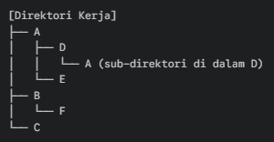 <br>
        Struktur ini menunjukkan kemampuan Linux dalam menangani nested directories. Folder A di dalam folder D memiliki identitas yang berbeda dengan folder A di tingkat teratas karena memiliki jalur (path) yang unik.
    - Error yang ditemukan :
        1. mv: cannot stat 'contoh': No such file or directory
        Penyebab: Terjadi inkonsistensi antara status file di disk dengan perintah yang diinput. Hal ini terjadi karena file asal telah diubah namanya atau dipindahkan pada langkah sebelumnya. Sistem tidak dapat melakukan operasi pada referensi yang sudah tidak ada.
        2. rmdir: failed to remove 'B': Directory not empty
        Penyebab: Perintah rmdir memiliki proteksi internal yang hanya mengizinkan penghapusan direktori kosong untuk mencegah kehilangan data secara tidak sengaja. Direktori B masih memiliki sub-direktori F.

2. Kesimpulan 
    Sistem operasi Linux mengelola sumber daya melalui hirarki file yang sangat ketat namun fleksibel. Keberhasilan operasi sangat bergantung pada pemahaman user terhadap jalur file (path), izin akses (permissions), dan ketersediaan paket utilitas. Penggunaan shell memerlukan ketelitian sintaksis karena setiap karakter (seperti /, ., atau ..) memiliki arti fungsional yang spesifik dalam manajemen memori dan penyimpanan.
