# LAPORAN PRAKTIKUM SISTEM OPERASI JOBSHEET 6

<h4> Nama : Muhammad Toriq Januarsyah (18)<h4>
<h4> NIM : 254107020075<h4>
<h4> Kelas : TI 1-H <h4>

## 1. Manajemen Proses

### 1.1 Konsep Proses dan thread 

#### Prakitkum 6.1 - Melihat Proses dan Thread
1. Tampilkan Semua proses yang berjalan : 
```
ps aux
```
 <br>
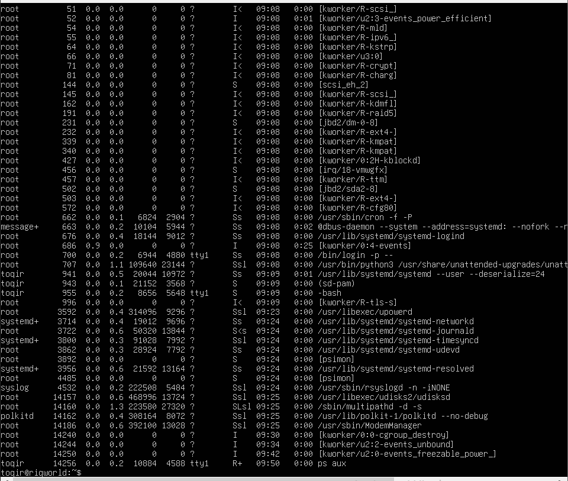

2. Tampilkan proses beserta thread-nya, dapat dilihat pada kolom LWP (Light-Weight Process ID) :
```
ps aux -L
```

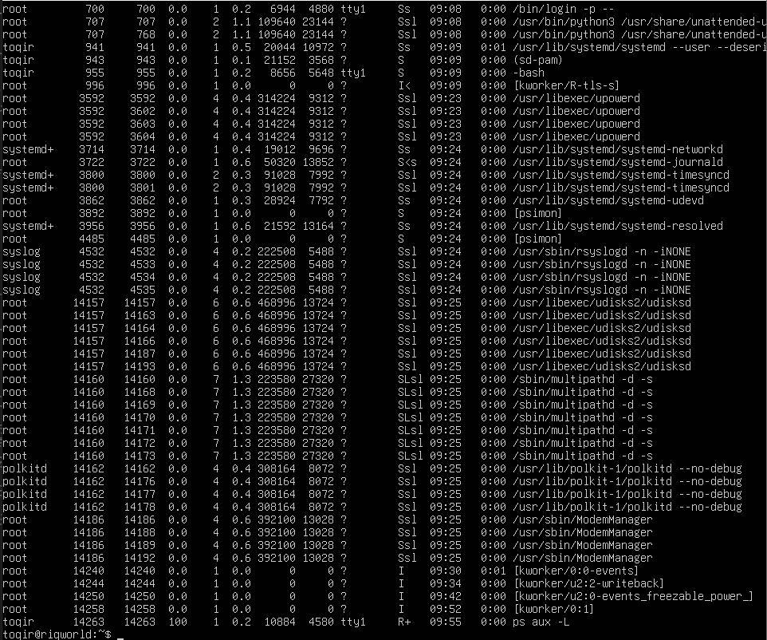

3. lihat PID shell aktif dan detail prosesnya : 
```
echo $$
ps -p $$ -f
```
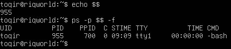

4. lihat hierarki prosessecara visual :
```
pstree -p
```
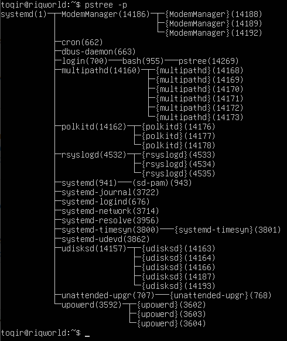

#### Latihan 6.1
Jalankan ps aux dan amati outputnya : 
1. Berapa total proses yang berjalan? Proses apa yang memiliki PID terkecil?

##### Jawab 
- Total proses: 
Jumlah baris hasil ps aux dikurangi satu (baris header). menghitung otomatis bisa dilakukan dengan perintah :
```
ps aux | wc -l
```
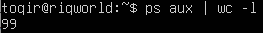 <br>
total proses yang berjalan sebanyak 99.

- PID terkecil : 
proses dengan PID 1, yaitu systemd.

2. Jalankan pstress -p dan temukan proses bash anda. proses apa yang menjadi induk (PPID) dari bash tersebut?

##### Jawab 
- Proses yang menjadi induk (PPID) dari bash tersebut adalah login dengan PID 700.

3. Bandingkan output ps aux da ps aux -L. Apa perbedaaan yang anda lihat?
##### Jawab 
- Perbedaan utamanya terletak pada detail unit eksekusi. Output ps aux hanya menampilkan proses sebagai satu kesatuan , sedangkan ps aux -L memecah proses tersebut dengan menampilkan kolom LWP (Light-Weight Process) yang menunjukkan ID dari setiap thread yang berjalan di dalam proses tersebut.

### 1.2 Siklus Hidup Proses 

#### Praktikum 6.2
1. Buat proses di background dan amati kondisinya :
```
sleep 60 &
ps aux | grep sleep 
```
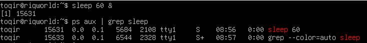

2. Amati perubahan ecit code dari peritah yang berhasil dan gagal :
```
ls /tmp
echo "sukses: $?

ls /direktori-tidak-ada
echo "gagal: $?
```
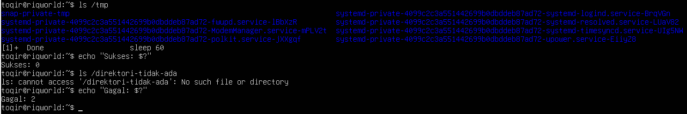

#### Latihan 6.2 
1. Jalankan sleeep 120 & dan amati kolom STAT pada ps aux. Kondisi apa yang ditampilkan? Mengapa proses sleep berada di kondisi tersebut?

##### Jawab 
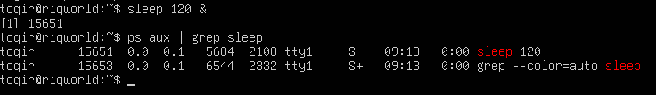

2. Jalankan beberapa perintah yang berhasil dan yang gagal, lalu catat exit code masing-masing. Pola apa yang anda temukan?

##### Jawab 
- Perintah berhasil <br>
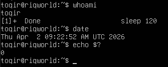

- Perintah gagal <br>
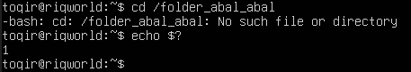

- Hasil Percobaan:
    1) Perintah berhasil (seperti whoami atau date) menghasilkan exit code: 0.
    2) Perintah gagal (seperti ls /tidak-ada atau cd /folder_abal_abal) menghasilkan exit code: 1, 2, atau angka lain selain nol.

- Pola yang ditemukan:
Sistem Linux menggunakan angka 0 sebagai sinyal bahwa proses telah selesai dengan sukses tanpa kendala. Sedangkan angka selain 0 menunjukkan adanya error atau kegagalan, di mana jenis angkanya sering kali merepresentasikan tipe kesalahan yang terjadi.

### 1.3 Penjadwalan Proses dan Prioritas

#### Praktikum 6.3 - Mengatur Priorotas Proses
1.  Jalankan proses dengan prioritas rendah : 
```
nice -n 10 sleep 3000 & 
```
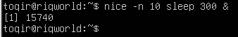

2. Verifikasi nilai nice pada kolom NI :
```
ps aux | grep sleep
```
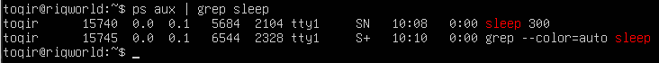

3. Ubah nilai nice proses yang sudah berjalan : 
```
renice -n 15 -p <PID>
ps -p <PID> -o pid,ni,cmd
```
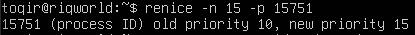
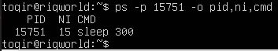

4. Bersihkan proses percobaan :
```
kill %1
```
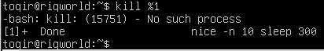

#### Latihan 6.3 
1. Jalankan nice -n 5 sleep 200 & dan verifikasi nilai NI-nya dengan ps.

##### Jawab 
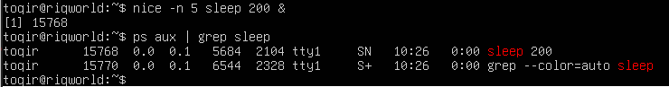

2. Ubah nnilai nice menjadi  10 menggunakan renice, lalu verifikasi kembali.

##### Jawab 
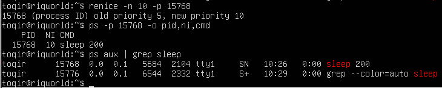

3. COba ubah nilai nice menjadi -5 tanpa sudo. Apa yang terjadi? mengapa linux membatasi hal ini untuk user biasa?

##### Jawab 
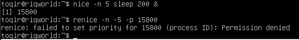 <br>
- Yang Terjadi sistem menolak perintah tersebut dan menampilkan pesan error seperti "Permission denied" atau "Operation not permitted"

- Alasan: Linux membatasi ini karena nilai nice negatif memberikan prioritas CPU yang lebih tinggi. Jika user biasa diizinkan melakukan ini, mereka bisa mengambil alih jatah waktu CPU dan mengganggu stabilitas sistem atau proses penting milik user lain.

### 1.4 Sinyal Proses 

#### Praktikum 6.4 - Mengirim sinyal ke proses
1. Buat proses percbaan :
```
sleep 500 &
sleep 600 &
sleep 700 &
ps aux | grep -v grep | grep sleep
```
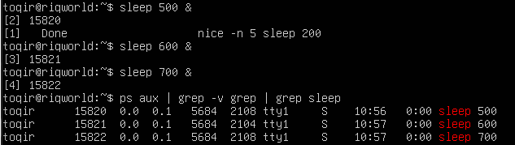

2. Hentikan satu proses dengan SIGTERM dan verifikasi
```
kill <PID - sleep -500 >
ps aux | grep -v grep | grep sleep
```
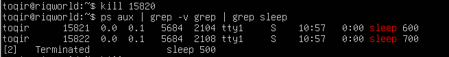

3. Jeda dan lanjutkan proses dengan SIGSTOP/SIGCONT:
```
kill - SIGSTOP <PID - sleep -600 >
ps aux | grep sleep     # amati kolom STAT : berubah
menjadi T

kill - SIGCONT <PID - sleep -600 >
ps aux | grep sleep     # STAT kembali ke S
```
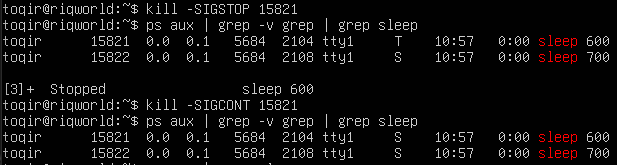

4. Hentikan semua proses sleep sekaligus:
```
pkill sleep
```
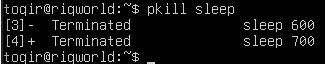

#### Latihan 6.4 
1. Jalankan sleep 400 &, kirim  SIGSTOP, dan amati perubahan kolom STAT. Kondisi apa yang muncul?

##### Jawab
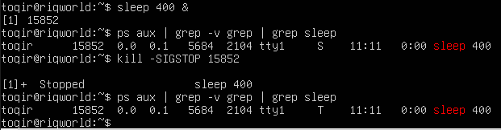 <br>
- Kondisi yang muncul pada kolom STAT adalah T (Stopped atau Terminated by signal). Ini menandakan proses masih ada di memori tetapi tidak dijadwalkan untuk berjalan oleh CPU.

2. Kirim SIGCONT dan verifikasi proses kembali berjalan.

##### Jawab 
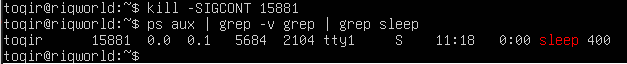

3. Hentikan proses dengan SIGTERM lalu verifikasi sudah tidak ada. Kapan Anda memilih SIGKILL daripada SIGTERM?

##### Jawab 
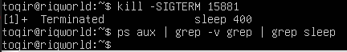 <br>
- memilih SIGKILL (9) hanya ketika proses sudah benar-benar tidak responsif (macet/hang) dan tidak bisa ditutup secara normal menggunakan SIGTERM. SIGTERM lebih disukai karena merupakan sinyal "pembersihan" yang memberikan kesempatan bagi proses untuk menutup file yang terbuka atau menyimpan data sementara sebelum benar-benar mati.

### 1.5 Manajemen Job

#### Praktikum 6.5 - Manajemen Job foreground dan background
1. Jalankan tiga job di background :
```
sleep 200 &
sleep 300 &
sleep 400 &
jobs
```
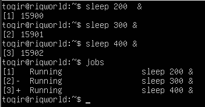

2. Bawa job pertama ke foreground, jeda, lalu kembalikan ke background:
```
fg %1
# Tekan Ctrl +Z untuk menjeda
bg %1
jobs
```
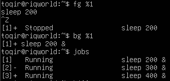

3. Hentikan semua job:
```
kill %1 %2 %3
jobs
```
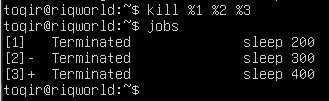

#### Latihan 6.5 
1. Jalankan top di foreground. Apa yang terjadi di terminal?

##### Jawab 
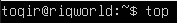
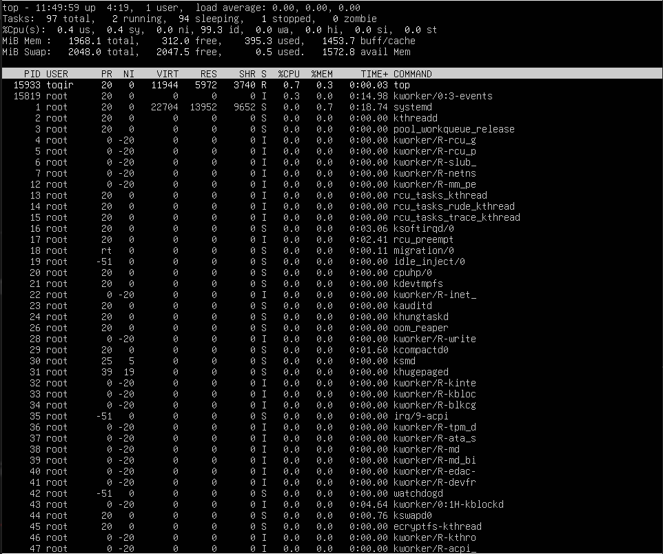 <br>
- Terminal akan menampilkan antarmuka pemantauan proses secara real-time. Selama top berjalan di foreground, shell akan terkunci sehingga user tidak bisa memasukkan perintah baru sampai proses tersebut dihentikan atau dipindahkan ke background.

2. Tekan "Ctrl+Z" dan cek statusnya dengan jobs. Kondisi apa yang ditampilkan?

##### Jawab 
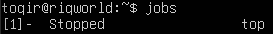
- Kondisi yang ditampilkan adalah Stopped (atau Suspended). Hal ini terjadi karena sinyal SIGSTOP dikirim ke proses tersebut, yang memaksa kernel untuk menghentikan eksekusi proses namun tetap menyimpannya di dalam memori (RAM).

3. Pindahkan ke background dengan bg. Apakah top dapat berjalan dengan baik di background? Mengapa?

##### Jawab
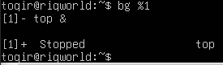 <br>
- Tidak, top tidak dapat berjalan dengan baik di background. Begitu dipindahkan ke background, statusnya akan segera berubah menjadi Stopped (tty output).
- Karena top adalah aplikasi interaktif yang memerlukan akses langsung ke terminal untuk menampilkan update visual secara terus-menerus. Linux memiliki keamanan yang melarang proses background menulis ke terminal agar tidak mengganggu tampilan shell yang sedang aktif digunakan user.

4. Kembalikan ke foreground dengan fg, lalu keluar dengan q.
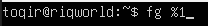 <br>
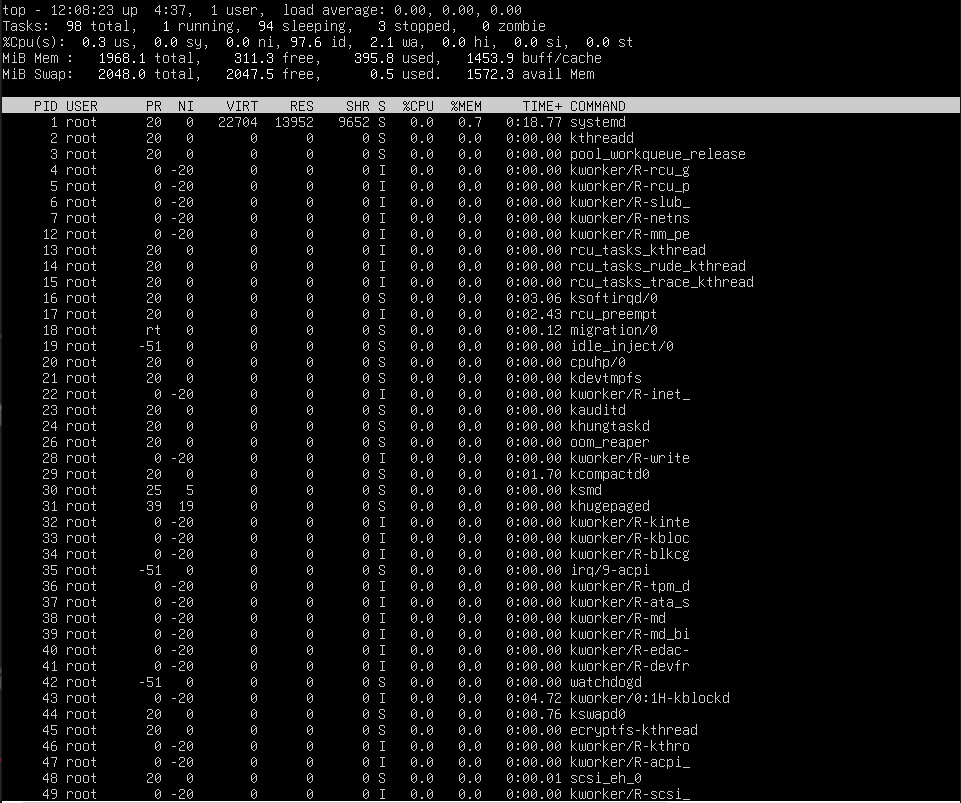

### 1.6 Pemantauan Proses

#### Praktikum 6.6 - Pemantauan Proses 
1. Temukan proses dengan penggunaan CPU dan memori tertinggi:
```
ps aux -- sort = -% cpu | head -10
ps aux -- sort = -% mem | head -10
```
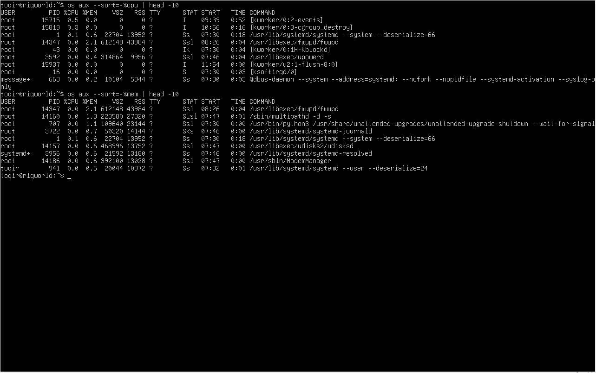

2. Jalankan top dan eksplorasi shortcut-nya:
```
top
# Tekan M, P, 1 , u secara bergantian
# Tekan q untuk keluar
```

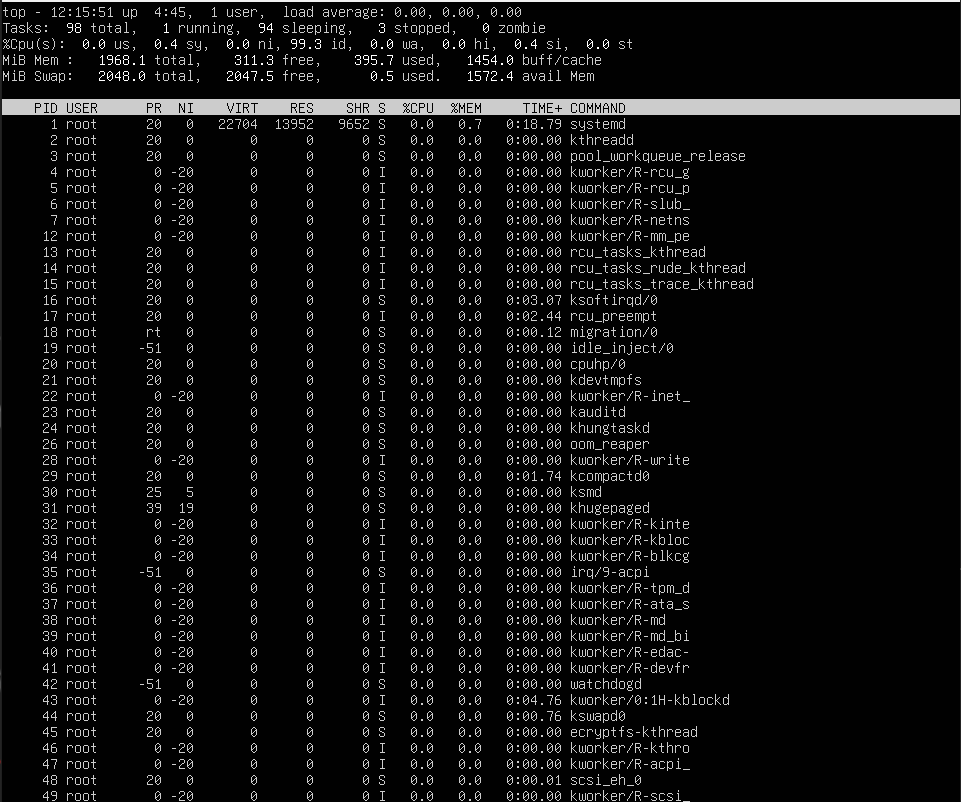
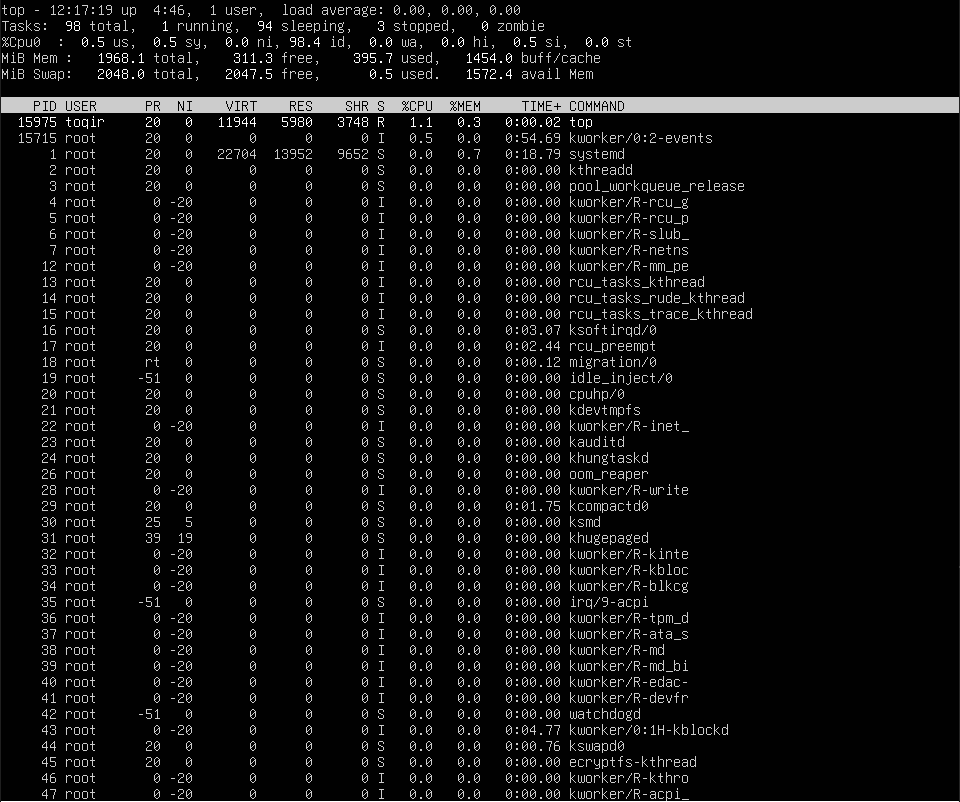
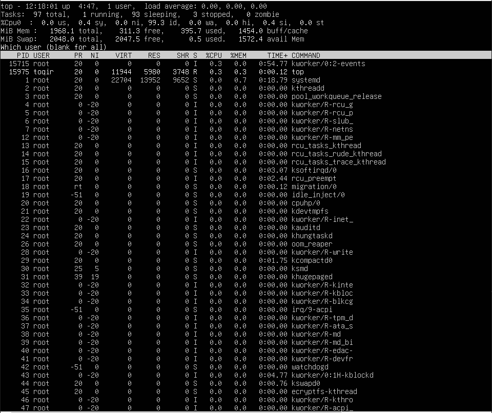
- M (Huruf kapital): Mengurutkan proses berdasarkan penggunaan Memori.
- P (Huruf kapital): Mengurutkan proses berdasarkan penggunaan CPU.
- 1 (Angka satu): Menampilkan detail penggunaan tiap Core CPU.

3. Instal dan jalankan htop
```
sudo apt install -y htop
htop
# Tekan F6 untuk pilih kolom pengurutan
# Tekan F10 atau q untuk keluar
```
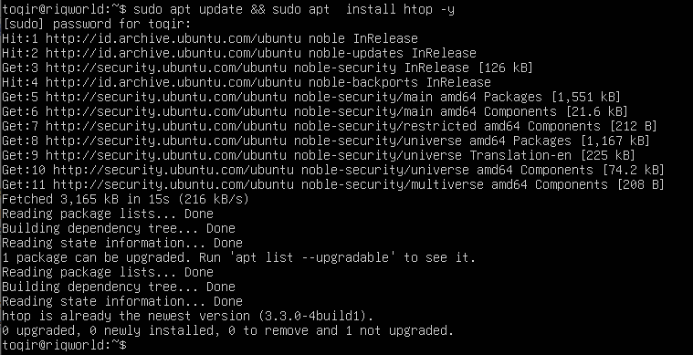
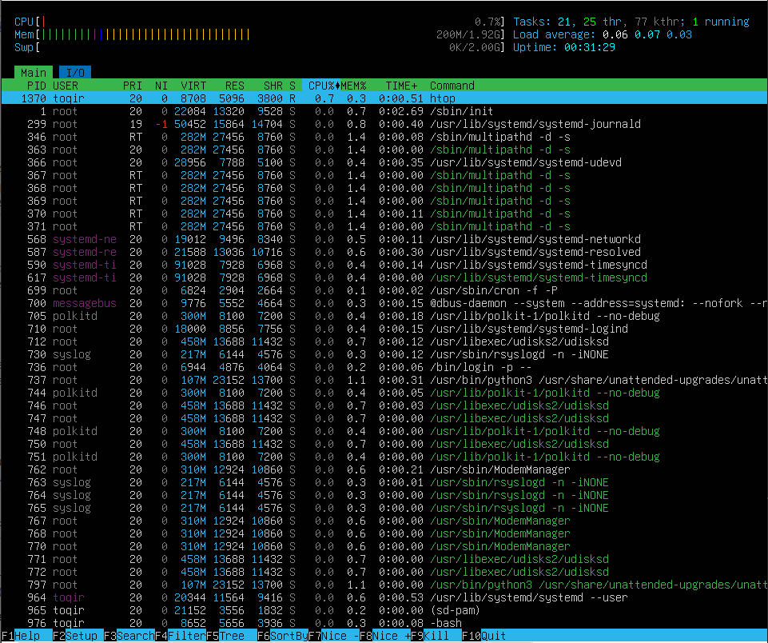

#### Latihan 6.6
1. Gunakan ps aux –sort=%mem untuk menemukan proses yang menggunakan memori paling banyak di VM Anda. Proses apa itu?

##### Jawab 

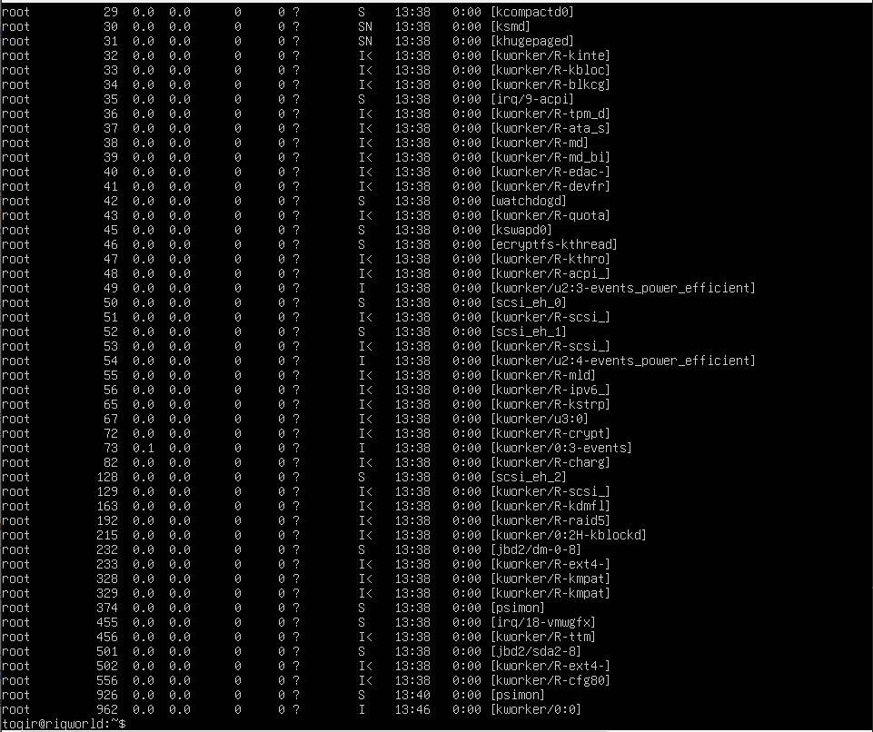
- Proses yang menggunakan memori paling banyak adalah accounts-daemon (dengan path lengkap /usr/lib/accountsservice/accounts-daemon). Proses ini mengonsumsi 0.8% dari total memori sistem.

2. Di dalam top, tekan 1 . Apa yang berubah pada tampilan? Mengapa informasi ini berguna?
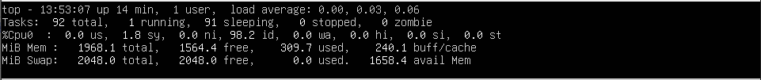
- Tampilan penggunaan CPU yang tadinya hanya satu baris (rata-rata total) berubah menjadi rincian penggunaan per setiap Core/Logical CPU yang ada di sistem.
- Informasi ini sangat berguna untuk mendeteksi adanya ketimpangan beban kerja (CPU imbalance). Admin bisa mengetahui jika ada satu Core yang bekerja 100% (bottleneck) sementara Core lainnya menganggur, yang bisa menjadi indikasi adanya proses yang tidak teroptimasi dengan baik (single-threaded).

3. Di dalam htop, navigasikan ke proses sshd menggunakan tombol panah. Tekan F9 dan amati opsi sinyal yang tersedia


### 1.7 Rangkuman 
- Proses adalah instance program yang berjalan dengan PID unik dan ruang memori terpisah. Thread berbagi memori dalam satu proses—lebih ringan namun lebih rentan saling mempengaruhi.
- Siklus hidup proses: R (running), S (sleeping), D (uninterruptible), T (stopped), Z (zombie). Proses dibuat via fork-exec dan berakhir dengan exit code (0 = sukses).
- Prioritas dikontrol dengan nilai nice (-20 s.d. +19, default 0). nice untuk proses baru, renice untuk proses yang sudah berjalan. Nilai negatif hanya bisa diset oleh root.
- Sinyal adalah cara berkomunikasi dengan proses yang berjalan. Selalu coba SIGTERM (15) sebelum SIGKILL (9). Gunakan kill (berdasarkan PID), pkill (berdasarkan nama), atau pgrep untuk mencari PID.
- Manajemen job: tambahkan & untuk background, fg/bg untuk berpindah,
Ctrl+Z untuk menjeda.
-  Pemantauan: ps untuk snapshot dan scripting, top untuk real-time, htop untuk antarmuka interaktif yang lebih visual.

### 1.8 Latihan 

#### Latihan 6.A
Eksplorasi Proses Sistem
1. Jalankan ps aux –forest dan temukan proses dengan PID 1. Apa nama dan fungsi proses tersebut dalam sistem Linux modern?

##### jawab 
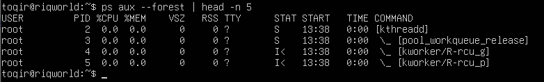
- Nama proses tersebut adalah systemd. Dalam sistem Linux modern, systemd berfungsi sebagai induk dari semua proses (ancestor of all processes). Tugas utamanya adalah menginisialisasi komponen sistem segera setelah kernel dimuat, mengelola services (layanan), menangani proses booting, dan memastikan layanan-layanan penting tetap berjalan di latar belakang.

2. Hitung berapa proses yang dimiliki oleh user root dan berapa yang dimiliki oleh user Anda. Mengapa root memiliki lebih banyak proses?

##### Jawab 
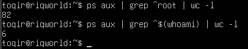
- Root = 82 & user = 6
- Root memiliki lebih banyak proses karena root adalah pengelola seluruh sumber daya sistem. Proses-proses root mencakup kernel threads, system daemons (seperti pengelola jaringan, log, keamanan, dan penjadwalan), serta layanan infrastruktur yang harus berjalan terus-menerus agar sistem tetap stabil dan aman, bahkan sebelum ada user yang login ke sistem.

3. Temukan semua proses yang berada dalam kondisi S. Mengapa sebagian besar proses di sistem berada dalam kondisi ini?
##### Jawab 
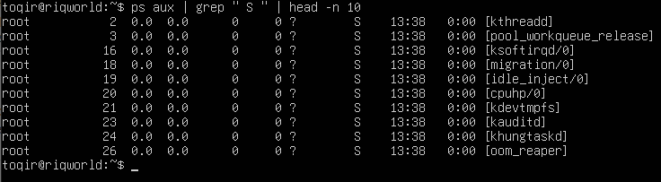
- Kondisi S berarti Interruptible Sleep (Tidur yang bisa disela). Sebagian besar proses berada dalam kondisi ini karena Linux menggunakan model manajemen sumber daya yang efisien. Proses masuk ke kondisi Sleep saat mereka sedang menunggu sebuah event terjadi (seperti menunggu input dari keyboard, menunggu data dari jaringan, atau menunggu interval waktu tertentu). Dengan "tidur", proses tersebut tidak menggunakan siklus CPU sama sekali, sehingga daya komputasi bisa dialokasikan sepenuhnya untuk proses yang benar-benar sedang aktif (Running).

#### Latihan 6.B
Simulasi Manajemen Job
1. Jalankan tiga perintah sleep dengan durasi 100, 200, dan 300 detik di background. Verifikasi ketiganya dengan jobs.

##### Jawab 
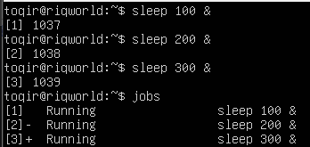

2. Bawa job kedua ke foreground, jeda dengan Ctrl+Z , lalu kembalikan ke background dengan bg. <br>
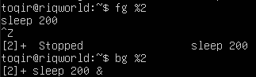

3. Hentikan job pertama dengan kill %1. Tampilkan kembali daftar job Berapa job yang tersisa? <br>
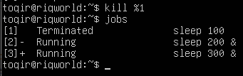
- Setelah menjalankan perintah kill %1, job nomor 1 akan dihentikan secara paksa. Ketika daftar ditampilkan kembali dengan perintah jobs, maka jumlah job yang tersisa adalah 2 job (yaitu job nomor 2 dan job nomor 3).


#### Latihan 6.C 
Prioritas dan Sinyal 
1. Jalankan dua proses sleep : satu dengan nice +5 dan satu dengan nice +15. Verifikasi nilai NI keduanya dengan ps.

##### Jawab
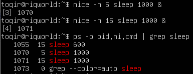

2. Gunakan renice untuk mengubah nice proses pertama menjadi +10 Proses mana yang kini lebih diprioritaskan scheduler?

##### Jawab 
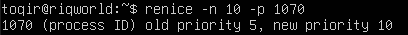 <br>
- Proses yang kini lebih diprioritaskan oleh scheduler adalah proses pertama (yang baru saja diubah menjadi nice +10).

3. Kirim SIGSTOP ke salah satu proses, verifikasi kondisi T-nya, lalu kirim SIGCONT. Akhiri semua proses percobaan dengan pkill sleep.
 