# LAPORAN PRAKTIKTUM SISTEM OPERASI JOBSHEET 7

<h4> Nama : Muhammad Toriq Januarsyah (17)<h4>
<h4> NIM : 254107020075<h4>
<h4> Kelas : TI 1-H <h4>

## Bash Shell dan shell Basic

### 1.8 Tugas  Praktikum 

#### Tugas Praktikum 1 - Toolkit Bash Administrator Pribadi
Konteks rill :  
seorang administrator sering mengulang perintah yang sama setiap hari. Agar pekerjaan lebih efisien dan konsisten, ia perlu memiliki toolkit Bash

Instruksi tugas: 
1.  Tambahkan konfigurasi pada .bashrc untuk:
    - menambahkan direktori bin pribadi ke PATH,
    - membuat minimal 2 alias yang membantu kerja harian,
    - membuat minimal 1 fungsi shell yang berguna untuk administrasi  

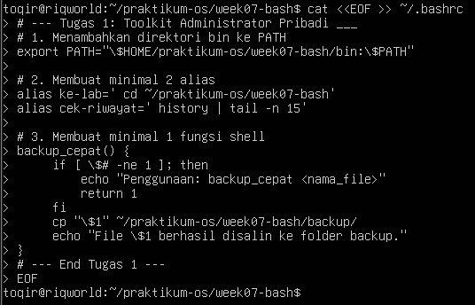

2. Pastikan konfigurasi tersebut aktif kembali saat membuka shell login.  
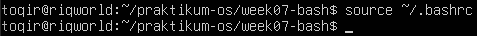

3. Buat satu script sederhana di direktori bin pribadi, misalnya script untuk menampilkan ringkasan sistem.  
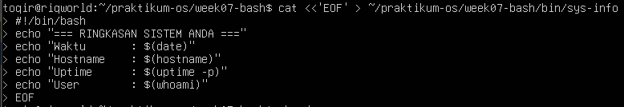

4. Uji dari direktori yang berbeda untuk memastikan script dapat dipanggil tanpa menuliskan path lengkap.  
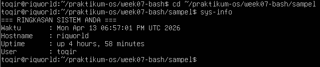

5. Simpan bukti pengujian ke file toolkit-bash-report.txt.  
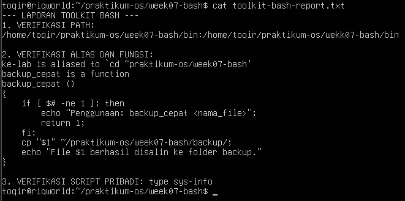

Minimal Luaran :  
- isi blok konfigurasi yang ditambahkan ke .bashrc,
- output echo $PATH,
- output type untuk alias, fungsi, dan script,
- file laporan toolkit-bash-report.txt.

#### Tugas  Praktikum 2 - Audit File Konfigurasi dan Logging Aman
Konteks riil :  
saat troubleshooting, administrator sering perlu menginventarisasi file konfigurasi dan memisahkan output normal dari pesan error.

Instruksi tugas : 
1. Buat file laporan bernama audit-konfigurasi-$(date +%F).txt.  
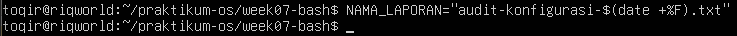

2. Cari file *.conf di dalam /etc dan simpan hasilnya ke file laporan.
3. Catat jumlah total file konfigurasi yang ditemukan.
4. Jika ada pesan error, simpan ke file terpisah, misalnya audit-error.log.
5. Tampilkan isi laporan ke terminal dan sekaligus simpan menggunakan tee.
6. Tambahkan ringkasan singkat 3–5 baris yang menjelaskan mengapa pemisahan stdout dan stderr penting dalam audit sistem.

Syarat konsep yang harus muncul: 
- redirection >, 2>, atau &>,
- pipeline,
- tee, 
- penggunaan variabel atau command substitution.

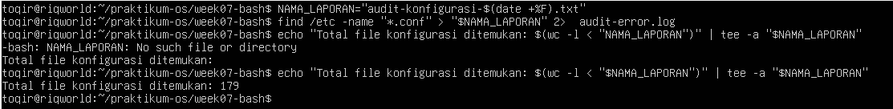

Minimal luaran:
- file laporan audit,
- file log error,
- perintah yang digunakan,
- analisis singkat hasil audit.

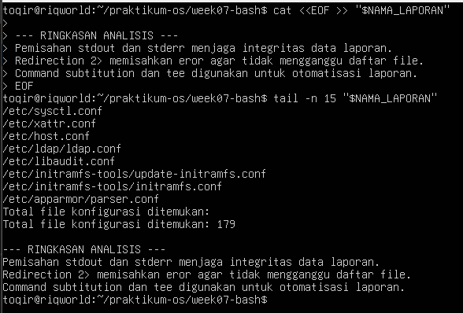

#### Tugas Praktikum 3 - Mini Health Check Harian Server
Konteks riil:  
administrator perlu membuat pemeriksaan cepat (health check) untuk mengetahui kondisi dasar server sebelum dan sesudah maintenance.

Instruksi Tugas: 
1. Buat script Bash bernama daily-healthcheck pada direktori bin pribadi.
2. Script minimal harus menampilkan:
    - tanggal dan waktu,
    - hostname,
    - user aktif,
    - shell aktif,
    - uptime,
    - penggunaan memori,
    - penggunaan filesystem root,
    - 10 baris terakhir history command yang relevan dengan pengecekan.
3. Simpan hasil ke file log harian, misalnya healthcheck-$(date +%F).log.
4. Tampilkan hasil ke terminal dan ke file secara bersamaan.
5. Jika Anda menggunakan pipeline dengan tee, cek juga status exit command utama.  
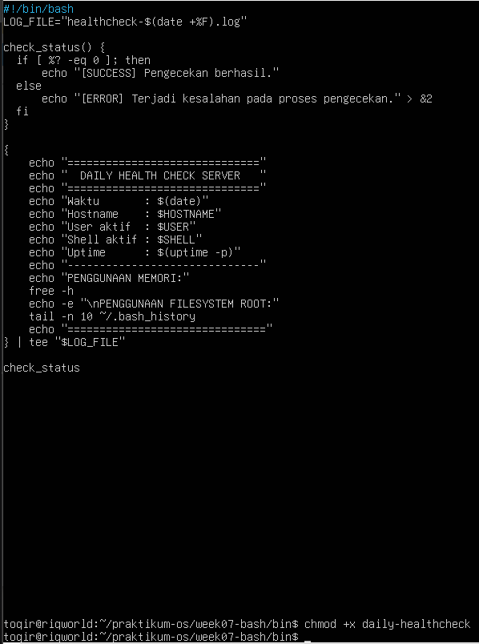

Syarat konsep yang harus muncul :
- environment variable,
- PATH,
- alias atau fungsi pendukung,
- history,
- tee,
- penanganan error dasar.

Minimal luaran : 
- file script yang executable,
- contoh isi file log hasil eksekusi,
- penjelasan singkat fungsi tiap bagian script.  
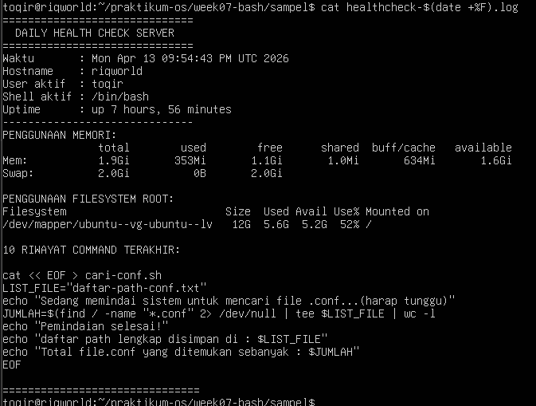

#### Tugas Praktikum 4 - Penanganan FIle dengan Nama Kompleks dan Arsip Aman
Konteks riil:  
file hasil backup, ekspor, atau laporan sering memiliki nama yang mengandung spasi atau karakter khusus. Administrator harus tetap dapat memproses file-file tersebut tanpa salah target.

Instruksi tugas: 
1. Buat minimal 4 file contoh dengan nama yang bervariasi, termasuk:
    - nama file yang mengandung spasi,
    - nama file yang mengandung tanda kurung siku atau karakter khusus,
    - file dengan pola nama serupa untuk diuji dengan wildcard.  

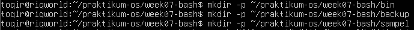

2. Tunjukkan perbedaan hasil jika file diakses tanpa quoting dan dengan quoting yang benar.
3. Lakukan preview wildcard dengan echo sebelum dipakai untuk operasi nyata.
4. Salin file-file tersebut ke direktori backup dengan nama yang aman.  

5. Buat arsip tar.gz dari hasil backup.  
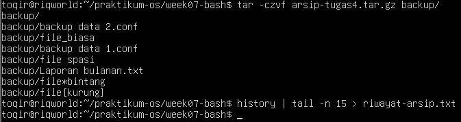
6. Simpan riwayat perintah yang Anda gunakan ke file riwayat-arsip.txt

Syarat yang harus muncul:
- single quote, double quote, dan escaping,
- wildcard,
- variabel path,
-  history,
- operasi file lanjutan yang aman. 

Minimal luaran: 
- daftar file awal,
- daftar file hasil backup,
- file arsip tar.gz,
- file riwayat-arsip.txt,
- refleksi singkat tentang pentingnya quoting di Bash.  

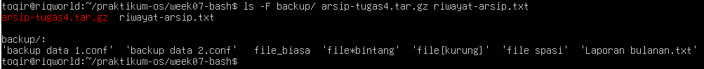

### Rangkuman  
- Bash adalah shell yang sangat umum digunakan pada Linux dan menjadi alat utama interaksi administrator dengan sistem.
- .bashrc dipakai untuk konfigurasi shell interaktif, sedangkan .bash_profile dipakai pada konteks login shell.
- Variabel lingkungan dan PATH menentukan konteks kerja shell serta bagaimana Bash menemukan command dan script.
- Alias cocok untuk shortcut sederhana, sedangkan fungsi shell cocok untuk logika yang lebih kompleks dan berulang.
- Completion dan history membantu mempercepat kerja serta mengurangi kesalahan pengetikan.
- Wildcard dan ekspansi nama file memudahkan pemrosesan banyak file sekaligus, tetapi harus digunakan dengan kebiasaan preview yang aman.
- Quoting dan escaping adalah fondasi penting agar Bash menangani variabel, spasi, dan karakter khusus dengan benar.
