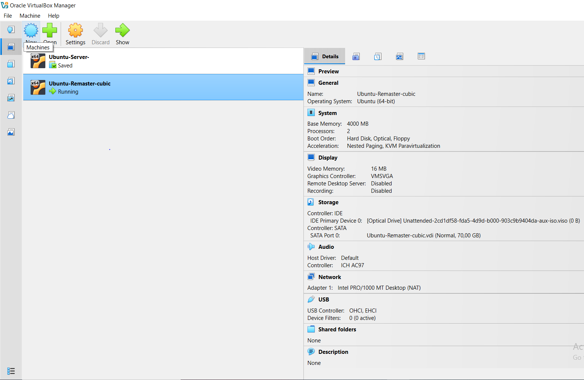
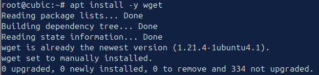
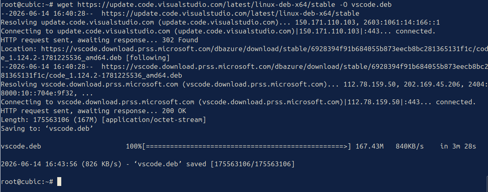
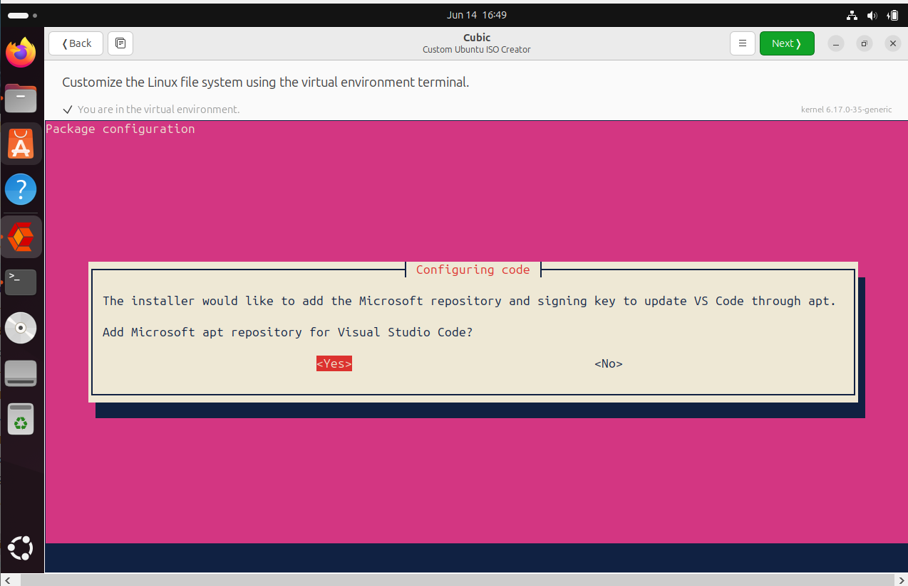
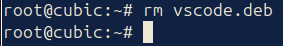

# Laporan Proyek Remastering Sistem Operasi Linux
<h4> Nama : Muhammad Toriq Januarsyah<h4>
<h4> NIM : 254107020075<h4>
<h4> Kelas : TI 1-H <h4>

## 1. Persiapan Sistem Dasar

## TAHAP 1: PEMBUATAN DAN KONFIGURASI VIRTUAL MACHINE

Pada tahap ini, dilakukan perakitan spesifikasi hardware virtual menggunakan Oracle VirtualBox Manager. Spesifikasi ini dirancang secara khusus untuk memenuhi kebutuhan minimum sistem operasi Ubuntu 24.04 LTS serta memberikan ruang penyimpanan yang cukup bagi aplikasi Cubic selama proses dekompresi file ISO.

Berikut adalah ringkasan spesifikasi mesin virtual yang telah berhasil dibuat:

 <br>
_Gambar 1 Panel Detail Spesifikasi Virtual Machine Ubuntu-Remaster-cubic_

### Detail Alokasi Sumber Daya:
1. **Sistem Operasi:** Ubuntu 64-bit berbasis kernel Linux.
2. **Memori Utama (RAM):** 4000 MB (~4 GB) untuk menjamin kelancaran kompilasi data.
3. **Prosesor:** 2 Cores CPU guna mempercepat proses build ulang ISO.
4. **Media Penyimpanan:** Virtual Disk berkapasitas 70 GB dengan tipe alokasi dinamis (Dynamically Allocated) untuk mencegah kegagalan *Disk Full* saat ekstraksi core system.

### TAHAP 1.1: PEMASANGAN UTILITAS CUBIC PADA OS HOST

Setelah lingkungan OS Host siap digunakan, langkah berikutnya adalah memasang utilitas inti remastering, yaitu Cubic (Custom Ubuntu ISO Creator). Pemasangan dilakukan melalui terminal emulasi Bash dengan urutan perintah sebagai berikut:

### 1.1.1 Menambahkan PPA Resmi Cubic
   Pendaftaran repositori dilakukan menggunakan perintah `sudo add-apt-repository ppa:cubic-wizard/release -y` agar sistem dapat mengenali paket biner Cubic yang berada di luar repositori bawaan Ubuntu.

 <br>
_Gambar 1.1.1 Eksekusi pendaftaran repositori PPA cubic-wizard_

### 1.1.2 Sinkronisasi Indeks Paket Sistem
   Setelah repositori baru terdaftar, perintah `sudo apt update` dijalankan untuk memperbarui database paket lokal pada sistem Ubuntu agar mendeteksi paket Cubic versi terbaru.

 <br>
_Gambar 1.1.2 Sinkronisasi database paket lokal sistem_

### 1.2.1 Eksekusi Instalasi Cubic
   Proses instalasi inti diselesaikan dengan menjalankan perintah `sudo apt install cubic -y` untuk mengunduh dan mengonfigurasi seluruh dependensi utilitas Cubic secara otomatis hingga selesai.

 <br>
_Gambar 1.2.1 Terminal menunjukkan paket utilitas Cubic telah terpasang sempurna_

### 1.2.2 Verifikasi Shared Folder dan Penyalinan Berkas ISO
   Setelah folder bersama aktif, perintah `ls /media/sf_ISO_24` dijalankan untuk memverifikasi keberadaan berkas di dalam Windows Host, kemudian dilanjutkan dengan perintah `cp /media/sf_ISO_24/ubuntu-24.04.4-desktop-amd64.iso ~/cubic-Project/` untuk menyalin berkas ISO utama tersebut ke dalam direktori kerja lokal.

 <br>
_Gambar 1.2.2 Proses verifikasi isi shared folder dan penyalinan berkas ISO ke workspace_

## TAHAP 1.3.1: INISIALISASI DAN KONFIGURASI METADATA ISO

### 1.3.1 Pemilihan Direktori Kerja Proyek
   Halaman awal wizard Cubic dikonfigurasi dengan memilih direktori kerja `/home/toqir/cubic-Project` agar seluruh berkas hasil ekstraksi dan kompilasi ISO nantinya tersimpan di dalam satu ruang lokal yang aman.

 <br>
_Gambar 1.3.1 Penentuan direktori utama proyek pada Cubic_

### 1.3.2 Konfigurasi Metadata dan Identitas NIM pada Berkas Kustom
   Pemuatan master ISO berhasil divalidasi oleh sistem Cubic. Pada bagian kustomisasi parameter (*Custom Disk*), nama berkas keluaran (*Filename*) diubah secara spesifik menjadi `Ubuntu-Custom-254107020075.iso` menggunakan identitas NIM mahasisw untuk memenuhi standarisasi penamaan proyek remastering.

 <br>
_Gambar 1.3.2 Penyesuaian nama berkas ISO kustom dan parameter metadata berdasarkan NIM_

### 1.4.1 Masuk ke Lingkungan Virtual Terminal (Chroot Environment)
   Proses dekompresi berkas sistem (*SquashFS*) dari ISO asli telah selesai dieksekusi oleh Cubic, ditandai dengan munculnya akses konsol `root@cubic:~#`. Lingkungan Chroot ini bertindak sebagai ruang isolasi virtual untuk memodifikasi sistem operasi seperti memperbarui repositori, menambah paket aplikasi, hingga memanipulasi konfigurasi internal OS.

 <br>
_Gambar 1.4.1 Berhasil masuk ke dalam lingkungan virtual terminal Chroot di Cubic_

### 1.4.2 Pembaruan Indeks Repositori Paket Sistem
   Perintah `apt update` dieksekusi di dalam lingkungan Chroot untuk menyinkronkan daftar paket lokal dengan server cermin (*mirror*) Ubuntu resmi. Proses ini berhasil mengunduh metadata sebesar 19.1 MB dan mengidentifikasi paket-paket yang siap diperbarui, memastikan bahwa instalasi perangkat lunak kustom berikutnya berjalan menggunakan versi indeks yang paling mutakhir.

 <br>
_Gambar 1.4.2 Hasil eksekusi pembaruan indeks paket sistem pada lingkungan Chroot_

## 2 Instalasi Paket Perangkat Lunak Utama (VLC, GIMP, Apache2, PHP)
   Eksekusi perintah `apt install -y vlc gimp apache2 php libapache2-mod-php` dilakukan untuk memasang aplikasi multimedia (VLC), editor grafis (GIMP), serta lingkungan *web server* lokal (Apache2 dan PHP) langsung ke dalam *core* sistem operasi. Seluruh dependensi berhasil diunduh dan dikonfigurasi secara otomatis tanpa kendala.

 <br>
_Gambar 2 Proses instalasi paket VLC, GIMP, Apache2, dan PHP pada lingkungan Chroot_

### 2.1 Instalasi Visual Studio Code
   Proses pemasangan penyunting kode (*code editor*) Visual Studio Code dilakukan secara manual di dalam lingkungan Chroot menggunakan paket instalasi resmi berbasis Debian (`.deb`). Langkah-langkah penanganan instalasi dijabarkan secara kronologis sebagai berikut:

   1. **Verifikasi Ketersediaan Utilitas Wget**
      Sebelum mengunduh paket eksternal, sistem melakukan verifikasi terhadap ketersediaan alat pengunduh `wget`. Hasil pengecekan menunjukkan bahwa utilitas `wget` telah terpasang pada versi mutakhir di dalam sistem inti, sehingga siap digunakan untuk menarik berkas dari luar jaringan.

 <br>
_Gambar 2.1.1 Output verifikasi ketersediaan utilitas wget di dalam sistem Chroot_

   2. **Pengunduhan Paket Manifes VS Code**
      Sistem mengeksekusi penarikan berkas biner mentah VS Code langsung dari peladen resmi Microsoft. Berkas berukuran 167.43 MB tersebut berhasil diunduh secara stabil dan disimpan ke dalam direktori lokal dengan nama `vscode.deb`.

 <br>
_Gambar 2.1.2 Proses pengunduhan paket installer VS Code dari repositori resmi Microsoft_

   3. **Konfigurasi Repositori dan Kunci Keamanan Paket**
      Saat paket mulai dieksekusi, sistem memunculkan dialog interaktif *Package Configuration*. Konfigurasi ini meminta konfirmasi untuk mengintegrasikan repositori pihak ketiga serta *signing key* resmi agar pembaruan VS Code di masa mendatang dapat diverifikasi secara aman oleh perintah `apt`. Pilihan `<Yes>` diambil untuk melanjutkan pemrosesan.

 <br>
_Gambar 2.1.3 Persetujuan integrasi repositori dan kunci penandatanganan pada sistem kustom_

   4. **Eksekusi Pemasangan Paket Aplikasi**
      Manajer paket `apt` melakukan dekompresi terhadap berkas `vscode.deb`. Seluruh dependensi dasar (termasuk paket runtime `socat`) diurai, dikonfigurasi, dan didaftarkan secara otomatis ke dalam sistem menu Desktop Environment.

 <br>
_Gambar 2.1.4 Proses pembongkaran paket dan penuntasan instalasi komponen binary VS Code_

   5. **Pembersihan Berkas Manifes Temporer**
      Setelah status instalasi dinyatakan berhasil (*Done*), berkas instalasi lokal `vscode.deb` segera dihapus dari direktori penyimpanan menggunakan perintah `rm`. Langkah pengosongan ruang ini esensial untuk menjaga efisiensi ruang dan meminimalkan ukuran berkas citra ISO kustom akhir.

 <br>
_Gambar 2.1.5 Penghapusan berkas instalasi lokal untuk optimasi kapasitas penyimpanan ruang ISO_

### 2.2 Pembuatan dan Integrasi Utilitas Sistem Kustom Berbasis Bash Script
   Proses perancangan dan penanaman utilitas monitoring sistem kustom bernama `cek-hardware` dilakukan secara manual di dalam lingkungan Chroot. Langkah-langkah pembuatan skrip hingga tahap integrasi biner global dijabarkan secara kronologis sebagai berikut:

   1. **Inisiasi Berkas Perintah Global Baru**
      Sebelum menyusun baris kode, sistem melakukan pembuatan berkas biner baru pada direktori khusus `/usr/local/bin/cek-hardware` menggunakan penyunting teks Nano. Penempatan pada direktori ini bertujuan agar skrip dapat dipanggil secara universal sebagai perintah internal baru di seluruh sistem.

 <br>
_Gambar 2.2.1 Eksekusi pembuatan berkas biner kustom baru pada editor Nano_

   2. **Penyusunan Sintaks dan Logika Skrip**
      Proses pemrograman dilakukan dengan menyusun instruksi Bash Script untuk mengekstrak metrik vital perangkat keras secara otomatis. Konfigurasi ini dirancang menggunakan kombinasi utilitas `lscpu`, `free -h`, dan `df -h` yang telah divalidasi dan dibersihkan dari dependensi kesalahan penulisan (*syntax error*).

 <br>
_Gambar 2.2.2 Struktur penulisan kode biner utilitas hardware yang telah diperbaiki di dalam Nano_

   3. **Eskalasi Izin Berkas Eksekusi**
      Setelah berkas skrip berhasil disimpan, sistem melakukan perubahan mode hak akses menggunakan perintah `chmod`. Langkah ini esensial untuk mengonversi berkas teks biasa menjadi berkas berkategori *executable* agar dapat bertindak sebagai perintah mandiri.

 <br>
_Gambar 2.2.3 Pemberian hak akses eksekusi penuh pada utilitas cek-hardware_

   4. **Pengujian Pemanggilan Perintah Kustom**
      Sistem mengeksekusi uji coba pemanggilan perintah baru `cek-hardware` langsung dari prompt terminal utama. Tahap ini dilakukan tanpa menyertakan *absolute path* guna memastikan bahwa integrasi biner ke dalam variabel *environment* sistem telah berjalan sempurna.

 <br>
_Gambar 2.2.4 Mekanisme pengujian dan pemanggilan perintah kustom dari terminal environment_

   5. **Evaluasi Output Antarmuka Sistem**
      Hasil pengujian menunjukkan bahwa utilitas berhasil melakukan operasi pembersihan layar (*clear screen*) secara otomatis dan menyajikan pembacaan data spesifikasi perangkat keras (CPU, RAM, dan Storage) secara rapi, presisi, serta bebas dari kendala *error*.

 <br>
_Gambar 2.2.5 Tampilan visual output laporan spesifikasi perangkat keras komputer yang berhasil diekstrak_

## 3. Kustomisasi Tampilan (Antarmuka)

### 3.1 Menyalin Wallpaper ke Direktori Sistem

Langkah yang dilakukan:

1. Menyiapkan file wallpaper yang akan digunakan sebagai latar belakang sistem hasil remaster.
2. Mengimpor file wallpaper ke lingkungan Cubic menggunakan fitur drag and drop.
3. Menyalin file wallpaper ke direktori sistem Ubuntu agar dapat diakses oleh seluruh pengguna setelah instalasi.

Perintah yang digunakan:

```bash
mkdir -p /usr/share/backgrounds
cp /root/wallpapper-upp.jpeg /usr/share/backgrounds/custom-wallpaper.jpeg
```

 <br>
_Gambar 3.1 Menyalin Wallpaper ke Direktori Sistem_

Pada tahap ini dilakukan penyalinan wallpaper kustom ke direktori resmi sistem Ubuntu, yaitu `/usr/share/backgrounds`. Direktori tersebut merupakan lokasi standar yang digunakan sistem operasi untuk menyimpan koleksi wallpaper. Dengan menempatkan wallpaper pada lokasi ini, wallpaper dapat digunakan sebagai latar belakang bawaan pada sistem hasil remaster tanpa memerlukan konfigurasi tambahan dari pengguna.

### 3.2 Instalasi Theme Orchis GTK

Langkah yang dilakukan:

1. Melakukan pembaruan daftar repositori paket Ubuntu.
2. Menginstal paket tema Orchis GTK dari repositori resmi Ubuntu.
3. Memastikan seluruh komponen tema berhasil dipasang ke dalam sistem remaster.

Perintah yang digunakan:

```bash
apt install orchis-gtk-theme -y
```

 <br>
_Gambar 3.2 Instalasi Theme Orchis GTK_

Theme Orchis GTK dipilih karena memiliki tampilan modern, elegan, dan profesional. Variasi tema ini juga menyediakan mode gelap yang sesuai dengan konsep visual wallpaper hitam putih yang digunakan pada proyek. Instalasi dilakukan melalui repositori resmi Ubuntu sehingga kompatibilitas dan stabilitas paket lebih terjamin dibandingkan pemasangan dari sumber pihak ketiga.

---

### 3.3 Instalasi Icon Pack Papirus

Langkah yang dilakukan:

1. Menginstal paket ikon Papirus dari repositori Ubuntu.
2. Menambahkan koleksi ikon ke sistem hasil remaster.
3. Memastikan paket ikon tersedia untuk digunakan sebagai ikon bawaan desktop.

Perintah yang digunakan:

```bash
apt install papirus-icon-theme -y
```

 <br>
_Gambar 3.3 Instalasi  Icon Pack Papirus_

Papirus dipilih sebagai paket ikon utama karena memiliki desain yang bersih, modern, dan konsisten dengan tema Orchis GTK. Kombinasi keduanya menghasilkan tampilan desktop yang lebih profesional dan estetis dibandingkan tampilan bawaan Ubuntu. Paket ikon dipasang langsung dari repositori resmi Ubuntu sehingga mudah dikelola serta mendapatkan dukungan kompatibilitas yang baik.

### 3.4 Konfigurasi Tampilan Default Sistem

Langkah yang dilakukan:

1. Membuat berkas konfigurasi GNOME menggunakan mekanisme GSettings Override.
2. Mengatur wallpaper bawaan sistem.
3. Mengatur tema GTK bawaan sistem menggunakan Orchis-Dark.
4. Mengatur paket ikon bawaan sistem menggunakan Papirus.
5. Menyimpan konfigurasi pada direktori skema GNOME agar dapat diterapkan secara global kepada seluruh pengguna.

Perintah yang digunakan:

```bash
nano /usr/share/glib-2.0/schemas/99-custom-wallpaper.gschema.override
```

Isi konfigurasi:

```ini
[org.gnome.desktop.background]
picture-uri='file:///usr/share/backgrounds/custom-wallpaper.jpeg'
picture-uri-dark='file:///usr/share/backgrounds/custom-wallpaper.jpeg'

[org.gnome.desktop.interface]
gtk-theme='Orchis-Dark'
icon-theme='Papirus'
```

 <br>
_Gambar 3.4 Konfigurasi Tampilan Default Sistem_

Pada tahap ini dilakukan konfigurasi tampilan bawaan sistem menggunakan mekanisme GSettings Override milik GNOME Desktop Environment. Konfigurasi tersebut meliputi pengaturan wallpaper, tema GTK, dan paket ikon yang akan digunakan secara otomatis ketika sistem hasil remaster dijalankan.

Wallpaper yang digunakan berasal dari berkas `custom-wallpaper.jpeg` yang telah ditempatkan pada direktori sistem. Tema yang digunakan adalah Orchis-Dark karena memiliki tampilan modern dan elegan yang sesuai dengan konsep visual proyek. Paket ikon Papirus dipilih karena memiliki desain yang konsisten, minimalis, dan profesional.

Dengan konfigurasi ini, pengguna akan langsung mendapatkan tampilan desktop yang telah dikustomisasi tanpa perlu melakukan pengaturan tambahan setelah proses instalasi maupun saat menjalankan Live Session.

### 3.5 Kompilasi Skema GNOME

Langkah yang dilakukan:

1. Melakukan kompilasi ulang skema GNOME setelah konfigurasi wallpaper, tema, dan ikon selesai dibuat.
2. Menggabungkan seluruh berkas konfigurasi skema dan override ke dalam basis data konfigurasi GNOME.
3. Memastikan konfigurasi kustom dapat diterapkan secara otomatis ketika sistem dijalankan.

Perintah yang digunakan:

```bash
glib-compile-schemas /usr/share/glib-2.0/schemas/
```

 <br>
_Gambar 3.5 Kompilasi Skema GNOME_

Setelah konfigurasi wallpaper, tema, dan ikon selesai dibuat, diperlukan proses kompilasi ulang skema GNOME agar perubahan tersebut dapat dikenali oleh sistem. Proses ini akan membaca seluruh berkas konfigurasi yang berada pada direktori skema GNOME, termasuk berkas override yang telah dibuat sebelumnya.

Hasil kompilasi menghasilkan basis data konfigurasi baru yang akan digunakan saat sistem dijalankan. Dengan demikian, seluruh pengaturan tampilan yang telah dikustomisasi dapat diterapkan secara otomatis tanpa memerlukan konfigurasi tambahan dari pengguna.

### 3.6 Verifikasi Konfigurasi Desktop

Langkah yang dilakukan:

1. Memeriksa kembali berkas konfigurasi tampilan yang telah dibuat.
2. Memastikan lokasi wallpaper yang digunakan sesuai dengan direktori sistem.
3. Memastikan tema Orchis-Dark telah ditetapkan sebagai tema bawaan.
4. Memastikan paket ikon Papirus telah ditetapkan sebagai ikon bawaan sistem.
5. Memastikan konfigurasi yang akan diterapkan pada hasil remaster sesuai dengan rancangan visual yang telah ditentukan.

Perintah yang digunakan:

```bash
cat /usr/share/glib-2.0/schemas/99-custom-wallpaper.gschema.override
```

 <br>
_Gambar 3.6 Verifikasi Konfigurasi Desktop_

Tahap verifikasi dilakukan untuk memastikan seluruh konfigurasi tampilan yang telah dibuat tersimpan dengan benar sebelum proses build ISO dilakukan. Pemeriksaan meliputi lokasi wallpaper sistem, tema GTK yang digunakan, serta paket ikon yang akan diterapkan secara otomatis ketika sistem dijalankan.

Hasil verifikasi menunjukkan bahwa wallpaper kustom, tema Orchis-Dark, dan ikon Papirus telah terkonfigurasi pada berkas override GNOME. Dengan demikian, identitas visual sistem hasil remaster telah siap digunakan dan dapat diterapkan secara otomatis pada saat boot pertama maupun setelah instalasi sistem.

## 4. Pembuatan File ISO Baru

### 4.1 Persiapan Build ISO

Langkah yang dilakukan:

1. Memastikan seluruh proses kustomisasi sistem telah selesai dilakukan.
2. Memastikan aplikasi tambahan, wallpaper, tema sistem, dan paket ikon telah berhasil dipasang.
3. Memastikan konfigurasi GNOME telah dikompilasi menggunakan `glib-compile-schemas`.
4. Memastikan seluruh perubahan telah tersimpan pada lingkungan remastering Cubic sebelum proses pembuatan ISO dimulai.
5. Melanjutkan proses ke tahap pembuatan ISO melalui antarmuka Cubic.

 <br>
_Gambar 4.1 Persiapan Build ISO_

Tahap ini dilakukan untuk memastikan seluruh konfigurasi sistem telah selesai dan siap dimasukkan ke dalam berkas ISO hasil remastering. Pemeriksaan dilakukan terhadap aplikasi yang telah dipasang, konfigurasi wallpaper, tema sistem, paket ikon, serta konfigurasi desktop GNOME. Setelah seluruh komponen dipastikan tersedia dan terkonfigurasi dengan baik, proses dapat dilanjutkan menuju tahap pembuatan berkas ISO menggunakan Cubic.

### 4.2 Konfigurasi Informasi ISO
Langkah yang dilakukan:
   1. Memulai proses pembuatan ISO pada Cubic.
   2. Menunggu proses penyalinan kernel dan berkas boot selesai.
   3. Menunggu proses kompresi filesystem Linux.
   4. Memperbarui ukuran filesystem dan metadata instalasi.
   5. Menghasilkan berkas ISO hasil remastering.
   6. Menghitung checksum untuk memastikan integritas berkas ISO.

.png) <br>
_Gambar 4.2 Proses Generate ISO_

Pada tahap ini Cubic melakukan proses pembangunan ulang sistem operasi ke dalam bentuk image ISO. Seluruh perubahan yang telah dilakukan sebelumnya dikompresi dan disusun kembali menjadi media instalasi Ubuntu yang baru. Proses ini memerlukan waktu beberapa menit tergantung spesifikasi komputer dan ukuran sistem yang dibangun.

### 4.3 Hasil Generate ISO
Langkah yang dilakukan:
   1. Menunggu proses generate hingga selesai.
   2. Memastikan tidak terdapat pesan kesalahan selama proses build.
   3. Mencatat nama file ISO yang dihasilkan.
   4. Mencatat lokasi penyimpanan berkas ISO.

.png) <br>
_Gambar 4.3 Hasil Generate ISO_

Setelah proses build selesai, Cubic menampilkan informasi mengenai berkas ISO yang berhasil dibuat. Informasi tersebut meliputi nama file ISO, ukuran file, direktori penyimpanan, checksum, volume ID, dan informasi release sistem operasi hasil remastering.

### 4.4 Verifikasi File ISO
Langkah yang dilakukan:
   1. Memeriksa keberadaan file ISO pada direktori hasil build.
   2. Melakukan pengecekan ukuran file ISO.
   3. Melakukan verifikasi checksum menggunakan perintah `md5sum`.
   4. Menyalin file ISO ke Shared Folder untuk digunakan pada proses pengujian.

 <br>
_Gambar 4.4 Verifikasi File ISO Berhasil Dibuat_

Tahap verifikasi dilakukan untuk memastikan bahwa file ISO hasil remastering berhasil dibuat tanpa kerusakan. Pengecekan checksum menunjukkan bahwa nilai checksum file ISO sesuai dengan file checksum yang dihasilkan Cubic sehingga file dinyatakan valid dan siap digunakan untuk pengujian.

## 5. Pengujian ISO Hasil Remastering

### 5.1 Pembuatan Virtual Machine Pengujian
Langkah yang dilakukan:
   1. Membuat virtual machine baru pada Oracle VirtualBox.
   2. Menentukan kapasitas RAM, prosesor, dan media penyimpanan virtual.
   3. Menghubungkan file ISO hasil remastering sebagai media boot.
   4. Menjalankan virtual machine untuk memulai proses pengujian.

.png) <br>
_Gambar 5.1 Pembuatan Virtual Machine Pengujian_

Pengujian dilakukan menggunakan Oracle VirtualBox agar ISO hasil remastering dapat diuji tanpa memengaruhi sistem operasi utama. Virtual machine berfungsi sebagai lingkungan simulasi untuk memastikan ISO dapat melakukan booting dan instalasi dengan baik.

### 5.2 Booting dan Instalasi ISO Custom

Langkah yang dilakukan:
   1. Menjalankan virtual machine menggunakan ISO hasil remastering.
   2. Memastikan sistem berhasil melakukan booting.
   3. Memulai proses instalasi Ubuntu.
   4. Melakukan konfigurasi bahasa, keyboard, dan pengaturan sistem lainnya.
   5. Menyelesaikan proses instalasi hingga sistem siap digunakan.

 <br>
_Gambar 5.2 Booting dan Instalasi ISO Custom_

Tahap ini bertujuan untuk memastikan bahwa media instalasi hasil remastering dapat digunakan sebagaimana mestinya. Keberhasilan proses booting dan instalasi menunjukkan bahwa struktur filesystem, bootloader, dan paket sistem telah tersusun dengan benar selama proses remastering.

### 5.3 Verifikasi Hasil Kustomisasi

Langkah yang dilakukan:

1. Login ke sistem Ubuntu yang telah selesai diinstal.
2. Memeriksa wallpaper kustom yang telah diterapkan.
3. Memastikan aplikasi tambahan tersedia pada sistem.
4. Memastikan perubahan tampilan desktop berhasil diterapkan.
5. Memastikan sistem dapat digunakan dengan normal.

 <br>
_Gambar 5.3 Tampilan Akhir Sistem Hasil Remastering_


Verifikasi dilakukan untuk memastikan seluruh modifikasi yang telah dilakukan selama proses remastering berhasil diterapkan pada sistem hasil instalasi. Dari hasil pengujian terlihat bahwa wallpaper kustom berhasil diterapkan dan sistem dapat berjalan dengan baik setelah proses instalasi selesai.

### 5.4 Pengujian Aplikasi Kustom Informasi Perangkat Keras
Langkah yang dilakukan:
   1. Membuka aplikasi Terminal pada sistem hasil instalasi.
   2. Menjalankan Bash script informasi perangkat keras yang telah dibuat selama proses kustomisasi.
   3. Mengamati informasi perangkat keras yang ditampilkan oleh program.
   4. Memastikan informasi CPU, RAM, dan media penyimpanan berhasil ditampilkan dengan benar.

 <br>
_Gambar 5.4 Hasil Eksekusi Bash Script Informasi Perangkat Keras_

Tahap ini dilakukan untuk menguji aplikasi kustom berupa Bash script yang telah ditambahkan ke dalam sistem hasil remastering. Pengujian dilakukan melalui Terminal dengan menjalankan script yang telah dibuat. Hasil pengujian menunjukkan bahwa aplikasi berhasil menampilkan informasi perangkat keras komputer, meliputi jenis prosesor, kapasitas dan penggunaan memori utama (RAM), serta informasi media penyimpanan. Keberhasilan eksekusi script menunjukkan bahwa aplikasi kustom telah berhasil terintegrasi ke dalam sistem operasi hasil remastering dan dapat dijalankan sebagaimana mestinya.


